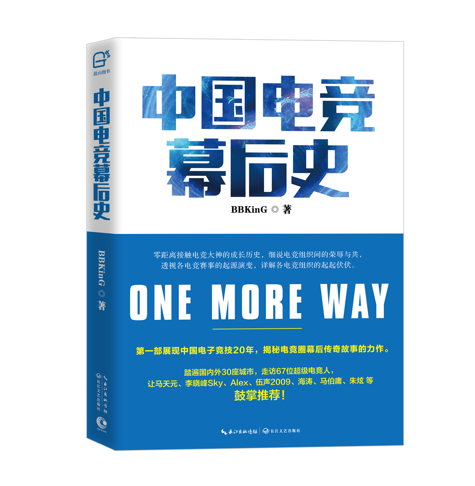
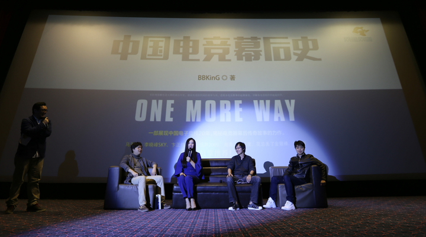
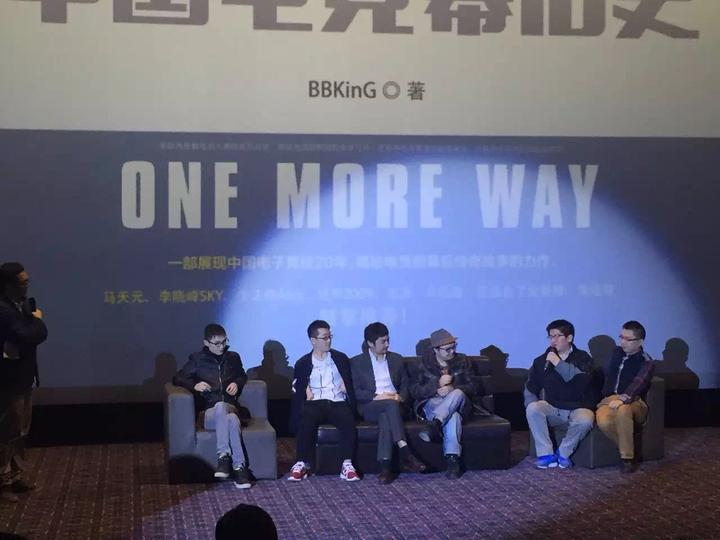
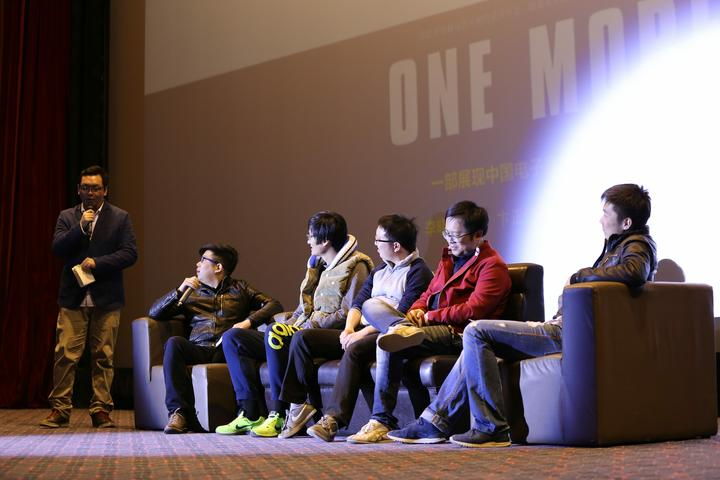

<p align="center">
  
</p>

# 中国电竞幕后史

**ONE MORE WAY**

第一部记录中国电子竞技二十年（1998 至 2017）幕后故事的书。作者用三年时间走遍国内外 30 座城市，走访 67 位电竞人，从星际争霸时代写到移动电竞前夜。

**在线阅读（推荐）：https://bkingfilm.github.io/china-esports-history/**

本书 2015 年 12 月由长江文艺出版社出版（ISBN 9787535483249）。纸书因篇幅所限删去了部分章节，本仓库以知乎专栏连载版为底本整理，内容比纸书更全，全部章节免费公开。

## 如何阅读

- **从头阅读**：[中文首页](docs/zh/index.md) → [TEDx 序章](docs/zh/chapters/序章-TEDx演讲-让路更多一些.md) → [自序](docs/zh/chapters/00-自序.md)
- **按栏目**：[中国电竞幕后史](docs/zh/chapters/index.md)（48 篇）｜[中国游戏幕后史](docs/zh/gamehistory/index.md)（10 篇）｜[散篇与史料](docs/zh/appendix/index.md)（9 篇）
- **按年代**：从[早期星际争霸](docs/zh/chapters/01-从星际争霸说起.md)、[WCG 2003 纪录片](docs/zh/appendix/07-黑暗前的黎明-WCG2003未播出的纪录片.md)、[俱乐部与联盟](docs/zh/chapters/18-从俱乐部到联盟的演变.md)读到[移动电竞](docs/zh/appendix/04-两年后，再看移动电竞.md)
- **按主题或人物**：导航覆盖人物、战队、赛事、媒体、平台、公司和社区；维护者可查阅 [67 篇内容映射](project/content-map.csv) 中的 `topic`、`period` 与 `entities`
- **切换语言**：[简体中文](docs/zh/index.md)｜[English](docs/en/index.md)。尚无英文译文的章节回退到中文目录，不自动机器翻译

## 关于作者

BBKinG，本名刘洋，1998 年入行的电竞老兵。前上海文广《游戏人生》《游戏大家谈》编导，StarsWar 总导演，前 WE 俱乐部经理，TEDx 演讲者。现在是游戏纪录片导演，B 站与 X 上的「导演 BK」。

- X：[@bkingfilm](https://x.com/bkingfilm)
- B 站：[导演 BK](https://space.bilibili.com/10500463)
- 知乎专栏：[中国电子竞技幕后史](https://zhuanlan.zhihu.com/bbking)

## 2015 新书发布会

2015 年 12 月 4 日，本书新书发布会在上海举行，马天元、SKY 李晓峰、Alex 卞正伟、海涛、BBC、小苍、ZAX 等几十位中国电竞的亲历者到场。[完整现场记录见附录](docs/zh/appendix/09-新书发布会.md)。



左起 ZAX（Replays.net、StarsWar 和 WE 创始人）、小苍（前 WAR3 职业选手）、刘义峰（前 WAR3 职业选手）、SKY 李晓峰（WCG 2005、2006 世界冠军）



左起 EVA 剑心（剑心补丁包作者）、王晓鹏无手哥、马天元（中国第一个 WCG 世界冠军金牌获得者之一）、林熊猫、魔术羊、熊律师



左起吴健、王晓东、bunny、brett（四位均为暴雪中国电竞团队成员）、波比（腾讯游戏，前 TGA 负责人）

## 目录

### 序章

- [TEDx 演讲，让路更多一些](docs/zh/chapters/序章-TEDx演讲-让路更多一些.md)（[演讲视频](https://www.bilibili.com/video/BV1ts411U7tz/)｜[English version](docs/en/one-more-way-tedx-2015.md)）
- [自序](docs/zh/chapters/00-自序.md)

### 正文

| 章 | 标题 |
| --- | --- |
| 一 | [从星际争霸说起](docs/zh/chapters/01-从星际争霸说起.md) |
| 二 | [电子竞技的百家争鸣](docs/zh/chapters/02-电子竞技的百家争鸣.md) |
| 三 | [电子竞技新闻网站的革新](docs/zh/chapters/03-电子竞技新闻网站的革新.md) |
| 四 | [中国电子竞技对战平台兴衰录](docs/zh/chapters/04-中国电子竞技对战平台兴衰录.md) |
| 五 | [CEG的故事](docs/zh/chapters/05-CEG的故事.md) |
| 六 | [StarsWar的电竞赛事娱乐化探索](docs/zh/chapters/06-StarsWar的电竞赛事娱乐化探索.md) |
| 七 | [游戏风云的前世今生](docs/zh/chapters/07-游戏风云的前世今生.md) |
| 八 | [NeoTV、PLU恩仇录](docs/zh/chapters/08-NeoTV、PLU恩仇录.md) |
| 九 | [海涛和2009的宿命撞击](docs/zh/chapters/09-海涛和2009的宿命撞击.md) |
| 十 | [女电竞人Miss](docs/zh/chapters/10-女电竞人Miss.md) |
| 十一 | [女电竞人小苍](docs/zh/chapters/11-女电竞人小苍.md) |
| 十二 | [820的人生牌局](docs/zh/chapters/12-820的人生牌局.md) |
| 十三 | [川军先锋 马天元](docs/zh/chapters/13-川军先锋-马天元.md) |
| 十四 | [腾讯，他想干嘛](docs/zh/chapters/14-腾讯，他想干嘛.md) |
| 十五 | [贫民窟走出的电竞百万富翁 孟阳](docs/zh/chapters/15-贫民窟走出的电竞百万富翁-孟阳.md) |
| 十六 | [忧虑的平媒《电子竞技》](docs/zh/chapters/16-忧虑的平媒《电子竞技》.md) |
| 十七 | [EVA剑心补丁包十年造](docs/zh/chapters/17-EVA剑心补丁包十年造.md) |
| 十八 | [从俱乐部到联盟的演变](docs/zh/chapters/18-从俱乐部到联盟的演变.md) |
| 十九 | [长发飘飘 DC](docs/zh/chapters/19-长发飘飘-DC.md) |
| 二十 | [多玩的绝招](docs/zh/chapters/20-多玩的绝招.md) |
| 二十一 | [U9，凶猛](docs/zh/chapters/21-U9，凶猛.md) |
| 二十二 | [WE.LOL队长 若风Misaya](docs/zh/chapters/22-WE.LOL队长-若风Misaya.md) |
| 二十三 | [I-Rocks大韩 豁出来的人生传奇](docs/zh/chapters/23-I-Rocks大韩-豁出来的人生传奇.md) |
| 二十四 | [当李晓峰成为SKY](docs/zh/chapters/24-当李晓峰成为SKY.md) |
| 二十五 | [左手会跳舞的男人 suhO](docs/zh/chapters/25-左手会跳舞的男人-suhO.md) |
| 二十六 | [抗韩英雄 MagicYang](docs/zh/chapters/26-抗韩英雄-MagicYang.md) |
| 二十七 | [父母带他打比赛 山城鬼王TED](docs/zh/chapters/27-父母带他打比赛-山城鬼王TED.md) |
| 二十八 | [西安高校电子竞技联盟 XUGA](docs/zh/chapters/28-西安高校电子竞技联盟-XUGA.md) |
| 二十九 | [Replays.net、StarsWar和WE创始人 ZAX](docs/zh/chapters/29-Replays.net、StarsWar和WE创始人-ZAX.md) |
| 三十 | [世界级中国CS指挥官 Alex卞正伟](docs/zh/chapters/30-世界级中国CS指挥官-Alex卞正伟.md) |
| 三十一 | [从剑舞红颜笑 到 IG.xiaoxiao](docs/zh/chapters/31-从剑舞红颜笑-到-IG.xiaoxiao.md) |
| 三十二 | [艾泽拉斯国家地理创始人 Ediart](docs/zh/chapters/32-艾泽拉斯国家地理创始人-Ediart.md) |
| 三十三 | [TI4世界冠军Newbee队长 张宁](docs/zh/chapters/33-TI4世界冠军Newbee队长-张宁.md) |
| 三十四 | [苹果牛的《帝国时代》](docs/zh/chapters/34-苹果牛的《帝国时代》.md) |
| 三十五 | [电竞娱乐化浪潮 解说小智](docs/zh/chapters/35-电竞娱乐化浪潮-解说小智.md) |
| 三十六 | [中国电竞解说元老Alone](docs/zh/chapters/36-中国电竞解说元老Alone.md) |
| 三十七 | [格斗天王 小孩曾卓君](docs/zh/chapters/37-格斗天王-小孩曾卓君.md) |
| 三十八 | [Razer创始人兼CEO Min](docs/zh/chapters/38-Razer创始人兼CEO-Min.md) |
| 三十九 | [星际老男孩的不老青春](docs/zh/chapters/39-星际老男孩的不老青春.md) |
| 四十 | [名嘴BBC的人生选择](docs/zh/chapters/40-名嘴BBC的人生选择.md) |
| 四十一 | [另起一行做电竞 刘义峰](docs/zh/chapters/41-另起一行做电竞-刘义峰.md) |
| 四十二 | [中国电子足球先生 FIFA冠军 李君](docs/zh/chapters/42-中国电子足球先生-FIFA冠军-李君.md) |
| 四十三 | [电竞第一女老板 RuRu潘婕](docs/zh/chapters/43-电竞第一女老板-RuRu潘婕.md) |

### 番外

- [刀工与大厨](docs/zh/chapters/番外-刀工与大厨.md)
- [三言两语说电竞](docs/zh/chapters/番外-三言两语说电竞.md)
- [当事人篇，NeoTV前总经理熊剑明Neo亲述](docs/zh/chapters/当事人篇-NeoTV前总经理熊剑明Neo亲述.md)

## 《中国游戏幕后史》（另一本书的计划，未完成）

《中国游戏幕后史》是作者计划中的另一本书，视野从电竞扩大到整个游戏行业，计划涉及单机游戏、独立游戏、网络游戏等更多层面，后因投身纪录片而中断。已完成的九篇全部收录于此。

- [前言](docs/zh/gamehistory/00-前言.md)
- [一，吉川明静的日系游戏情缘](docs/zh/gamehistory/01-吉川明静的日系游戏情缘.md)
- [二，优酷不是媒体 游戏主编 秀才](docs/zh/gamehistory/02-优酷不是媒体-游戏主编-秀才.md)
- [三，WOW 暴雪其实不想跟九城离婚](docs/zh/gamehistory/03-WOW暴雪其实不想跟九城离婚.md)
- [四，雪猹 我们错过的不止是几台游戏机](docs/zh/gamehistory/04-雪猹-我们错过的不止是几台游戏机.md)
- [五，天狼的COSPLAY工业化梦想](docs/zh/gamehistory/05-天狼的COSPLAY工业化梦想.md)
- [六，黄锋 网鱼网咖创始人](docs/zh/gamehistory/06-黄锋-网鱼网咖创始人.md)
- [七，单隽的困惑 中国独立游戏人](docs/zh/gamehistory/07-单隽的困惑-中国独立游戏人.md)
- [八，然而已经不是愤青的CEO 黄一孟](docs/zh/gamehistory/08-然而已经不是愤青的CEO-黄一孟.md)
- [番外，波士顿棒球记](docs/zh/gamehistory/番外-波士顿棒球记.md)

## 附录，幕后史散篇

成书之后，作者仍在专栏里陆续写下的电竞史料短文，按发表时间排列。

- [失控的中国电子竞技](docs/zh/appendix/01-失控的中国电子竞技.md)（2015）
- [《中国电竞幕后史》新书发布会](docs/zh/appendix/09-新书发布会.md)（2015）
- [KULOU.CSA韩国之旅，写于2000年WCGC](docs/zh/appendix/02-KULOU.CSA韩国之旅-写于2000年WCGC.md)（2016）
- [为什么大多电竞组织和赛事都在上海](docs/zh/appendix/03-为什么大多电竞组织和赛事都在上海.md)（2017）
- [两年后，再看移动电竞](docs/zh/appendix/04-两年后，再看移动电竞.md)（2017）
- [中国游戏格斗圈，凝固的『芳华』](docs/zh/appendix/05-中国游戏格斗圈-凝固的『芳华』.md)（2017）
- [电竞比赛规则探索的牺牲品，韩国KTA战队](docs/zh/appendix/06-电竞比赛规则探索的牺牲品-韩国KTA战队.md)（2018）
- [黑暗前的黎明，WCG2003未播出的纪录片](docs/zh/appendix/07-黑暗前的黎明-WCG2003未播出的纪录片.md)（2018）
- [2003年瑞典SK战队访华](docs/zh/appendix/08-2003年瑞典SK战队访华.md)（2018）

## 参与

书里写的都是真实的人和事。如果你是当事人，或者掌握当年的一手资料，欢迎开 Issue 补充和指正，让这份记录更完整。翻译、目录和站点贡献请先阅读 [CONTRIBUTING.md](CONTRIBUTING.md)；维护设计见 [信息架构说明](project/information-architecture.md)。

## 本地预览与验证

本项目使用 MkDocs 1.6.1 与 Material for MkDocs 9.7.7。安装 Python 后运行：

```bash
python -m venv .venv
.venv/Scripts/python -m pip install -r requirements.txt
.venv/Scripts/python scripts/validate_content.py
.venv/Scripts/python -m mkdocs serve
```

提交前执行严格构建：

```bash
.venv/Scripts/python -m mkdocs build --strict
.venv/Scripts/python scripts/validate_content.py --site site
git diff --check
```

Linux 与 macOS 将 `.venv/Scripts/python` 替换为 `.venv/bin/python`。

## English

**ONE MORE WAY** is the first book documenting the first twenty years of Chinese esports (1998 to 2017), written by BBKinG (Liu Yang), a documentary director who has been in the industry since 1998. He visited 30 cities and interviewed 67 people who built Chinese esports from nothing: players, casters, tournament organizers, club owners and journalists.

The full text is in Chinese. As an English sample, start with the author's 2015 TEDx talk, which condenses the whole book into one story: [One More Way: How Chinese Esports Survived](docs/en/one-more-way-tedx-2015.md).

Want more chapters in English? Open an issue and tell us which one.

## 许可 License

本仓库全部文字与图片采用 [CC BY-NC-ND 4.0](https://creativecommons.org/licenses/by-nc-nd/4.0/deed.zh-hans) 许可。欢迎转载与分享，须署名 BBKinG 并注明出处，禁止商用，禁止改编。

Text and images are licensed under [CC BY-NC-ND 4.0](https://creativecommons.org/licenses/by-nc-nd/4.0/). Share freely with attribution. No commercial use. No derivatives.
