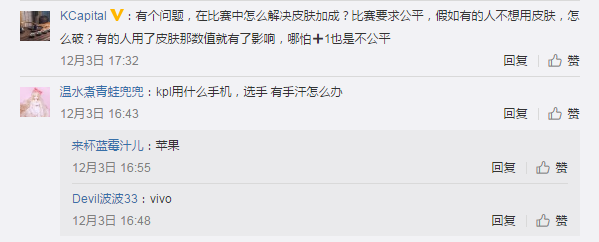
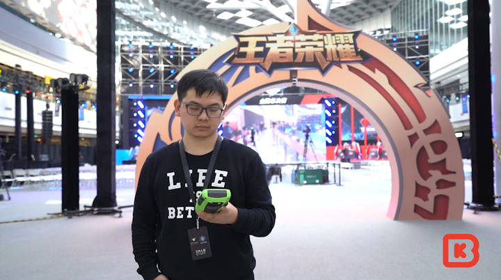
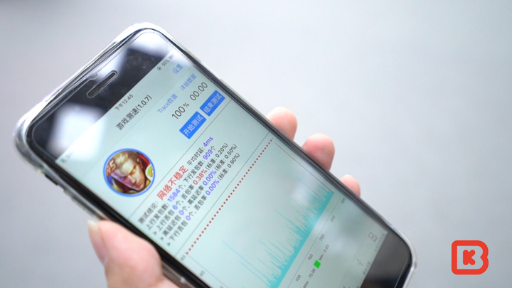
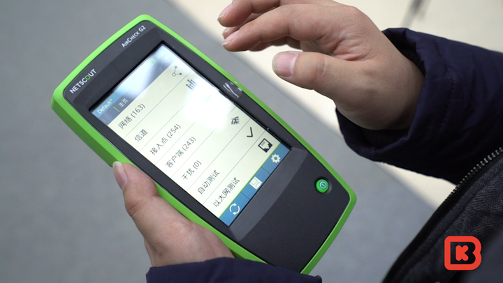
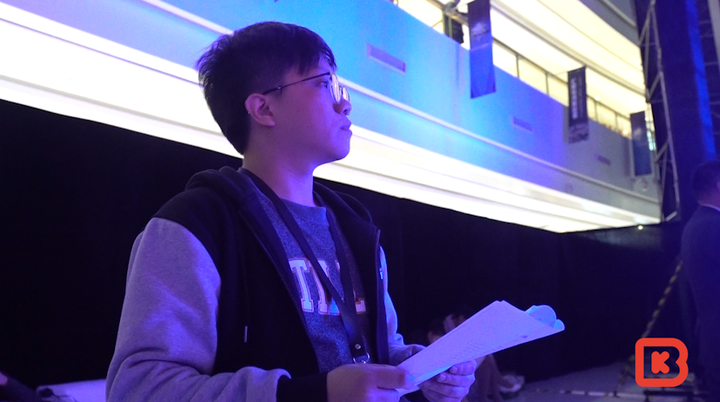
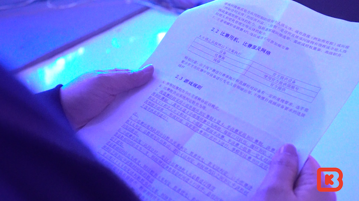
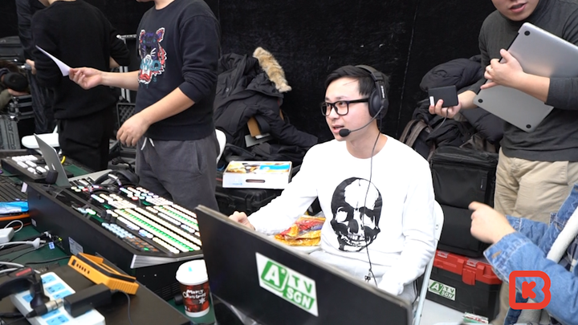

# 两年后，再看移动电竞

> 首发于知乎专栏（2017-12-15）原文链接：https://zhuanlan.zhihu.com/p/31942615

文/BBKinG

　　如果你两年前就看我的知乎，估计会记得 我当时是不看好移动电竞的，因为无论从硬件、软件、网络情况，还是操作精细度的处理，当时的手机游戏都没有处理的很好。

　　可是，两年后，王者荣耀的大火，无论从现实中还是数据上，都算是一种打脸吧。

　　不过，大众依然对移动电竞有很多质疑。

　　2017年12月10日，王者荣耀城市赛总决赛在北京合生汇举行，我受邀可以随意看随意问。

　　于是，我收集了大家的问题，找到王者荣耀项目的相关负责人，看看这个跟大众结合更紧密，赛事更亲民的城市赛，是怎么解决移动电竞方面的问题的。

　　问题1：王者荣耀的比赛如何保障现场网络的稳定？

　　回答者：王者荣耀运维负责人 Haris

　　答：为了解决现场的网络问题，我们采用了线下服的方案，然后让选手和整个服务器在同一个局域网内。我们专门开发了一款软件叫“智营网优”用来验证我们赛事所用的手机以及现场的网络是否能够达到我们赛事的标准。像这样的大型商场，有很多的无线WiFi，它们之间会进行干扰，我们会提前进行网络测试，选择利用率最低的信道以保证我们赛事稳定运行。

　　问题2：王者荣耀的皮肤是有属性的，怎么保持比赛的公平性？

　　回答者：王者荣耀 赛事运营 戴廷达

　　答：在赛前我们都会寻找所有比赛的规则，关于皮肤的部分我们会讲解它的属性的影响性，我们会提供全英雄全皮肤的账号供参赛选手使用，也会保证其所有的公平性。

　　问题3：比赛时是使用什么型号手机进行的？选手的手汗怎么处理？

　　答：王者荣耀运营团队测试了市面上所有的手机，测试结果是 iPhone7plus 是能够在王者电竞比赛下运行最顺畅的一款手机。

　　有些玩家可能会问到，如果有手汗的问题会怎么解决，在赛前呢我们都会询问我们的参赛选手，我们可能会提供爽手粉、纸巾、毛巾来解决他们的问题。

　　问题4：如何增进王者荣耀的比赛现场的观赏性？

　　回答者：现场总导演 顾铭

　　答：为了给我们城市总决赛这次观众不一样的体验，我们在一血以及团战的胜利以后，我们在游戏中大龙及小龙打败它们以后，我们会在灯光和音效上面给到我们观众一个不一样的视觉体验。

　　问题5：移动电竞项目的赛事转播和PC电竞项目的转播有什么区别？

　　答：PC端和我们手游端在转播方面最大的区别就在于我们需要通过一些设备的转接把手机信号转到我们自己的直播信号中去，这个是我们PC端里面不会遇到的问题。

　　问题6：在经历了王者城市赛后，有什么感想？

　　回答者：冠军队伍SV战队领队 HanSir

　　答：这一路打下来，挺艰难的吧，因为王者城市赛是全民赛事中规模最大的，遇到了很多强手，希望能在KPL预选赛中获得好成绩。

　　现场还采访了两个王者级段位的观众，他们提出了一个问题：很想参加王者城市赛的线下比赛，但是不知道去哪里看相关的比赛预告信息，想知道有什么途径可以了解这些。

　　我们也跟主办方做了沟通，他们会尽快处理这个需求！

　　可以看出，移动电竞在场地选择方面，比PC电竞灵活多了，据悉很多城市赛的分赛点甚至是在景区内完成的，这将拓展电竞普及的边界，让电竞的概念更加深入到大众中。

　　感谢各方面的支持，希望以后有更多的机会可以了解移动电竞的发展。

以下是本次活动的视频完整版：

[

                                              https://www.zhihu.com/video/925063781065854976                          ](http://link.zhihu.com/?target=https%3A//www.zhihu.com/video/925063781065854976)
