# 中国游戏格斗圈 凝固的『芳华』

> 首发于知乎专栏（2017-12-25）原文链接：https://zhuanlan.zhihu.com/p/32326209

文/BBKinG

　　如果你接触过中国游戏格斗圈，你会发现这个圈子的时间，好像凝固在了某一个时刻。

　　比如，1998年，9岁称霸广州街机格斗界的小孩，2007年称霸日本斗剧世界总决赛，可到了20年后，2017年站在中国格斗界顶点上的，还是小孩。

　　格斗圈的人告诉我，如果有一天小孩不打了，中国游戏格斗职业选手可能就断档了，这个圈子的新人已经很少了，而且跟一线选手水平差距太大。

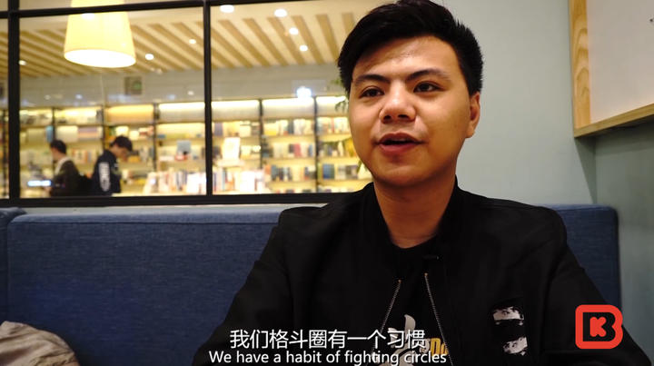

　　为什么新人少？你也能猜到。

　　PC和互联网的兴起，让游戏娱乐有了更多的选择，过去20年，街机厅没有赶上互联网时代的浪潮，孤寂的落寞了。

　　游戏软硬件的版权问题，让格斗游戏厂商把重点放在了游戏主机上，而中国的主机被禁了20多年，让中国跟世界游戏玩家的使用习惯完全不一样了。

　　就像北美规模影响力巨大的格斗游戏比赛EVO，在中国关注和了解的人，相对非常少。

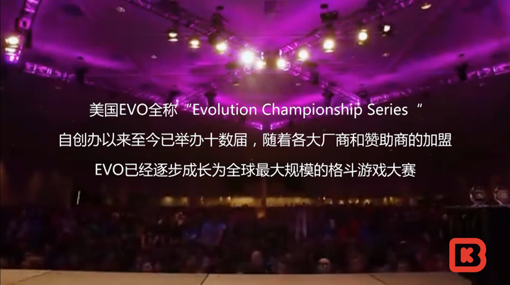

　　这些中国过去非常独特，甚至扭曲的发展历史，也让这个圈子里留下来的人变得很独特。

　　比如，他们这个圈子现在打比赛，会固执的只选择一个游戏人物作为自己的本命角色。

　　这意味着，无论这个游戏人物未来被版本增强还是削弱，他们都不会改变自己的选择。

　　如果你用了别的角色，即使赢了比赛，也不会赢得大家的尊重，大家会觉得这是版本的功劳，而不是你的水平。

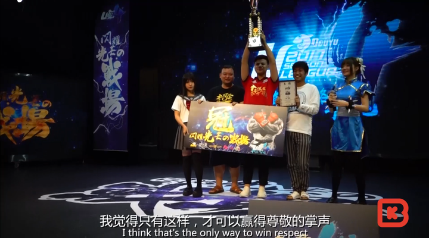

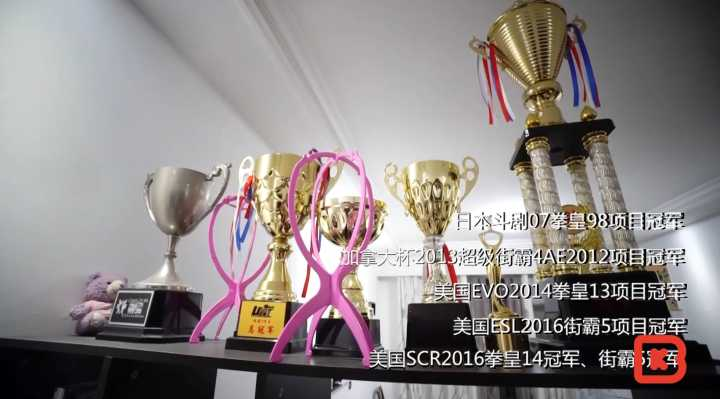

　　在全世界格斗爱好者这样近乎偏执的坚持下，格斗技巧也有了很多神乎其神的发展。

　　有一种技巧，就叫复合操作，简单的说，这种操作会在出手一个瞬间摇出截然相反的两手准备。

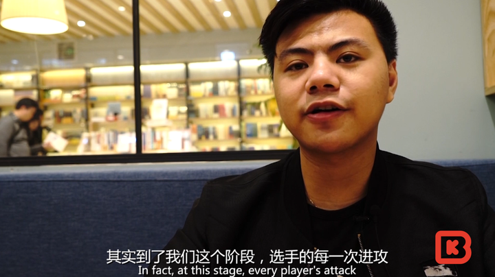

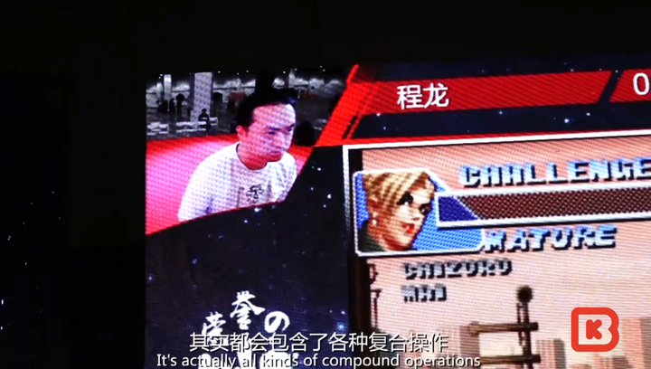

　　原理就是，你打对方时，对方要么挡，要么跑，如果他挡，你们手会撞上，这就会出现一个定格，这个定格会清除这一瞬间之前的所有操作。

　　那么，在这个即将定格的一瞬间，如果摇了一个突进跟随的攻击技能，对手没有挡，直接后退，那定格就不会出现，技能会释放，且会在对方后退的过程中释放，对方来不及挡，就会被击中。

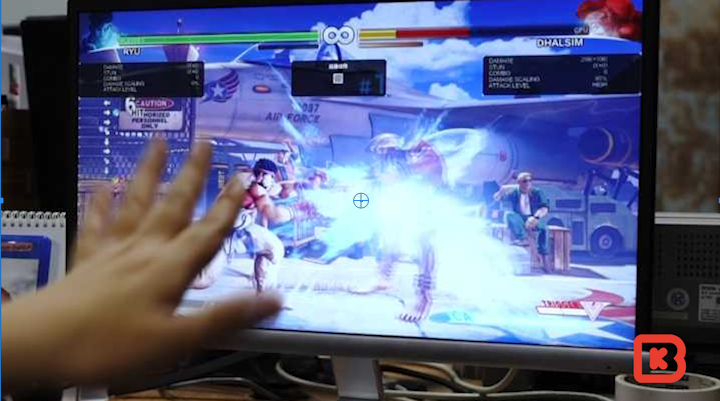

　　这种利用定格会消除操作的技巧，是日本选手发明的，小孩第一次在一个大赛中看到时，惊为天人，他眼睁睁的看着，日本选手的角色会瞬间跟随攻击，打的对方措手不及。

　　现在这个技巧已经成为职业格斗选手的基本技巧了，被大家开发出各种套路式的打法。

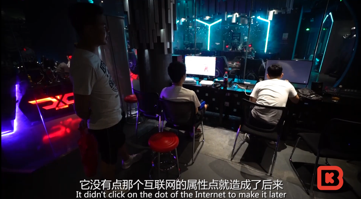

　　20多年的职业生涯，小孩一直站在一线，说起来，这在世界电竞历史上，也算是一个纪录了。

　　毕竟，他出道的时候，还没中国电子竞技这个词呢。

　　这也造成了，格斗圈对于电子竞技这个词有着很复杂的情绪，他们甚至也是在直播兴起了一段时间后，才跟互联网有了更紧密的结合。

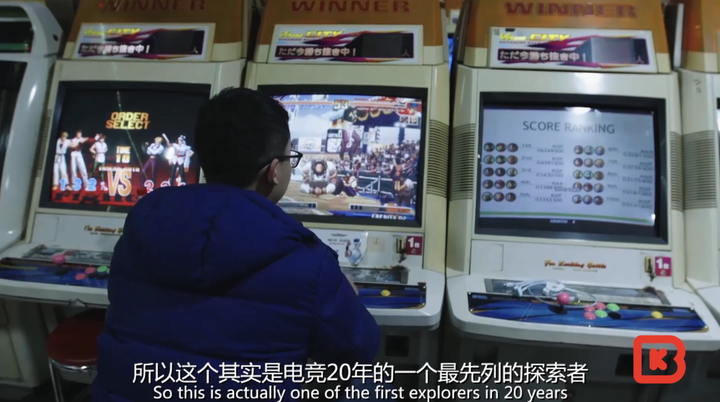

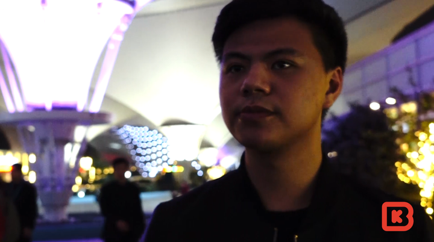

　　1989年出生的曾卓君，已经快29岁了。

　　曾经的他拥有别人羡慕的芳华，每周末被父亲开这车送去街机厅打比赛，18岁在日本站在世界格斗大赛的舞台上夺冠，单手连败十个日本顶级格斗选手，被称为电竞英雄。

　　虽然大家依然叫他小孩，但是他也很清楚，自己的青春已经不在了。

　　芳华逝去，看着他每天在直播中跟观众互动，参加各种活动，台下却观众寥寥，我总有种说不出的遗憾，还好我们活在影像的时代，可以有机会再重现我们的芳华。

[
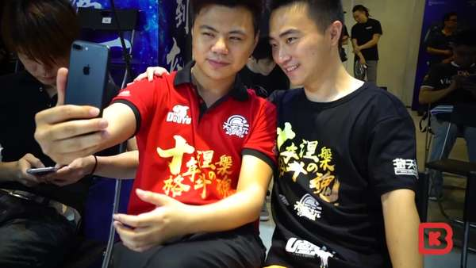
                                              https://www.zhihu.com/video/928734557824507904                          ](http://link.zhihu.com/?target=https%3A//www.zhihu.com/video/928734557824507904)            『BBKinG』短纪录片

英雄不朽！

记录我们自己的芳华！
