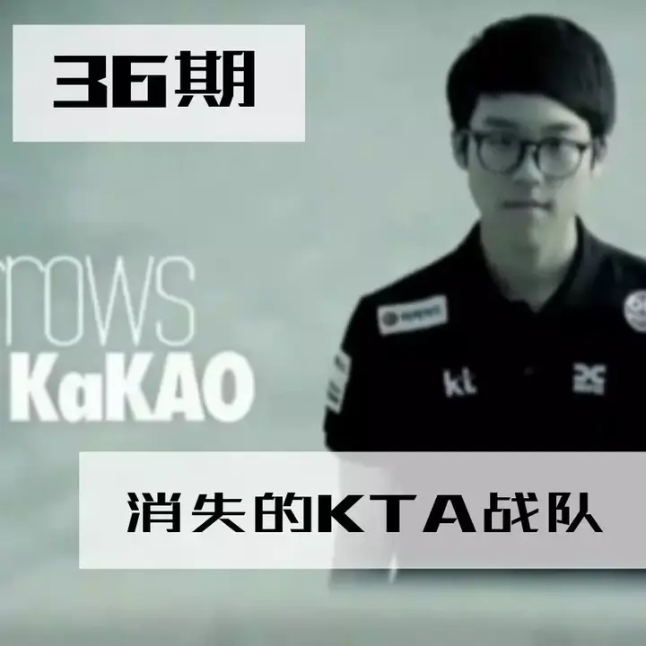
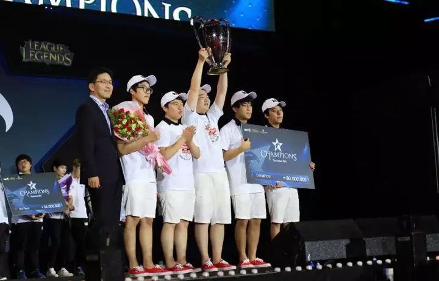
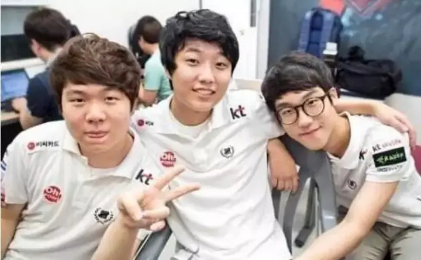
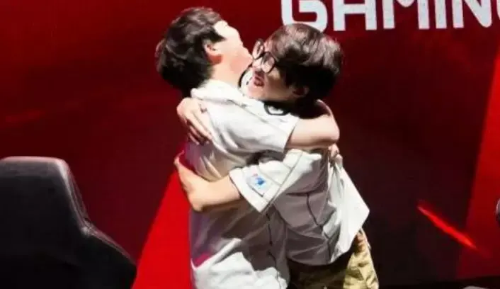
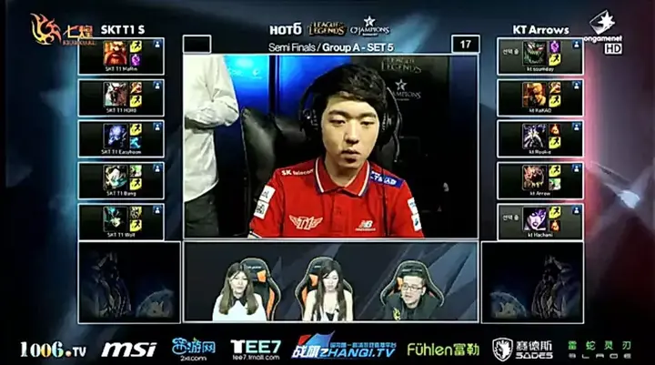
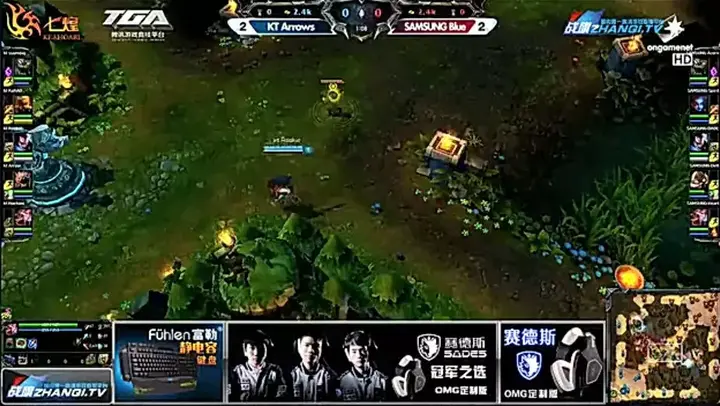
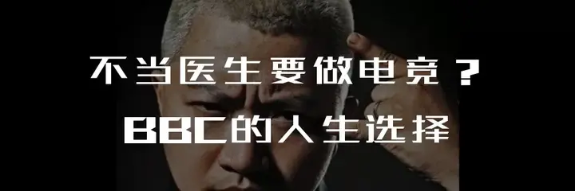
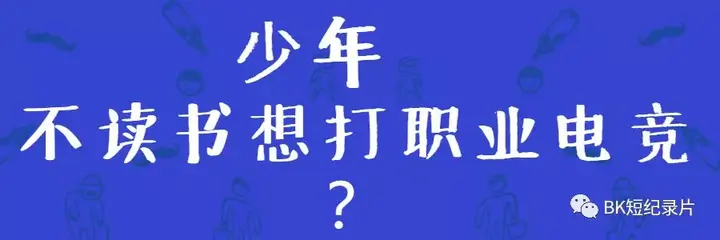
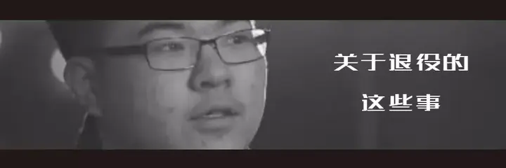

# 电竞比赛规则探索的牺牲品 韩国KTA战队

> 首发于知乎专栏（2018-04-16）原文链接：https://zhuanlan.zhihu.com/p/35753492

文／BK短纪录片

**　　他们是OGN的最后一个冠军，也是唯一一支拿到夏季赛冠军却无缘最终世界赛的队伍。**

　　时至今日，或许大家还记得Rookie出身KTA，甚至记得他们拿到了夏季赛冠军，却忘了最后他们有没有进入世界赛。

**　　传奇的KT战队**

　　毫无疑问作为联赛老牌强队，KT一直是一个传奇的队伍，反复被提及的一场比赛两个劫KTB，在今年季后赛淘汰SKT，完成复仇的银河战舰KT Rolster。

　　KTB身上背负了太多的魔咒，可KTA的命运却更加惨淡。

　　它曾经以挑战者姿态，从季后赛冒泡赛的最顶层一路盲选进入决赛，甚至还附送了让二追三的表演，从无人看好到全场喝彩。

　　可他们也作为守擂者，在最终世界赛门票的争夺中，被最底层打上来的Najin White Shield击败，最终无缘世界赛。

　　他们是第一个，亦是最后一个夺得了夏季赛冠军却无缘世界赛的队伍。

　　是他们的经历迫使Riot修改赛制，让之后的每个夏季赛冠军以种子队名额出线。

　　也是因为这场失利，让Kakao意识到在OGN出线的难度，决定带领中单Rookie转投LPL，才成就了今天的IG。只为一个进军世界赛的机遇，拉开了S5这所谓的“LPL洋务运动”的序幕。

　　那或许是OGN出场英雄最少的版本，比赛时长最长的版本，在当时大龙与小龙不过是直接的经济转化，无法像现在一样利用BUFF快速推动比赛的进程。

　　中单发条、时光、炸弹人，ADC大嘴、小炮甚至上单卡萨丁，比赛时间直接40分钟后见，四保一也是从那时开始风靡全球，一时间打遍天下无敌手。

　　可这支KTA专注打自己前期快攻，让Kakao向世界证明四大野王并非空有其名，在所有人费力将比赛拖到大后期时在前期终结比赛，也是这支KTA在决赛中通过盲选击败了将四保一练到极致的SSB，证明了四保一并非是必胜的战术。

　　从那时候起，LCK赛区的神奇之处就已经注定：他们墨守成规，但最终取胜的一定是打破常规的队伍。

**盲选之王**

　　在OGN联赛还采取观众最喜闻乐见的盲选赛制时，这支KTA一路打满BO5，在最终的盲选局依靠出其不意的选人以及快攻的节奏斩杀了许多队伍，从无人问津到季后赛的黑马，从默默无闻到最终决赛现场全场高喊KTA。

　　在当时他们不算明星战队，也并非夺冠热门，摇摇欲坠的晋级路程，让大家觉得他们可能将会在这一轮折戟。

　　但每次他们都能神奇的将比赛拖入盲选局，带入KTA节奏。如果换成盲选赛制取消的今天，KTA的命运又将如何呢？

**最终的落幕**

　　没有人能够想到，Ggoong能够用劫带领队伍完成一串三的壮举，如果曾经杀入世界赛的是KTA，那么还会不会有OMG三比零的故事？

　　随着“一家俱乐部只能在同级联赛拥有一支战队”政策出台，OGN变为LCK，队伍发生大规模重组，这支KTA的故事也就逐渐落下了帷幕。

　　从开始的遗憾，到如今的记不清，这支黑马的故事，也仅仅只在人们的记忆了停留了不足三年的时光，从万众感叹到世人遗忘不过弹指一挥间。

- **往期回顾 微信搜索 BK短纪录片 **

