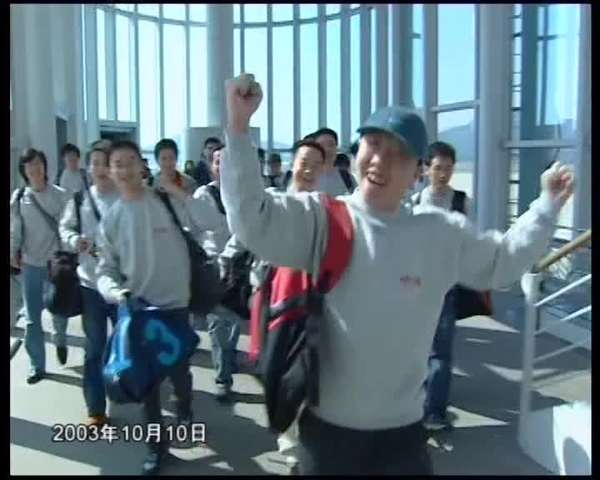
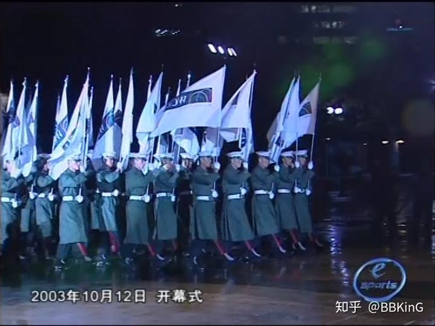
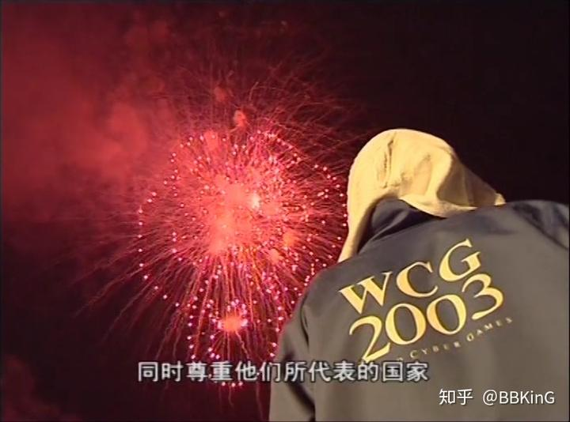
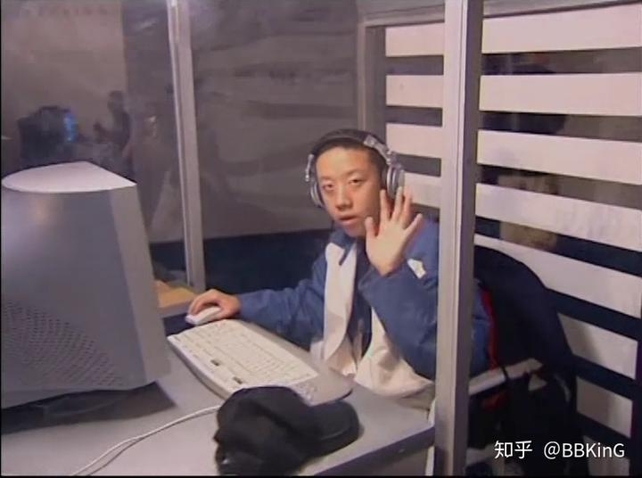
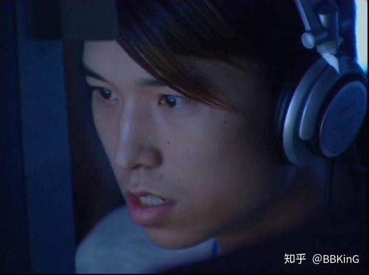
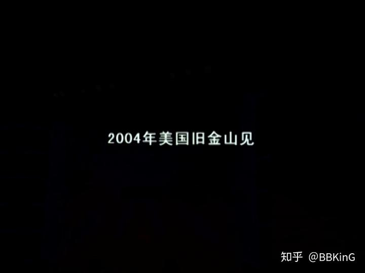

# 黑暗前的黎明 WCG2003未播出的纪录片

> 首发于知乎专栏（2018-05-04）原文链接：https://zhuanlan.zhihu.com/p/36406132

文/BBKinG

　　这是CCTV5《电子竞技世界》拍摄的2003年WCG世界总决赛纪录片，据当时的编导说，这个片子只播出过了一半，另一半还没播出，就被叫停了，后来放在一个杂志的DVD中发出，一位珍藏DVD的电竞爱好者把视频发给了我，我回绝了DVD，这是属于他的藏品，我不能要。

[

                                              https://www.zhihu.com/video/975699601358028800                          ](http://link.zhihu.com/?target=https%3A//www.zhihu.com/video/975699601358028800)            　　大家在视频中，能看到很多耳熟能详的电竞老人，这些人15年前，都20左右，现在都是35岁的中年人了，大家在朋友圈中的留言，都蛮伤感，比如，那时我好瘦，等等。

　　说点背景故事吧。

　　2003年，是中国电竞历史上最光明的一年，在经过了从1998年到2003年，世界电竞项目、赛事和运营模式对中国的各种影响和教育后，中国电竞开始发芽了。

　　在赛事方面，WCG中国区已经在国内铺到8个赛区以上了，北到东三省，西到成都重庆，东部沿海，广东广西，辐射全国，总决赛放在北京的奥体羽毛球馆，ESWC和CPL都还是财大气粗，赞助商热捧的时候，也都有了国内的选拔赛。

　　赞助商方面，华硕、戴尔、联想等等，当时的电脑硬件厂商，都是疯狂砸钱办各种全国性质的大小比赛，以至于出现了一些专门跟着巡回比赛全国跑的抢钱职业战队，当时没有限制每个队伍参加次数的规则，甚至WCG分赛区也能重复打。

　　在传播渠道方面，2003年4月4日，CCTV5开了一个节目叫《电子竞技世界》，注意这并不是当时唯一一个做电竞和游戏内容的节目，当时各大卫视都已经推出自己的游戏节目几年了。

　　电竞俱乐部也开始进入职业化发展，WE的前身YollinY（友菱电通）已经是全职业战队了，拥有Suho等等知名选手。

　　年底更是高潮，电竞被划为正式体育项目，也是2003年。

　　民间有群众基础、传播有主流频道、政府亮绿灯、商家愿意出钱。

　　我想不到，中国电竞历史上，还有哪一年能与2003年相比了。

　　当片尾字幕出现『2004年美国旧金山见』的时候，让我异常痛心。

　　因为，估计当时的所有人都想不到，911事件之后，美国升级了签证审核，2004年WCG中国代表队，几乎全体被拒签（只过了2个选手，1个FIFA，1个星际）。

　　2004年4月，广电下发通知，所有卫视和开路频道的游戏类电视节目，全部被停播，赞助商开始撤离。

　　2003年过去了，那年我19岁，我很想念它。

　　那个DVD里，还有很多2003年别的视频，我会陆续发出来，可以关注我的公众号

**　　BK短纪录片**
