# 七 单隽的困惑 中国独立游戏人

> 首发于知乎专栏（2015-10-15）原文链接：https://zhuanlan.zhihu.com/p/20262129

中国游戏幕后史 七
单隽的困惑 中国独立游戏人
文/BBKinG

　　单隽的经历很特别，15岁开始独立编写即时战略游戏，19岁获得中科大『全国大学生游戏比赛』冠军，23岁成为盛大最年轻的游戏项目经理，27岁创业，并在微软Xbox Live Arcade上发布了主机3D格斗游戏《风卷残云》，获得国内外多项游戏大奖。

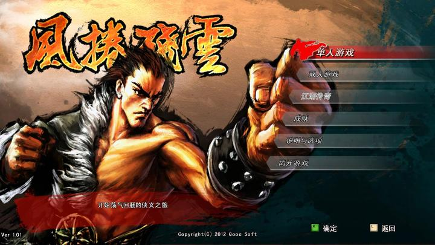

 　　『什么是独立游戏人？』

　　这是刚参展完『2015东京电玩展TGS』的单隽，看完采访大纲后，问我的第一个问题。

　　『财务独立？想法独立？制作独立？不为赚钱？这些好像都无法完整准确的概括独立游戏呀。』单隽微笑着表达了对这个名词的困惑。

　　我原以为，以单隽在中国游戏圈起伏跌宕的经历，会告诉我一个简单明确的答案。

　　也许，也正因为他经历了这些，才知道这个答案从未简单过。

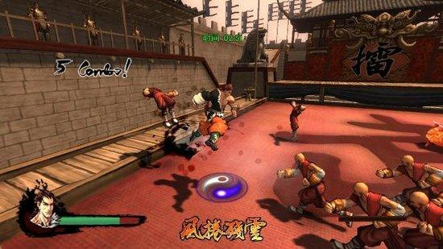

 　　单隽，1981年8月30日，出生于上海，小时候一家人挤在十平米不到的房子里，父母也很早就离异了，长期的压抑和家庭的动荡，对他的性格影响很大，孤僻、内向，却好胜、强烈渴望表达。

　　绘画天赋，为单隽开启了一个全新的世界

　　童年画汽车火车，一年级画变形金刚，四年级画圣斗士星矢，无一不被朋友和同学到处传阅，这让他非常有成就感，于是，初中开始有了自己创作的漫画集，特别是格斗漫画，之后越画越多，越画越深。

　　到高一时，他画漫画已经很有经验了，开始前会先写5万字的脚本，然后定期发布每本20页的手绘单行本，无数天马行空的想法被融入到自己的创作中，他甚至把自己很多的同学，变成漫画中的角色，这让他的作品得到了更加广泛的传播。

　　一边是，单隽沉浸在自己创造的一个个虚拟的世界中翱翔。

　　另一边是，他的老师和父母陷于了『支持还是反对？』的纠结之中。还好，这时候的单隽并没有什么困惑，他曾一度认为，画画就是自己的未来。

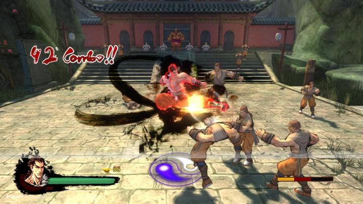

 　　直到高一那年，学校开了电脑编程课。这门课虽然只开了半学期，却改变了单隽一生。

　　这门课让他突然发现，原来自己从小跟父亲去沪西工人文化宫玩的魂斗罗，吃豆人，小蜜蜂就是通过眼前的这一条一条程序命令编写出来的。

　　这个发现让他激动不已，他终于可以创造一个『活』的世界了，而且刚好家里也给他买了电脑，让他可以有更多的时间去研究游戏编程。

　　于是，单隽以前上课无聊时设计的纸牌桌游，变成了有攻击有防御的电脑战棋游戏。

　　他又用调色板点像素画画的方式，把以前在纸上躺着的坦克，变成可以到处行走的战车，车上的炮塔还是可以旋转的，玩的人甚至可以选择不同种类的炮塔。

　　单隽创造的世界越来越大了，拿着火箭筒的士兵，可以发射的导弹，多兵种混合的部队，甚至可以即时对战。

　　闻风而来的同学，组队到他家玩游戏，但他只有一台电脑。

　　于是，他把程序写成在一个屏幕上左右分开显示的游戏。

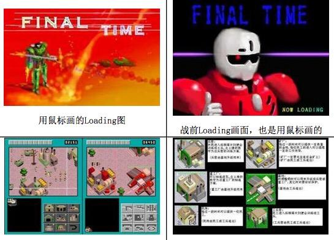

 　　只是对战的时候，需要有一个人拿本书挡住两边的视线，左边的同学用键盘控制，右边的用鼠标控制。

　　虽然现在看起来，这种方式蛮傻的，但是在90年代末的一群小孩子眼里，能参与并创造自己的游戏世界！这是大人们无法想象的惊喜和快乐。

　　1999年，单隽考入上海交通大学美术系，强大的上交大计算机选修课和图书馆，让他的游戏编程技术突飞猛进。

　　由于上海交大规定：大二才可以在学校里有自己的电脑。所以当他大二拿到电脑后，就开始制作一款更加复杂的对战游戏。

　　单隽说，这是一款要让看的人也觉得有意思的游戏！

　　这个创意来自于单隽小时候的一个体验，他有个亲戚非常喜欢默默一人在家玩策略类游戏，即使他和其他孩子作为客人来了，也只有坐在一边眼巴巴看的份，有时一看就是一整天，他当时就想，如果能让看的人也能分享游戏的快乐，那该多好啊。

　　带着这个想法，他在跟很多朋友、同学、以及同样很喜欢游戏的哥哥单晖（现腾讯天天酷跑 游戏制作人）沟通探讨后，他决定设计一个机器人对战的游戏。

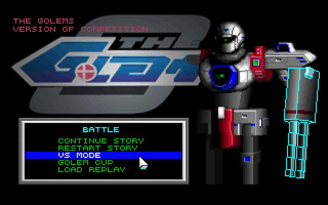

 　　这个游戏的玩法很特别，单隽设计了几个不同属性的机器人，比如，有火力强大的，有抓住敌人给同伴创造进攻机会的，也有可以敏捷的绕到敌人身后踢屁股的，还有专门打远程狙击的，近战肉搏的等等。

　　玩的人并不是直接联网实时操作机器人对战，而是事先用软盘来存储机器人的预设命令，需要编写大量的预判和执行程序，然后一起载入到同一台比赛机器上，让双方的机器人自行对决。

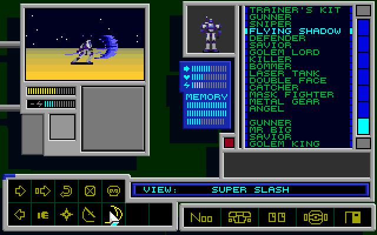

 　　简单的说，这比的是人工智能AI的设计，看看谁的机器人能在非人工操作的状态下，能更聪明的应对各种突发情况。

　　单隽通过计算机协会在交大里组织了一场比赛，吸引了很多好奇的游戏爱好者参加了比赛。

　　比赛那天的现场效果好极了，大家设计的程序一个一个的拿出来PK，观众笑的前仰后合，因为有的机器人程序写的不够完善，所以会显得非常的蠢萌，有的在不断原地转身，有的到处开火甚至打中了自己人，也有非常厉害的，能判断各种状态，让现场惊呼连连。

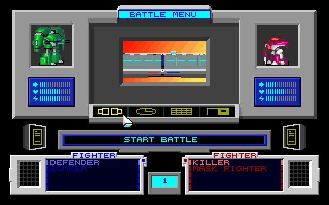

　　单隽的哥哥此时正在中科大读书，看过他的游戏后，建议他带着这个游戏来参加由中科大举办的一年一度的『全国大学生游戏比赛』，也就是在这个比赛上，单隽拿到了人生第一个冠军。

　　可是，收获最大的却是，他认识了一群独立游戏制作者。

　　特别是一位来自成都电子科技大的小伙，也就是那场比赛的亚军，告诉他了很多自己之前并不知道的系统底层操作技术。

　　其中最重要的是，一种可以突破DOS内存640K限制的技术，虽然在像素游戏的时代，大多数图片都很小，整个游戏也不过一两兆，但是因为这个限制，让很多游戏的制作者必须在游戏稳定性和复杂丰富的内容之间做选择，突破了这个限制，单隽就可以去设计更大更复杂的游戏了。

　　于是，大三时，单隽在校友胡岭的邀请下，加入了上海交大的一个游戏制作团队，这个团队里还有另一个后来很著名的游戏制作人—陈星汉。

　　同时，憋了很久大招，练了很久空手道的单隽，终于可以开始做自己一直最想做的格斗游戏了，仅用两个月就用DOS做出了一个3D效果的Demo（样品），打斗效果是核心，还设计了物理计算。

　　这是那个格斗游戏在DOS下的游戏Demo运行效果

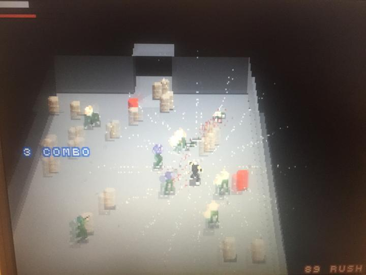

　　年轻的代价

　　有了团队，也有了技术，总的来说，单隽的人生在往好的方向发展。

　　可是，因为年轻、不懂沟通、欠缺团队合作经验、还有些许年少得志的自负，让单隽自身的问题也在此时暴露出来。

　　单隽说，年轻的独立游戏人往往是比较自我的，好的是会有很多独立思考，然而团队合作就是另一回事了。

　　显然，当时的单隽对这个度的把握还不够熟练，于是，团队班底虽然很不错，但因为沟通协调不足，三个原本期望很高的团队游戏作品，都没有达到预期。

　　不过，很可惜，这件事并没有让他产生什么警觉。

　　这一年是2003年，单隽大四了，以盛大为首的中国网络游戏产业正搞得如火如荼。

　　以计算机著称的上海交通大学，自然成了人才招揽的首要目标，单隽前后几次参加游戏设计大赛拿奖的履历，也自然而然的进入了盛大的核心研发部门。

　　做了2周客服，2个月运营之后，单隽回到《传奇世界》项目研发部，负责场景和关卡的设计。

　　单隽说，那一年很累，虽然他作为一个暴雪暗黑2的爱好者，并不喜欢传奇，但他依然在很努力的工作，因为只有这样，才能获得一个能自己设计游戏的机会。

　　一年后，《传奇世界》获得巨大的成功，23岁的单隽也如愿成为盛大最年轻的游戏项目经理，负责开发一款休闲类的战棋游戏《三国豪侠传》。

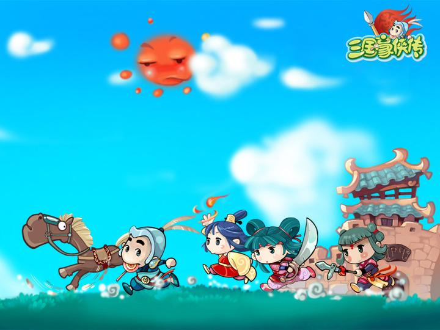

　　这款游戏的核心亮点设计是，可以不用等别人的回合就可以继续玩。

　　游戏的Demo很快被设计出来了，数据非常不平衡，单隽很不满意，但运营方面觉得非常好，他们认为不公平正是玩家追求成长的动力，如果有不公平的技能存在，玩家反而会留下来一直玩下去。

　　可是，年轻又理想主义的单隽，开始犯轴了，他没有虚心听取运营方面的商业化建议，坚持了自己对游戏的看法，去平衡了游戏数值，坚持低成长。

　　甚至，在一次陈天桥主持的公司策划交流会上，陈总提出，单隽的游戏中有个设计挺不错的，能不能再改简单一些。单隽立刻当面驳斥说，开发者应该有自己的追求。弄的现场整个气氛都瞬间僵掉了。

　　回想起那段时光，单隽非常懊悔，他说，自己年轻时的狂妄和自以为是，不但让自己错过了了解中国游戏用户的黄金时代，更重要的是，让很多本对自己十分器重的上司和同事彻底失望了。

　　2006年，《三国豪侠传》在经过了近2年的开发后，宣布失败，单隽作为项目负责人，责无旁贷，被盛大开除。
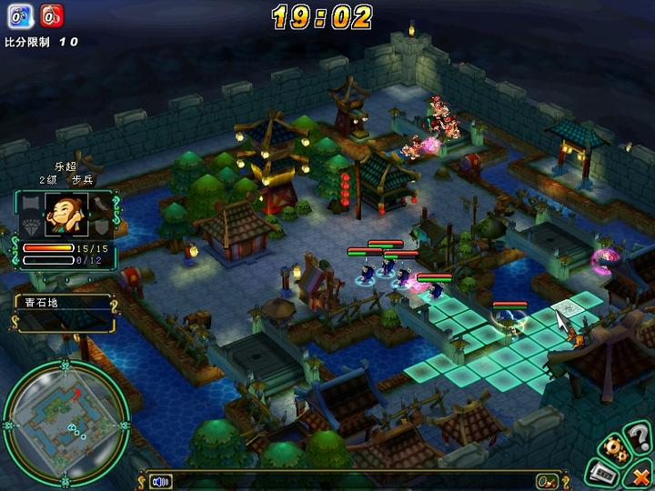

　　 当时的盛大，在很多人眼里，就是中国游戏制作人的天堂，财大气粗，产品给力，代理《魔兽世界》的九城，也不过是刚开始而已。

　　被盛大除名，意味着他在这个行业里被公开否定了，单隽真是一步从天堂跌进地狱。

　　而此时如梦初醒的单隽，也开始意识到了自己的问题。虽然觉得很委屈，但是也明白了自己的不足，觉得应该脚踏实地的去了解下国内比较畅销的休闲和角色扮演类游戏，比如，冒险岛。

　　单隽说，从那以后，自己虽然还会坚持一些东西，但是改变了很多。

　　离开盛大后，在朋友的介绍下，单隽进入了当时刚开始做游戏软件外包的上海灵禅公司，担任项目经理。

　　之后，在跟世嘉的一个游戏项目的合作中，单隽偶然得知，美国微软为了给游戏主机Xbox平台进中国铺路，提前在成都成立了游戏孵化中心 ，有意挑选一些中国本土的游戏进入Xbox的线上游戏商店（Xbox Live Arcade）。

　　这对中国独立游戏和单隽来说，都是个绝好的机会，XBLA这个平台就像现在的苹果在线商店，而且更加严格，能上架的游戏，就会得到微软官方面向世界的推广机会，所以只要游戏好，就意味着会有海量的玩家和收入。

　　XBLA大大降低了游戏发行的门槛，让独立游戏只要很少的几个开发人员就可以真的独立起来。

　　单隽抓住了这个机会，用DOS做了一个叫『疯狂老鼠』的Demo，也是一个对战类的休闲小游戏，不到三个月就得到了微软的合作确认，而且是上Xbox的国际市场。

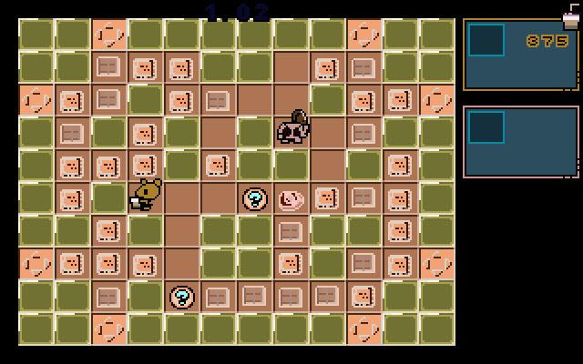

 　　这件事让他信心倍增，觉得『独立游戏+XBLA』这个避开国内市场，直接做国际化产品的路线似乎是可以走通的。

　　『现在回头看，当时真的是把独立游戏想的太简单了！』单隽坐在我对面，揶揄了自己一句。

　　2007年，在大学老友胡岭的再次召唤下，单隽辞职创业。

　　公司就2个人，胡岭写引擎和工具，单隽写核心逻辑，美术和音乐外包，所以一开始的游戏制作方向就定好了，就做单隽想做也擅长的格斗游戏， 于是，专门为Xbox Live Arcade平台定制的3D格斗游戏《风卷残云》出现了。

　　不过，想上平台推荐并没有那么简单，有两条路可以走，一条是参加微软组织的游戏比赛Dream Build Play，如果获得冠军，就有机会上，但是竞争相当激烈，会遇到全球的独立游戏开发者，最终的决赛往往都有四五十款游戏入围。

　　单隽他们在之后的2年里，只获得过一次三等奖，两次二等奖，接近，但是并不足够上XBLA。

　　另一条路是，找一个微软承认的发行商，通过这个发行商来登录XBLA。

　　这条路，几乎就是单隽之前面对的路子，简单的说，就是有个商业公司愿意投资你做游戏，之后上了平台大卖之后，大家利润分成。

　　此时已经是2007年到2009年，腾讯的网络休闲游戏已经在大赚特赚，而单隽这个专门为欧美人开发的主机格斗游戏，显然已经不再是国内市场上的主流。

　　2年的时间，发行都没谈下来，胡岭和单隽的积蓄快烧光了，家庭压力非常大。

　　胡岭的老婆快生了，他必须要去澳大利亚照顾家庭，两边为难的他提出，自己可以去那边赚钱养着单隽，继续做游戏。但是单隽觉得心里不过去，婉拒了这个提议，打算另谋出路。

　　2009年底，在中国国内游戏一片大好的情况下，单隽拿着一个独立游戏，却是走到了山穷水尽的地步。

　　他开始怀疑自己的选择，怀疑游戏的方向，怀疑独立游戏。

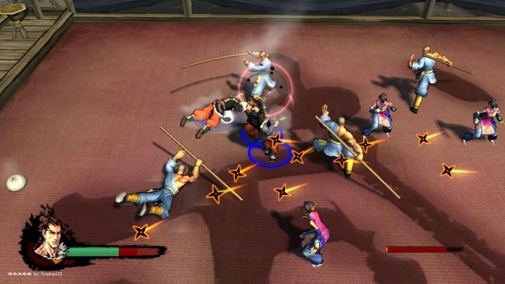

　　就在他最迷茫的时刻，一个万万没想到的地方，发生了一个转机。

　　单隽的老东家盛大18基金，决定以千万级别的投资赞助《风卷残云》，并且给三年的时间打造产品，这是一个非常不错的条件了。

　　单隽马上就组建起一个十几人的团队，而且因为有了盛大的背书，几乎是瞬间就谈成了一个国外的游戏发行公司，并且确定了与XBLA的合作。

　　有钱做游戏了，也能上Xbox的平台了。

　　忙活了2年都毫无成果的事情，几乎是瞬间就完成了。

　　Happy ending？

　　其实，我很想把文章结束在这里，告诉大家，单隽和他的独立游戏，从此过上了幸福和快乐的生活。

　　但是，现实总是那么残酷，之后的两年发生了2个大转折。

 　　一、《风卷残云》上线第一个月卖出了8000套，受到了国内外的玩家好评，至今还有一些玩家会在贴吧里活动，可就在应该发力推广的关键时刻，负责发行的那个国外公司，跟微软闹翻了，该公司的所有游戏被下架，《风卷残云》因此停售。

　　 二、盛大的18基金突然中止，单隽团队的第二款游戏刚做了一半，正是青黄不接的时刻，断粮了。

　　 2013年，几经风雨、苦苦支撑的单隽，终于撑不住了，心灰意冷，放下了自己所有做独立游戏的想法，开始做商业游戏，再次踏上拿着Demo到处找赞助的苦旅。因为此时的他已经不再是一个人在打拼了，他身后还有跟随自己多年的二十多个兄弟要照顾，他们背后也有很多生活和家庭的压力。

　　单隽说：『从为自己创业，做自己喜欢的游戏，到为别人负责，做别人喜欢的游戏，是自己人生中一个很大的转变，这并没有什么好与不好，也没有什么对与错的结论，我并没有放弃做自己想做的游戏，只是现在人更成熟了，没有以前那么偏激了。所以，当我再回头看 "什么是独立游戏？什么是独立游戏人？" 这个问题的时候，也会比以前更加复杂，更加平实了』

　　单隽，中国独立游戏人

---------------------------------------------------

　　招助理，不问出处，只看创意，详情点右|[如何把人的尸体挂在上海外滩的树上？ - 中国游戏幕后史 - 知乎专栏](http://zhuanlan.zhihu.com/bbking/20238904)
