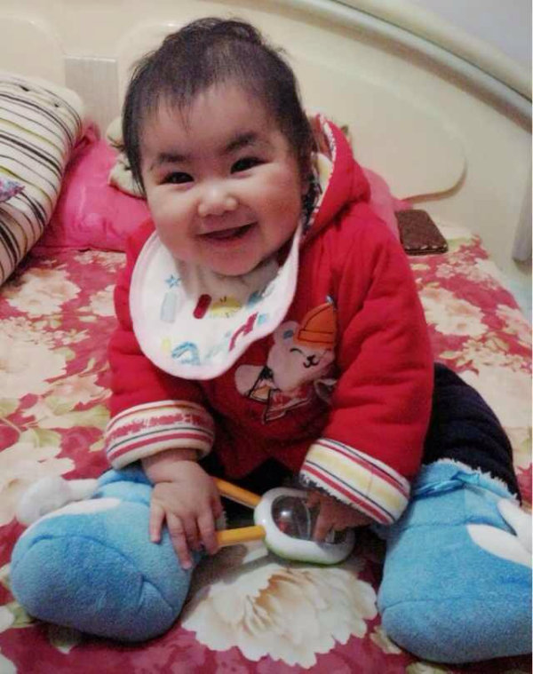

# 十三 川军先锋 马天元

> 首发于知乎专栏（2013-11-29）原文链接：https://zhuanlan.zhihu.com/p/19626821

中国电子竞技幕后史十三 川军先锋 马天元 文/BBKinG

　　在抗日战争中，每5个军人里就有1个是四川人。李宗仁曾评价道：“八年抗战，川军之功，殊不可没。”民间也有“川军能战”、“无川不成军”的美誉。

　　同样，四川人这种 "以天下为己任" 的文化在中国电子竞技的发展历史中也留下了浓墨重彩，Q3时代的孟阳，星际时代的马天元、重庆8DA战队以及他们的网站论坛，CS时代起源于四川的[http://Ccsk.net](http://link.zhihu.com/?target=http%3A//Ccsk.net)网站（Esai网的前身）和WNV战队（大部分为四川人），WAR3时代的CQ2000、WE.TED等等，无数电子竞技川军成员在这里燃烧了自己的青春，我会在幕后史中单独开辟出一个支线讲“中国电子竞技川渝军团”，以纪念他们的贡献。

　　马天元（MTY），中国电子竞技先驱者，很多人会进入电子竞技这个行业，就是因为看到他和DEEP（烤鸭）的一张照片， 那是2001年他们俩在韩国力克众多世界强敌，拿到了WCG星际争霸双打世界冠军后，高举五星红旗站在颁奖台上时的照片，这张照片对中国电子竞技的正面形象建设起到了极为深远的影响。

　　那一年马天元20岁，斗转星移，2013年，已经是33岁的老马在上海R2game公司工作，这是一家向欧美出口运营中国手机游戏和网页游戏的国际公司，老马专门负责在国内寻找合适的游戏项目。

　　1981年7月2日，马天元出生于四川成都一个工薪家庭中，从小聪明、机灵、叛逆、独立，父母管不住，当年一起玩的兄弟伙，现今没一个是走正道的。在这种环境下长大，自然少不了袍哥义气，兄弟情长，现在的马天元依稀也能看到点当年大哥的影子。从小学习看似很不上心，但是很擅长考试，有次家里说如果考到双百就给买游戏机，他就真的考到双百，但是也就那一次，平时的成绩依然很一般，可是高考时就认真了一下，这一认真就考进了四川大学计算机系，你说气人不！

　　1997年，马天元刚进大学就在电脑游戏方面展现出了惊人的天赋，《红色警报》打的全校知名，大二时还专门找了个游戏电脑房打工，因为星际争霸打的好，说是打工其实就是打游戏，因为光是靠他的名气每天就能帮电脑房吸引很多生意了。

　　随着1998年互联网的普及，马天元开始在网上跟游戏爱好者交流，鲲鹏战网成了他认识战友和对手的舞台，在此之后，接连不断的认识了后来大家熟知的Jeeps，Yr，洪哲夫，寒羽良（陈宇，现腾讯量子工作室负责人，重庆人），Kulou，Redapple等等星际高手。中国电子竞技川军的第一批人就是这样集结在一起的。

　　亚联战网的兴起与=A.G=（AsiaGame 亚联游戏战队）的成立

　　“电子竞技”这个词是舶来品，1999年，亚联游戏正在筹备中，当时国内还没有“电子竞技”这个概念，大家玩游戏还处于休闲娱乐的阶段，可是当时国外已经开始兴起这个概念，并且经过CPL等比赛的推广，已经发展的很不错了，很多在国外的华裔和留学生开始把这个概念引入中国，其中一个很重要的概念引入者叫胡海滨（美籍华裔，现在在美国），他认识亚联的一个副总，从美国回到中国后加入了亚联，并说服亚联把电子竞技作为公司的一个重要发展方向。

　　胡海滨回国后，认识了当时的星际争霸的名人Jeeps和寒羽良等，在经过半年的沟通后，在1999年10月1日胡海滨与Jeeps、寒羽良、马天元、易冉、CQZD闪电手、魔鬼天使等一起合并了成都战队-Rainbow、南充战队-天使战队、重庆战队-CQZD，组成了新战队=A.G=（AsiaGame 亚联游戏战队），这很有可能是中国第一支全职业电子竞技战队，因为完全脱产，每个正式成员都有工资，虽然只有2个项目2个选手，一个是打Q3的CHJ，一个就是打星际的马天元，工资2000块，这在当时已经是相当前卫的电子竞技职业化尝试了。

　　在亚联游戏的电子竞技部门里，胡海滨和Jeeps是=A.G=俱乐部的管理者，YR（易冉）负责后勤和战队管理，寒羽良负责宣传做了论战高手网站。

　　这里顺便说下，现在的AG.QQ会员.时空战线俱乐部就是由当初的=A.G=亚联战队发展而来，但是现在AG的全称已经改成了AllGamer，这个演变过程后面会讲到。

　　这里先说下亚联游戏的公司背景，方便大家理解后面发生的事情。

　　Asiagame（亚联游戏）隶属于海虹企业股份有限公司下属的子公司亚联赢通科技发展有限公司，这个公司之后同时代理了几款知名的网络游戏《千年》、《红月》、《战场》、《Online百战天虫》。海虹控股同时也是著名棋牌平台联众世界（ourgame）的母公司，无论是从注册用户看，还是公司规模看，海虹控股都是当时中国网络游戏领域首屈一指的先行者。

　　马天元的一出祁山，登上世界之巅

　　2000年初，19岁的马天元跟着同是电竞川军先锋的寒羽良来到了北京，开始了电子竞技职业选手生涯，此时亚联游戏的官网已经上线，亚联战网也在做最后的上线准备，整个电子竞技部门的目标很明确，就是为了推广电子竞技概念，让这个行业变的更加规范。

　　那是马天元第一次离开四川，当时的性格还很腼腆，平时话也不多，就是埋头打比赛，7个人住在北京一个一室两厅的房子里，但是每天都觉得很开心，感觉到处都是新鲜事物。

　　2000年的第一届WCG还叫WCGC时（从2001年改名叫WCG），马天元也去参加了，不过被很快淘汰，这促使他开始了更加疯狂的训练，除了睡觉每天十七八个小时都在亚联战网上打星际。

　　亚联战网由于购买了德国最先进的FSGS技术，使得平台在线人数的容量比其它战网大的多，人多约比赛就更容易，所以刚开不久就有了2000多人的在线，几乎全中国的星际高手都在这上面了，那时没有天梯和匹配系统，打比赛就只能在频道里喊话，可想而知早期的电子竞技选手想提高水平有多困难。

　　由于马天元每天都在亚联战网上横扫对手，却因为年龄小，心理素质差老是在正式比赛里输掉冠军，于是被大家称为无冕之王。

　　同时，马天元因为选择了电子竞技职业之路，自然无法兼顾学业，也失去了四川大学的毕业证书，我是觉得很可惜，但是马天元并不这样认为，他觉得这是自己的选择，没有过去就没有后来的事情了，他不觉得可惜。

　　WCG的前身2000年WCGC

　　2000年左右，中国星际争霸处于群雄逐鹿的时期，按照地域可以划分出的几个格局。

　　东北地区：以东北三剑客为首，洪哲夫、Eat、单挑王子

　　西南地区：重庆8da战队

　　华中地区：Star战队

　　上海地区：SVS战队

　　北京地区：=A.G=战队

　　湖北地区：Deep（烤鸭）也属于 =A.G= 战队、Xiaot

　　广州地区：[T.S] TopSpeed战队，代表人物Shomaru

　　以上资料肯定有遗漏，大家可以在我微博留言，我会在考证后不断补充进去。

　　之所以说这个格局，是因为2000年WCGC中国赛区的选手就是从这些大区中邀请的。

　　2000年，WCG的前身WCGC在中国的执行是由胡海滨、洪哲夫、Redapple等做的，因为当时中国电子竞技本身规模很小，所以没有做全国的选拔，只在邀请了中国32位顶级高手比赛，马天元也在其中，却依然因为紧张而被淘汰了。那一年中国星际的水平不低的，可惜那一年只有Kulou一个人的韩国签证过了，而他在韩国总决赛上的成绩也不太好。

　　此时的马天元已经充分意识到自己的心理素质问题了。

　　他开始有意识的针对自己的心理素质问题进行训练，终于在2001年初参加在天津举办的“北方网”天津电视星际对抗赛上获得冠军，这是他第一次拿到中国冠军，这次比赛汇聚了全中国的高手参加，所以是相当有含金量的一个冠军。

　　大家知道人在经历无数次的失败后，总会有些怀疑自己的，而第一个有份量的冠军往往会成为改变自己的起点和自信的源动力，从此马天元开始了自己的夺冠之路。

　　有了自信后，上手就是三个冠军，2001亚联全国24人精英邀请赛冠军，东魅&亚联全国64人精英邀请赛冠军，WCG中国选拔赛北京赛区冠军，可是在WCG中国区总决赛的时候，马天元又紧张了，前三个人可以去韩国，而他只打到了第四。

　　不过，不知道这算不算是命中注定的，第三个人的签证出了问题，于是马天元便去了韩国总决赛，那届WCG中国代表队有16个人，里边有大家熟悉的CQ2000，还有他的老队友Deep，领队是洪哲夫。

　　可能很多人不知道，星际争霸双打项目是他们到了韩国才知道的。

　　到了韩国，发现还有这样一个比赛项目？不打白不打啊！于是，洪哲夫赶紧帮Deep和马天元报了名，因为他们毕竟是AG的队友，以前有配合过。值得一说的是，这个星际争霸双打项目在2003年之后就没有了，而中国星际争霸个人项目在WCG最好的成绩也只是PJ在2007年打到的世界第二。可对大众来说，第二和金牌，光从名字上看这是没法比的，所以，我们只能再次感叹：这就是命啊！

　　星际争霸2V2项目总决赛那场是打德国队，里边有一个著名的选手叫鱼眼睛，比赛很激烈打到2比2平，现场有上千观众在欢呼呐喊，拿到冠军的那一瞬间，全场掌声雷动，马天元的脑海里却是一片空白，他说他什么都不记得了，一直到上台领奖时，手里拿着五星红旗时才醒过来。

　　那届WCG比赛奖金有6000美金，他分到了3000美金，算下来奖金奖金25000块人民币，这对于才20岁的马天元来说，是不小的一笔钱了。

　　回国后马天元受到了英雄式的接待，中央台的新闻在不断的报道，老家的地方台也在不断的报道，街坊邻居都在拿马天元的事迹鼓励小孩子，亲戚朋友到处的赞誉，一时间曾经的大反派变成了正面人物，让马天元瞬间登上了人生的顶点。

　　顶点之后就是转折了，如此突如其来，亚联战网的收费失败。

　　2001年11月15日，亚联战网正式开始强制性收费，很多电竞人原本预想这是中国电子竞技腾飞的起点，但是现在回头看，这最终成了亚联战网崩溃的起点。

　　关于亚联战网收费失败，历史上有过很多的描写和评价，我就不多说了，马天元觉得一方面还是时机早了点，用户群体也不是太成熟，另一方面他觉得当时的点卡渠道没有铺开也是很大的一个原因，18块一个月说起来并不贵，可是当时没有什么很便捷的支付方式，很多人有钱买不到点卡，免费战网又全部停掉了，平台人数开始大幅度下跌，玩的人少了比赛难约了，大家开始四散到其它小的免费战网上去，于是比赛更难约了，这就造成了恶性循环。

　　海虹控股对此非常失望，毅然放弃了电子竞技这条路，在收费失败后的2个月，撤掉了电子竞技部门。

　　对于那次事件，马天元觉得很遗憾，他觉得当时中国的星际水平离韩国并不远，只要有稳定的训练环境，超越是迟早的事情，可惜一切就这样突然断了，马天元只好回到了成都，Jeeps后来去做了游戏研发，YR去了房地产公司，Deep去了网络游戏公司，寒羽良去了腾讯，一群人就这样散了。

　　马天元作为一个职业选手，这个事件对他影响不是太大，每天还是保持训练，并到处参加比赛，直到2003年初，胡海滨拉到了英特尔的一笔投资在成都开了一家电竞馆“VA电竞馆”，有200多台电脑，马天元加入了他的这个电竞馆，保持的自己的训练，每天依然有很多全国各地的星际爱好者慕名而来。

　　WCG代表团里的常青树，马天元

　　从2001年到2003年，中国乃至全世界都涌现出了无数新的电子竞技明星，而马天元似乎成了WCG国家队里最稳定的队员，每年韩国总决赛都能看到他的身影，2002年拿到了WCG星际争霸单人项目的第五名，这是他职业生涯中最好的世界成绩了。

　　马天元在这几年中获得的各种比赛奖金和参加的各种商业活动也很多，粗略的算一下，马天元这几年每年大概有30万的收入，其中费用比较高的有北京动感地带的活动，开出3天1万块，这在10年前，一年收入可以买套房了。

　　可是当我问马天元当时有没有买房时，马天元有点尴尬的说：没买，拿到的奖金都到处请客吃饭了。

　　马天元二出祁山，却在2004年心灰意冷的退役

　　2003年，裴乐KinG成立了职业电子竞技战队YollinY（友菱电通）战队，他把马天元也拉了进来，不过，马天元也就在YollinY待了两个月就离开了，因为他找了赞助可以去做自己的俱乐部了。

　　2004年初，17Game公司打算做电子竞技项目，一年给50万做预算，马天元是这个项目的负责人，从时间和数字上看，这在当时是一笔相当不错的赞助，马天元也很乐观，于是，他从全国各地找来了各个项目的选手，其中包括号称双塔奇兵的SYC和广漠（因为他们2个人都很高）、XiaoT等等，还收编了一只CS女队，这就是有1212的New4战队，不过到了2005年，17Game觉得看不到回报，就停掉了电竞项目。

　　马天元也在电子竞技的道路上奔跑了这么多年后，终于觉得有些累了，于是就在2004年的WCG之后退役了。退役后的三年，马天元去了武汉，做些跟电子竞技完全无关的事情了。

　　马天元三出祁山，尝试新盈利模式的探索

　　马天元消失了三年，直到2008年WNV战队解散，XiaoT回到武汉。

　　XiaoT和马天元是2002年就认识，当时XiaoT只有14岁，马天元一直把他当弟弟，两个人再次聚首，聊了下，发现大家依然还有电竞梦，于是马天元又在当地找了一个投资，成立了VA俱乐部，设置了4个项目，并招收了大量知名队员，WAR3有XiaoT和Sed（现IG星际争霸2选手）、DOTA有430、星际争霸有GOL、CS有KingZ。

　　电子竞技培训模式

　　这一次复出，马天元就没有当初做俱乐部的盲目乐观了。他提出了非常清晰的以战队养战队的盈利模式——电子竞技培训模式

　　这个说起来有点类似于健身房的专属教练模式，加入俱乐部会员，可以预约指定的电子竞技项目教练，每个教练都有不同的价位，越有名的教练每小时收费越贵。

　　2009年，马天元在武汉一个体育中心里租了一个场地，弄了30台电脑，开始尝试这个模式。队员平时训练比赛，每周偶尔腾出时间做做私人教练，通过培训赚一些钱，赞助商那边也会给一些，战队基本可以自给自足，后来做了一年发展了近200个会员，不过毕竟大环境和自身的名气有限，使得这个模式很难得到快速发展。

　　2010年，马天元即将30岁了，回首人生，此起彼伏，于是乎，他回到了成都准备结婚生子。

　　马天元走了，XiaoT还年轻，于是他带着整个VA的班底加入了北京的CCM，而CCM后来被IG收了，于是大家最开始看到的IG就是XiaoT在带队。

　　马天元四出祁山，AG战队的再次重生。

　　马天元回到成都后，结识了时空战线网吧的老板，发现这个网吧里有一只非常具有潜力的CF队伍——FC，并结识了CF队伍的领队菲菲，于是，马天元决定请菲菲参与运营VA俱乐部。之后又邀请了昔日=A.G=战队的管理易冉加盟VA电子竞技俱乐部任总经理。后来在与寒羽良、jeeps、闪电手商量后决定恢复AG战队的名号，毕竟大家对这个名字还是很有感情，但是显然全称的意思要改一下，于是AG就成了现在的AllGamer。

　　至此，AG.迅游.时空战线重生了（现叫AG.QQ会员.时空战线）。

　　新的AG战队有了CF、英雄联盟、DOTA、星际争霸2四个项目，培训模式依然在做，战队的成绩也不错，一直名列前茅，2013年AG拿了CFPL的冠军，整个俱乐部都在往好的方向发展。可是，俱乐部发展的很好，队员的工资和奖金很高，马天元自己和所有俱乐部管理人员的薪水却并不高，这就是他的哥们义气给他带来的麻烦，他的性格注定他不会去跟队员分钱。可是，日子总要过下去吧。

　　马天元五出祁山，为了家人的幸福与快乐而奋斗。

　　2012年6月6日，马天元得到一个女儿，女儿的出生让马天元彻底的醒了，这么多年的电子竞技生涯，起起伏伏，够了，自己一个人颠沛流离无所谓，但是不能让家人跟着吃苦，他开始意识到要去做一些比较实在的事情了。于是，他再次复出，来到上海，加入R2Game公司，从头开始。

　　这里插一句，可能大家发现了，我从没有在幕后史里放过一张照片，这是我故意不放的，我想知道有多少人能把纯文字的东西读完，但是马天元女儿的这张照片我一定要放，我看这个照片第一眼时就被他女儿的笑容感染了，放佛整个人一瞬间就被净化了，全身充满了快乐，真是非常神奇的体验，我希望能传递这种快乐。

　　马天元说他把女儿的这张照片设置成了闹钟的界面，每天无论多累，只要闹钟响时爬起来看到这张照片，马上浑身都有动力了，说这话时，他的眼睛就没有离开过手机里的照片，眼神中满载着笑意。

　　看到马天元这个样子，我不禁感慨万分，耳边响起那段经典的画外音：那个戎马一生，杀敌无数的逍遥浪子，今生终于遇到了给他三颗痣的人，从此他自愿带上金箍，收敛起骄傲不驯的个性，拿起那根重一万三千五百斤，丈二长短，碗口粗细，可大可小可长可短的定海神针铁如意金箍棒，踏上了新的征途。

　　愿你一路安好！

　　中国电子竞技川军先锋，马天元
