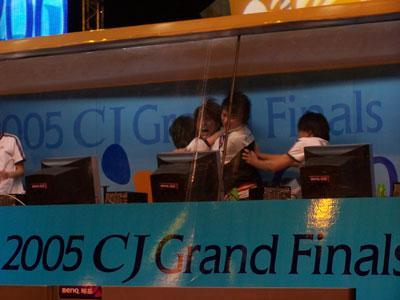
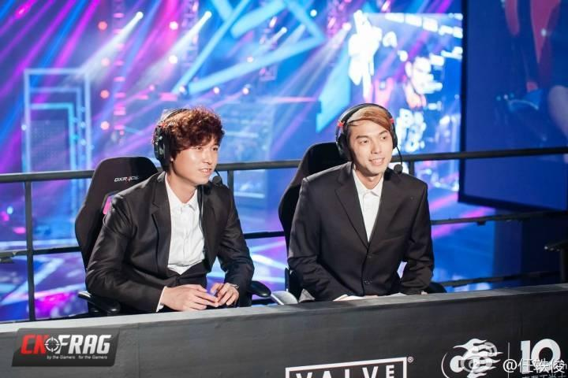
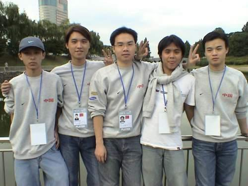
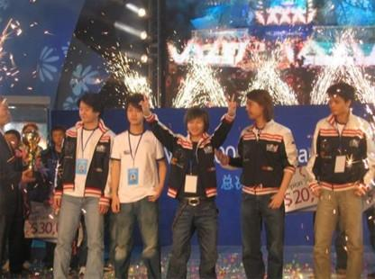

# 三十 世界级中国CS指挥官 Alex卞正伟

> 首发于知乎专栏（2014-03-02）原文链接：https://zhuanlan.zhihu.com/p/19691636

中国电子竞技幕后史 三十 世界级中国CS指挥官 Alex卞正伟

文/BBKinG

　　怎样才算是世界级的CS指挥官？

　　2005年12月11日，北京首钢体育馆。中国wNv.Gaming VS 韩国Project_kr战队，第三届WEG世界总决赛CS冠军争夺战。

　　三局两胜，wNv先输一局，然后扳平，把对手逼入第三局，决胜局地图Inferno。

　　开场wNv就落后，被打成3：6，局面已经坏到不能再坏了。没钱了，经济局，只能买手枪，现场观众紧张的鸦雀无声。

　　作为wNv队长的Alex决定破釜沉舟，赌一把，冲B点。

　　韩国人拼死防守，在B点发生激烈的近距离遭遇战。

　　wNv除了sakula全部阵亡，对方B点也只剩一个。两人都拼红了眼，近距离跳着圈对射，sakula子弹打光了，对面子弹也打光了。

　　就在对方换弹夹的一瞬间，sakula毫不犹豫的拔出匕首，一个跳转近身捅死了对手。

　　虽然那局还是丢了，但是现场燃了！

　　双方选手疯了，全场观众也疯了，加油助威声差点把房顶掀了，wNv士气大振，一口气冲到8：7，比赛进入下半场。

　　作为wNv队长和指挥的Alex却丝毫不敢大意，依然在沉着应对韩国人的犀利攻势。

　　最后一回合Project_kr战队主攻A点，wNv判断正确，回防及时，不但以2换4，还打掉了对方的雷包，并且十分从容冷静的给最后一名敌人做了一个陷阱，用交叉火力成功拿下了狡猾的韩国人。

　　最终，wNv以16：12获得WEG2005新科世界冠军。

　　赢了，梦想在那一瞬间变成了现实。

　　Alex说当时印象最深的是那个比赛房，韩国人做的隔音效果非常好，以至于他推开门的那一瞬间，全场爆掉的掌声和欢呼声才轰的一下砸进他耳朵里，那一刻，他觉得自己是世界上最幸福的人！

　　Alex卞正伟

　　曾效力NoA等世界一流队伍的著名挪威CS选手bsl说，Alex是他见过的最谨慎的领导者，而Team 3D战术指导bootman则直接说alex是他最不想遇到的指挥官。

　　当无数赞誉和鲜花扑面而来时，Alex永远都是那么谦虚有礼，总是大方得体的夸着队友。再加上他阳光英俊的外表和毫无绯闻的言行，也让他成了赞助商们眼中完美的CS代言人。

　　光荣与梦想都凝聚在了那一刻。

（图左是Alex卞正伟，右是著名前CS职业选手117）

　　时间暂停，开始倒转，世界慢慢开始变得昏暗，无光…

　　1982年2月28日，还不叫Alex的卞正伟出生在重庆九龙坡区，初中时父亲就因病去世了，母亲是电厂的工人，家里除了外公外婆，还有母亲弟弟的孩子等一大家子人需要照顾，生活的重担都压在母亲微薄的收入和外婆的退休工资上。

　　对，这又是一个以悲伤开始的故事。

　　Alex从小就喜欢足球，4岁就开始踢球，4年级时被老师看中，想送他到体功队接受专业训练，可是因为户口转学区要交5000块钱，当时家里实在拿不出这个钱，于是只好放弃职业路线，到处去混在别人队伍里踢野球。

　　因为敢带球敢突破，Alex初三时就已经在圈里小有名气，有次踢球被一个路过的教练看中，拉进了重庆红岩甲B青年队，终于成了一名职业球员，包吃包住，800块一个月的训练补助并不算多，但这让天生乐观的Alex已经很满足了，当时的他觉得管吃管住能踢球，还能贴补家用，有什么能比这更幸福？

　　可是好日子不长，2年后的1999年，重庆红岩被降到乙级，厂商取消了赞助，Alex的职业球员生涯到此结束，这时他才17岁，不甘心的他又开始回去帮企业队踢野球，后来还有一个房地产老板看中了他，雄心勃勃的打算带他们回甲B，本来很有希望成功的，可是因为一次市内企业和机关对抗的球赛黑幕，让这位房地产老板对足球彻底失望了，带着“惹不起躲的起”的愤慨毅然放弃了足球。

　　2001年在球队解散以后，Alex再一次陷入无球可踢也没有任何收入的人生漩涡中，19岁的他带着深深的失望和迷茫，漠然的放下了足球梦想。

　　也就是在那年7月，Alex第一次接触到了CS，可惜初次见面并不愉快，不知道是他的身体晕3D还是什么原因，第一次玩CS就把他玩吐了，十分难受，他很愤怒的说以后再也不玩这个游戏了，可是后来他发现整个网吧都在玩，朋友也在玩，于是只好继续玩下去，没想到不但没有再晕了，而且还越玩越喜欢。

　　打了两个月CS后，Alex发现CS竟然还有比赛？他身体里的竞技火种又点燃了，拉着班里的同学组了个战队，每天训练，还定了个目标：要打遍重庆发电厂家属区里的所有队伍，颇有点占山为王的意思。

　　没想到这目标半个月就实现了，不但在厂里打出了名气，还收编了三个队伍，自信心一下子膨胀起来了，开始到处打听周围有什么厉害的队伍，打算带着人马出去闯闯世界！

　　结果还真让他们问到了，说附近大坪有个队伍据称是重庆第三，于是Alex就带了一群小弟包了辆公交车，气势汹汹的去上门叫板，气焰那是相当的嚣张啊，结果用Alex自己的话说，被人家两个主力队员带了三个临时叫的路人差点把屎打出来。

　　一大帮人顿时就不敢嚣张了，默默站在对方身后看人家是怎么打的，才发现原来他们只会用MP5扫射，人家用的是AK和M4点射，而且人家用手雷和闪光弹配合玩战术，他们躲都不躲直接在往上冲，好比土匪遇到正规军，还这么嚣张的上门踢馆，真是丢人丢到家了，一群土包子灰头土脸一路无语的坐着公交车回去了，之后悄无声息的就散了。

　　虽然Alex也觉得很尴尬，但是不服输的体育精神还是让他清醒了过来，给自己定了新的目标：要拿到重庆第一！

　　目标有了，也知道问题出在哪了，这就是收获。于是，Alex开始去下载国外的CS录像研究了起来，起码这个路子是对的。但是他说，那个时候还谈不上是研究，只是模仿，别人怎么走，他们就怎么走，别人怎么扔雷，他们就怎么扔，也不太会去思考国外的队伍为什么要这样做，只是在枪法等个人技巧方面越来越娴熟了。

　　但是在2001年国内CS的那个发展阶段，是大多数人都还在拼枪的时代，所以国外战术能模仿的像也够用了，于是，Alex他们成立的A4U战队只用了半年时间，就在CBI主办的CS比赛上打赢了当时重庆排第一的C4战队，完成了本地制霸。

　　获得2002年CBI重庆赛区的冠军，就意味着可以代表重庆去上海参加中国总决赛了，这让Alex十分兴奋，第一次离开重庆坐了37个小时的硬座踏进全国这个新的战场。

　　新的战场，新的对手，新的高度，EVIL战队无疑是当年最引人注目的CS队伍，当时EVIL有三个最有名的分队，EVIL | UF、EVIL | FF、EVIL | GXU，很不幸Alex他们第一轮就跟FF和GXU分队分在了一起，被虐过程就不必说了，最后FF一路过关斩将拿到全国总冠军，不但有5万块的奖金（这在2002年是很高的），还有无数鲜花和掌声，这可把就在现场感同身受的Alex眼红的一塌糊涂，也让他咬牙定下了新的目标——全国冠军。

　　可是一回家，他们就遇到了一记当头棒喝，在WCG重庆赛区小组赛就被JF战队淘汰，C4战队再次拿到第一，输了之后，有队友说打算回去继续念书了，A4U战队就此解散了。

　　幸运的是打败他们的JF战队十分欣赏Alex，并把他和另一个队友招了进去，但是没有工资，只有网吧免费训练的待遇，这在2002年是很常见的电竞战队形态，别小看这个免费训练的待遇，这对刚20岁并且毫无收入的Alex来说，已经是天大的好处了，这意味着每天能省5块钱上网费，只用花4块钱来回的路费就能做自己喜欢做的事情，训练苦Alex并不怕，最难熬的是每天晚上通宵训练时队友买饭吃，自己明明饿的要死，不停的咽口水，嘴上却要笑着硬说自己不饿。

　　Alex说到这里的时候自己都笑了。还记得那句名言吗？现在很苦的事情，总有一天能笑着说出来。

　　天道酬勤。任何时候都不要小看这句话，Alex的机会就这样悄悄的来了。

　　2002年全国的CS气氛已经非常浓厚了，北京的DeviL战队打算成立VIP分队，包吃包住+每月1200块，这就是当时中国最顶级的职业战队待遇了，Alex得到了邀请，但是因为2002年6月蓝极速网吧事件，北京所有的网吧都关掉了，这事就一直拖到了12月，Alex才到了北京，此时网吧依然不允许开门，4个重庆人1个北京人组成的DeviL |
VIP战队只能在空旷的网吧里默默训练。

　　不过，即使在这样不利的训练环境下，Alex他们还是在2003年1月的网通杯上，连续2次击败夺冠大热门5DK战队拿到冠军，奖金5000块，Alex分到800块。

　　可网吧还是不能开门营业，这让DeviL战队的总队长也是网吧老板的110（网名）十分苦恼。当时电竞赛事能火起来，很大程度是因为各大新开的网吧想借比赛拉人气，国内硬件厂商开始大规模赞助电竞都是几年后的事了，所以当年蓝极速事件是真的影响很深远的。

　　可比起另一件事来，蓝极速的影响就小多了，2003年5月网吧的风波刚算是过去，Alex他们才开门训练了两三次，非典来了。所有的娱乐场所一夜之间全关了，三个重庆的队友被叫回了家，Alex硬是留了下来坚持在网上训练，等非典过去的时候，WCG还有一个月就开始了，可三个重庆队友却不来了。

　　Alex这个时候已经没空发火了，情急之下只好另外找人，联系到了前EVIL | UF战队的4个人Mahdi、ipig、Sprite、Luckyboy，以4个成都人和1个重庆人的组合，成立了后来名震天下的deViL*United战队。

　　可当时挡在deViL*U WCG之路上的对手，都是中国CS历史上最黄金时期的豪华阵容，而且当时大多队员都是头顶传奇光环的，比如，由CS传奇元老级明星KING带领的ICE战队，由Perfect、鸟鸟、OY、KinGZ、Butcher 组成的夺冠大热门Evil | Zero战队，著名的广东Rainbow战队，以及在全国到处抢比赛奖金抢到被真人PK的著名野战军China.V战队，还有不久前曾战胜deViL*U以北京赛区第一的身份进入总决赛的广西NP战队，最后别忘了Alex后来加入的战队wNv也在其中，如果你对CS历史稍微了解一点都能看出，这上面提到的队伍，每一个对于刚组建一个月的deViL*United来说都是硬骨头。

　　既然都来了，就啃吧，没想到，第一天就啃穿了。

　　deViL*U把上面这些队伍全送进了败者组，当然这在网上造成了极大的轰动和争论，各种黑幕和阴谋论全都出来了，别说粉丝们无法接受，其它队伍的选手也无法接受，于是，第二天败者组里剩下的4支队伍一致要求开着反作弊器打，但还是被deViL*U一路啃，最后在总决赛上再次战胜E | Zero，获得代表中国去韩国参加WCG世界总决赛的机会，可国内论坛上质疑的声音依然一浪高过一浪。

　　而此时的Alex完全没空在意这些，因为国外的一切都让他太激动了，2003年之前中国的CS比赛是不允许说话的，赢了比赛都不让说话，只能坐在那里像木头人一样鼓掌，这是一个很奇葩的事情，算是CS初期很中国特色的一个比赛规则，这个很畸形的规则由来以及后来的改变足够另写一篇论文了，这里先不展开。

　　国内的畸形的比赛规则，让Alex直到在WCG2003世界总决赛上，才发现CS比赛除了死了时不能说话，只要游戏角色活着，不但可以说话，还能欢呼雀跃，甚至可以嘲讽，Alex在这里玩的好嗨。除了可以尽情的享受游戏的乐趣，他还在这里近距离的看到了世界级的枪法和战术运用，这对于他后来形成自己的战术指挥体系起到了巨大的推进作用。

　　特别是当他看到最后WCG总决赛瑞典SK战队击败美国3D战队后，举起那张5万美金的牌子和WCG金牌时，Alex有了新的目标——世界冠军。

　　WCG结束了，Alex和他的小伙伴们一路披荆斩棘，第一次让中国CS拿到WCG世界前8的成绩，也终于向全世界证明了自己实力，到此国内的论坛里的争议和怀疑才告一段落。顺便提下，后来中国CS有三次进WCG世界前8，都有Alex的身影在。

　　回到当时，由于央视《电子竞技世界》栏目全程跟拍了WCG2003，并且在万众瞩目的CCTV5上连续播了几期WCG纪录片，deViL*U就这么火了，作为队长的Alex也火了，重庆晨报特别报道了Alex的故事，这让家人对他做电竞的怀疑态度有了根本的转变，他自己生活境遇也发生了巨大的改变，之前每天都在担心工资会不会被拖欠，战队会不会突然解散，在拿到WCG世界第8后，全中国的俱乐部都在挖Alex。

　　经过多方考虑，Alex接受了苏州Su.Z战队老板Oldfox开出的可以远程管理，每个队员每月1800块，只要挂队标打比赛就行的条件，带着U队回到了重庆，一切似乎都在往好的方向发展，但是WCG的激情随着日常训练在慢慢的消失，取而代之的是安逸、自满等情绪让队伍开始不断输比赛，之前被胜利掩盖掉的矛盾和问题开始一个个暴露出来。

　　2004年5月U队在北京打ESWC的决赛，从败者组冠军打上来最后输给wNv，Alex很不甘心的哭了，wNv的经理李杰和马超专门来找Alex，开出5000块工资让他组只新的全明星队伍。但是Alex没答应，他不想放弃，打算在WCG时再带队伍试一次。

　　可在7月的WCG中国区总决赛上，Alex的队伍在小组赛时就被淘汰了，这让他伤心欲绝，此时wNv的经理李杰和马超又一次找来，Alex在心灰意冷之下，打算换个环境试试，于是同意了wNv的邀请。

　　wNv最开始成立的2个分队叫wNv.Nerver和wNv.Wisdom，后来经过不断的融合调整，wNv.Nerver变成了[http://wNv.CN](http://link.zhihu.com/?target=http%3A//wNv.CN)，wNv.Wisdom变成了Alex领军的wNv.Gaming，当年的黄金阵容如下：

　　[http://wNv.CN](http://link.zhihu.com/?target=http%3A//wNv.CN)：Ray、Bigun、Rap、Aqi、aPs

　　wNv.Gaming：44‘alex、tK、sakula、Jungle、mikk

　　2004年12月，wNv.Gaming组成后练了半个月就拿到奥美王中王比赛的冠军，CN拿到亚军，当时wNv的训练基地是在写字楼里，还有专门的奖杯陈列室，待遇也是中国顶级电子竞技俱乐部的水准了。

　　Alex也是从这个时候开始被明确选为队伍指挥的，有了全局性的思考后，再加上对自己多年足球训练和电竞战队训练的经验总结和反思，他对电子竞技战队的训练和管理开始形成了自己的理解和体系。

　　Alex说他踢球时，最大的优势是敢带球敢突破，但是到了专业球队里，教练有取舍，队员有派系，个人的优势就被慢慢的磨光了，这是不对的。他认为训练时就应该因才而异，让每个队员都能发挥出自己的优势，鼓励他们打出自己的特点，并且协调团队的配合与默契，这样才能让团队的能量充分爆发出来。

　　也正是在这种思路下，2005年春节Sakula加入后，wNv.Gaming开启了自己的辉煌时代，先是轻松拿到ESWC去法国的资格，然后8连胜进入世界8强，最后以14：16的小分数败给了Mouz。2005年的WCG也很闹腾，世界总决赛采用了CSS这个游戏，这看似和CS一样的游戏，却跟CS1.6有着本质区别，以至于[http://wNv.CN](http://link.zhihu.com/?target=http%3A//wNv.CN)虽然拿到了中国区冠军的名额，却因为完全没练过CSS而放弃了资格，2006年的WCG就又换回CS1.6了，可随着CS黄金时代的式微，这个改变已经无足轻重了。

　　回到2005年的wNv.Gaming，那可真可以说是意气风发，朝气蓬勃，在韩国WEG第三赛季亚洲预选赛上，wNv.Gaming淘汰了日本，战胜了另一只中国战队AS（也就是上图117所在的队伍），在2005年11月，以第一名的身份与AS战队一起代表亚洲去韩国参加了WEG为期2个月的联赛。

　　这2个月让wNv.Gaming的水平有了翻天覆地的成长，这里要先夸下WEG，第三赛季他们得到了韩国CJ Media投资的20亿韩元，这使得WEG有足够的经费让所有队员住在首尔一个非常好的宾馆里每天训练，而且赛程节奏安排的非常好，每星期只需要打一到两场比赛，这让每个战队都可以非常仔细的研究下一场的对手，有充分的时间针对性的设计战术，这让Alex他们在战术理解层面受益匪浅，后期他们只需要根据对方人员的站位，就可以预测他们的走向，并且如果发现对方改变了风格，自己马上也有新的应对方法。

　　这才是电子竞技的魅力所在，斗智斗勇、比操作、比执行，把团队的智慧和默契度挖掘到极限，wNv.Gaming越打越兴奋，越打越有自信，最后以全胜的战绩完成2个月的异国进修之旅，回到国内与韩国Project_kr战队进行最后的对决，这也就是文章一开始的那一幕。

　　其实我很想把文章就截止在这一刻，努力的人最后实现了梦想！多完美的结局！

　　在过去的十多年里，虽然我做过很多电竞项目，但我骨子里还是一个狂热的CS爱好者，对我来说，可能没有哪个其它的游戏能像CS这样让我如此疯狂过，毫不夸张的说CS就是我的青春。所以，我个人很希望在这篇文章的结尾就写一句：从此他们就开始了幸福的生活。

　　可是，现实中并没有童话故事，生活还在继续，并且是以衰败的形式。

　　Alex说，当梦想和目标都实现后，迷茫也随之而来了，世界冠军都拿过了，不知道自己的新目标在哪里，训练量也不到以前的一半了。特别是在2006年拿了WEG大师赛冠军和ESWC中国冠军后，就更觉得自己很牛逼了，不断的胜利让人开始变得盲目的自信起来。

　　他现在回头看那个时期就会有很多反思，很多比赛都是2：1赢的，说明已经开始输比赛了，对手在研究自己，差距在不断的缩小，而他们自己却没有提高，还在用着老战术。

　　警钟终于被敲响了，2006年ESWC他们虽然去了法国，但是连第二阶段小组赛都没有出线就被淘汰了，这让饱含期待的国内粉丝大跌眼镜。

　　回国后wNv不但没有醒悟，还开始走极端，进行大换人，把CN分队的Aqi和Bigun与Gaming的tK和Mikk进行了对换，虽然随后就拿下了WSVG、WCG、KODE5等几个国内选拔赛的冠军，但队员之间的隔阂因为相互竞争等关系开始变得越来越疏远。

　　特别是在KODE5世界总决赛输给NIP后，所有的矛盾都积累到了一个临界点。用Alex的话说，就像没有打牢地基的大厦，经历一点风浪就会垮塌。

　　终于，在一次队员喝高酒后，埋藏在每个人心中的责备爆发了，先是口舌之争，然后Jungle气愤之下打了Aqi一拳，Aqi顺手拿起一个酒瓶想砸回去，但却把自己的手弄伤了，还缝了很多针，这直接导致在半个月后的意大利WCG总决赛上，wNv.Gaming16进8的阶段就输给了韩国队。

　　回国后，大家依然没有清醒，除了保留Alex、Jungle、tK三人外，还在继续不断的更换另外两人，甚至还到处挖人来换，从06年到07年春节都在换人。

　　而这个时候，CS的黄金时代已经渐渐远去，甚至WAR3的黄金时代都已经快结束了，DOTA在国内已经开始孕育，CS无论是玩的人还是关注的人都已经十分少了。

　　Alex说，如果在2005年WEG夺冠的那一刻就停下，该多好啊。

　　可是人生没有如果。

　　2010年12月，Alex在参加完WEM比赛后（前身是WEG），几经辗转的他彻底累了，正式退役进入了苏州的明基公司，负责电竞推广方面的工作，2012年在苏州结婚安了家，工作之余还抽空做了一个CS回顾系列视频，讲述2003年到2011年各种CS比赛录像的背后故事和战术回顾。

　　采访结束的时候，我说你摆个Pose我拍个照吧，Alex马上摆出招牌动作，依然笑的一脸阳光俏皮，只是眼角有了些许皱纹。

　　世界级中国CS指挥官 Alex卞正伟
