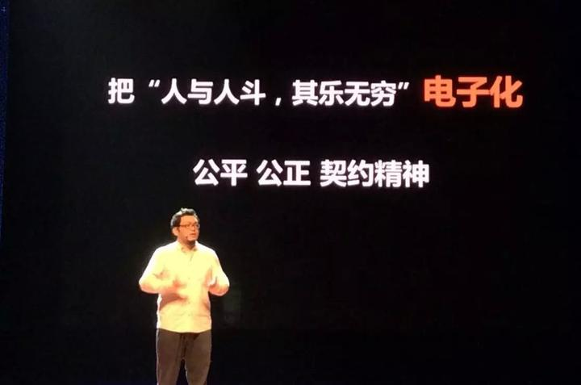

# 让路更多一些 我在TEDx 讲中国电竞

> 首发于知乎专栏（2015-05-16）原文链接：https://zhuanlan.zhihu.com/p/19975183

[

                              让路多一些电子竞技：刘洋@TEDxSuzhou 2015—在线播放—优酷网，视频高清在线观看                http://v.youku.com/v_show/id_XOTU2ODQwMTQ4.html                          ](http://link.zhihu.com/?target=http%3A//v.youku.com/v_show/id_XOTU2ODQwMTQ4.html)            文/BBKinG 《中国电子竞技幕后史》作者

　　经常有人问我，电子竞技到底是什么？

　　其实很简单，我认为，电子竞技就是把 “人与人斗，其乐无穷” 的这个过程电子化了。只是必须以公平、公正和契约精神为前提。

　　所以，与一些人看法不同的是，我认为，任何游戏都可以做出电子竞技模式，任何人都可以成为电子竞技选手，我们周围，很多年龄大的人在网上玩斗地主打桥牌，小孩子坐在一起用ipad玩愤怒的小鸟比谁分高，女孩子玩体感游戏两个人彪舞，年轻人组队玩的DOTA、英雄联盟，以及未来会越来越完善的3D虚拟技术游戏，这些项目只要在公平、公正和契约精神的前提下发展，就会衍生出比赛、明星、俱乐部、媒体、直播平台等等复杂的电竞体系。

　　这就是我理解的电子竞技，说起来好像不到一分钟就结束了，但是这背后是全世界无数电竞人十多年的艰难探索和尝试。

　　1999年，韩国人建立了世界上第一个专业游戏电视台OngameNet，就是现在依然很有名的OGN，同年他们成立了韩国电子竞技协会Kespa，也就是说，韩国人在1999年就建立了这样一个电子竞技模式。

　　电视台 + 电子竞技 + Kespa

　　这是个很厉害的模式，如果我们仔细分析这个模式，电视台天生拥有推广渠道和商业变现能力，电子竞技赛事做产品，Kespa强化了行业规则，让每个链条都可以环环相扣，稳定发展。

　　而且韩国的游戏电视频道的覆盖率非常高，2006年，OGN在韩国接入了1300多万户家庭，而这一年韩国的总人口才4700多万，再加上韩国政府的支持，他们的电竞赛事赞助商都是大韩航空、三星、现代这样的大国企，一方面是广泛的群众基础，再加上完整的商业模式，这让韩国电子竞技从一开始就进入了一个良性循环的状态。

　　同时期的中国电子竞技，在2004年之前发展的非常快，大家通过WCG、CPL和ESWC等国际赛事，开始见识到韩国电子竞技商业化运作的成功，他们的模式也被我们认为是当时最好的模式。

　　所以当2003年11月18日，中国电子竞技被国家体育局设立为中国第99个体育项目时，我们非常开心，一方面因为我们终于可以名正言顺的把韩国电子竞技的模式在中国搞起来了，另一方面中国很多卫视都已经开设了游戏节目，比如，旅游卫视的游戏东西，上海电视台的游点疯狂，西安电视台的游戏俱乐部，CCTV5的电子竞技世界，而且这些节目的收视率都名列前茅，可以说，中国电子竞技在那一刻有着无与伦比的资源和市场前景。

　　而这一切，都停止在2004年4月12日，那一天广电总局发布了《关于禁止播出电脑网络游戏类节目的通知》，刚才说的那些节目，全部被停掉了，这意味着从那一刻起，韩国电子竞技的那条路，在中国彻底堵死了。

　　所幸的是，中国电子竞技爱好者和电竞人都没有放弃，我们找到了一条新的路，也是我们当时唯一的一条路。

　　互联网 + 电子竞技

　　可是，怎么走呢？我们当时并不是太清楚，但是天无绝人之路，一个新的互联网技术出现了。

　　它叫P2P流媒体直播技术，这个技术简单的说就是，让互联网上的视频看的人越多速度越快，2004年，国内也出现了以此技术为核心的PPLIVE和PPS这样的直播平台，让中国电子竞技也找到了新的模式。

　　P2P直播平台 + 电子竞技赛事 + 赞助商

　　也正是这个模式，让中国电竞爱好者，从2005年开始，只需要坐在家里或者网吧里就可以看到中国乃至世界级的电竞比赛，特别是2005年和2006年的WCG世界总决赛，WE俱乐部的SKY李晓峰获得WCG两连冠时，身披国旗站上领奖台那一刻，全世界的电竞爱好者都同步看到了，也就是在这之后，我们出去跟厂商谈合作的时候，终于不用先花一个小时解释什么是电子竞技了。

　　可是，客观的说，这种模式受时代的限制太大了，即使到现在，经过了这么多年的互联网的用户培养，如今在网上看视频直播的观众数量跟传统媒体相比，依然差距巨大，这就更别说10年前了。

　　所以，这个模式让电子竞技在很长的一段时间里，只能饥一顿饱一顿的活着，根本谈不上发展。

　　而这个时期电子竞技活的最滋润的模式是什么？大家猜一下？

　　富二代模式

　　大家别笑，如果不是这些对电子竞技非常热爱的富二代，中国电子竞技可能走不过那个最困难的时期。

　　可是，这个模式又有一个很大问题，它不稳定，这个钱说断就断了。

　　于是，当2008年世界金融危机来临的时候，没有赞助商，推广渠道太窄，变现模式基本没有的电子竞技又一次跌回了黑暗中，很多电竞组织被打散，很多电竞人被迫去了其它行业。

　　在2008年到2010年的这3年里，中国电竞人吃了很多苦头，但是现在回头看，这是很值得的，正因为那3年的全行业萧条，让电竞人和电竞爱好者都深深的意识到了一个问题，这个行业光靠理想是发展不下去的，我们必须要有自己的产品、自己的推广渠道、自己的变现模式，才能活下去，就像郭德纲说的，我们必须要活的很好，才谈的上发展，才谈的上壮大。

　　所以到2010年金融危机过去之后，我个人认为此时的中国电子竞技才算开始成熟了。

　　而在这一年也发生了几个非常重要的事情，2010年12月8日，优酷上市了，上市之前，就开始大力推游戏频道，特别是电子竞技，很多DOTA的退役选手和解说，开始在优酷上开自己的频道。

　　也是这一年，团购网站的概念兴起了，网页游戏联合运营的模式出现了，以及最重要的一点，90后20岁了。

　　简单的说，这一年电子竞技不但突然有了新的推广渠道，还增加很多变现手段。

　　2011年有个游戏服装品牌，他的创建人也是电竞爱好者，他有很多做服装的资源，他把电竞和自己的资源整合在一起，做出了印游戏图案的服装，然后他找到一个知名解说帮他做推广，没想到这个解说开了个淘宝店，第一个月就做到30万的月销售额了，之后每个月都在翻。

　　大家突然发现，原来电子竞技还能这样玩呀，于是很多电竞明星和解说纷纷开起了自己的淘宝店，卖东西，最开始是卖跟电竞比较相关的鼠标键盘这种外设，后来产品种类也越来越多，现在不但有服装、外设、零食，还有箱包、生活用品、旅游产品，甚至成人用品等等。其中就有大家经常听到的肉松饼模式，很多人嘲笑肉松饼模式，可是我认为肉松饼模式的成功意味着中国电子竞技的新模式也就此诞生。

　　优酷 + 淘宝 + 电子竞技

　　我个人认为，这个模式的出现具有划时代的意义，我把这个模式称为自我关注度变现。这意味着中国电子竞技，从此有自己的推广渠道，有了自己的产品、自己的变现方式，从这一刻起，即使没有赞助商，没有富二代，电子竞技也可以活下去了。

　　可是在这个时候，另一个存在多年的矛盾终于被激化了。

　　我把它叫中国电子竞技的泡沫战争。

　　这种泡沫战争在中国电子竞技发展的这17年里，打了好几次，其中最大的一场发生在2010年DOTA的时代，由于电竞行业展现出的影响力越来越大，所以吸引了很多资本的疯狂涌入。

　　他们进来之后做的第一件事情，就是抢这个行业的核心资源，电竞选手，当时的挖人大战已经打疯了，他们是无视合同违约金的，比如，你俱乐部跟选手签的合同里写违约金是50万，100万，他们是直接把这个钱扔在你脸上，然后说，这个人我要定了，就把人挖走了。

　　当这个泡沫战争打到最后时，所有参战的俱乐部发现自己都是输家，因为花出去的钱根本赚不回来，于是，大家开始意识到，这个事不能这么搞了，电子竞技要重建契约精神，要有规矩。

　　于是，2011年，中国12家最大的职业电子竞技俱乐部，抱团成立了一个电子竞技联盟。

　　又经过这近5年的探索和完善，如今的中国电子竞技已经形成了稳定的行业格局，联盟提供了一种沟通协商的基础，现在每个赛季结束后有专门的转会窗口期，在这个时期里俱乐部的经纪人可以去找其它俱乐部的负责人商谈选手的转会事宜，如果选手有出现作弊、代打、消极比赛，甚至是出席活动时的穿衣和言谈举止不合适，联盟都有具体的条文做规范。

　　到了2014年8月，也就是去年，美国亚马逊9.7亿美金收掉电竞直播平台twitch后，很多类似twitch的直播平台在中国火起来了，又一次引发了资本和大众对电子竞技的新一轮关注，电子竞技的模式也变得更加复杂，我们过几年再来评论它。

　　关于未来，我认为电子竞技会像当年电影行业刚诞生一样，它大幅度的降低了大众休闲娱乐的消费成本和门槛，而且它比看电影还要方便、廉价，互动性强，这些都将带来一场互动娱乐形式的新革命，并且会衍生出一个庞大的娱乐产业格局。

　　最后我要说，我今天的这个演讲，并不是来说电子竞技有多好多完美，大家都来玩吧，不是，电竞只是这个社会的一个缩影，有很多问题我们还在寻找解决方法。

　　比如，我们经常接到家长的电话，跟我们说自己的小孩子要退学打电竞，他什么办法都用过了，还是拦不住，希望我们能找个电竞明星出面帮忙劝劝他的孩子，我们通常都会帮他劝的。

　　因为我曾经就是这样一个小孩子，所以我知道，大部分小孩子的内心里其实并不是十分确信自己适合走电子竞技这条路的。他们只是在自己学业受挫之后，潜意识里在给自己找新的出路。

　　可这正是问题的根源，除了高考那条独木桥之外，我们的社会给小孩子提供的路太少了。于是，貌似精彩热闹的电脑、互联网、游戏，便成了他慌乱中抓住的救命稻草。

　　我其实根本不在意他是否选择电子竞技，我在意的是，他选的这条路他是不是真的喜欢，是否合适自己，并且知道该怎么走？

　　而我们这一代的人责任，是努力的探索和开拓新的路子，建立一个可以包容孕育新文化的世界，让我们的下一代敢想敢选能做，让那些健康向上的亚文化都有机会发芽生长。

　　这便是我这个演讲的全部目的，谢谢大家
