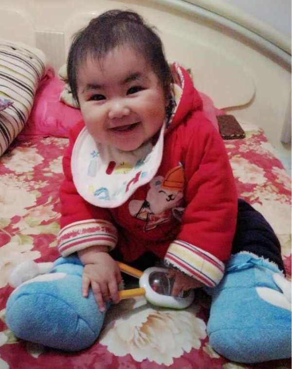

# Chapter 13. Vanguard from Sichuan: Ma Tianyuan

> A chapter from ONE MORE WAY: The History Behind Chinese Esports, by BBKinG (Liu Yang). Translated from the Chinese original: [十三 川军先锋 马天元](../zh/chapters/13-川军先锋-马天元.md)
>
> First published in the author's Zhihu column on November 29, 2013: https://zhuanlan.zhihu.com/p/19626821
>
> This is a working translation awaiting review. If you spot a mistranslation, a wrong name, or a factual error, please [open an issue](https://github.com/bkingfilm/china-esports-history/issues/new) or send a pull request.

In China's eight year war against Japan, one out of every five soldiers came from Sichuan. The Nationalist general Li Zongren once said, "In eight years of resistance, the merit of the Sichuan armies must never be dismissed." Ordinary people had their own sayings for it. Sichuan troops can fight. No army is complete without Sichuanese.

That same Sichuanese instinct of taking the fate of the world on your own shoulders left heavy marks on the history of Chinese esports. Meng Yang in the Quake III era. Ma Tianyuan in the StarCraft era, along with the 8DA team out of Chongqing and their website and forum. In the Counter-Strike era, the site Ccsk.net, which began in Sichuan and later became Esai, and the WNV team, most of whom were Sichuanese. In the Warcraft III era, CQ2000, WE.TED and many more. Countless members of the Sichuan esports legion burned their youth here, and I plan to open a separate thread inside this history for the Sichuan and Chongqing legion, so their contribution gets recorded.

Ma Tianyuan, known online as MTY, is a pioneer of Chinese esports. A lot of people entered this industry because of one photograph of him and DEEP, whose Chinese nickname was Roast Duck. It was taken in Korea in 2001, after the two of them beat one strong national team after another to win the StarCraft 2v2 world championship at WCG, standing on the podium holding the Chinese flag high above their heads. That single image did more for the public image of Chinese esports than almost anything else at the time.

Ma Tianyuan was 20 years old that year. Time moves on. By 2013 he was 33, working in Shanghai at R2Game, an international company that exports Chinese mobile and browser games to Europe and America, where his job was to find suitable game projects inside China.

Ma Tianyuan was born on July 2, 1981, into a working class family in Chengdu, Sichuan. He was bright, quick, rebellious and independent from an early age, and his parents could not control him. Of the crowd he ran around with back then, not one of them ended up on the straight and narrow. Growing up in that environment, you naturally pick up the brotherhood code of the Paoge, the old Sichuan sworn brotherhood societies, and even today you can still catch a trace of the neighborhood big brother in him. School looked like the last thing on his mind, but he was very good at taking exams. Once his family promised him a game console if he scored a perfect hundred in both subjects, and he went and did exactly that. That was the only time. His grades were otherwise ordinary. Then he decided to take the college entrance exam seriously, just once, and that one serious effort got him into the computer science department of Sichuan University. Infuriating, isn't it.

In 1997, barely into university, Ma Tianyuan was already showing an alarming talent for PC games. His Red Alert made him famous across campus. In his second year he took a job at a gaming PC parlor, and because he was so good at StarCraft, the job was really just playing games. His name alone brought the place plenty of business every day.

As the internet spread in 1998, Ma Tianyuan started talking to other game fans online. The Kunpeng battle net became the stage where he met both teammates and rivals, and through it he met, one after another, the StarCraft players everyone would later know: Jeeps, YR, Hong Zhefu, Hanyuliang (Chen Yu, a Chongqing native, now head of Tencent's Quantum Studio), Kulou, Redapple and others. That is how the first wave of the Sichuan esports legion came together.

## The rise of the AsiaGame battle net and the founding of =A.G=

"Esports" is an imported word. In 1999, when AsiaGame was still being set up, the concept did not exist in China. People here were still playing games purely for fun. Abroad the idea had already taken hold, and events like CPL had pushed it a long way. A number of overseas Chinese and Chinese students studying abroad started bringing the concept home. One of the most important of them was Hu Haibin, a Chinese American who now lives in the United States. He knew one of AsiaGame's vice presidents, joined the company after returning to China, and convinced AsiaGame to make esports a key direction for the business.

Once back in China, Hu Haibin got to know the StarCraft names of the day, Jeeps and Hanyuliang among them. After roughly half a year of talks, on October 1, 1999, Hu Haibin together with Jeeps, Hanyuliang, Ma Tianyuan, Yi Ran, CQZD Lightning Hand, Devil Angel and others merged three teams, Rainbow from Chengdu, Angel from Nanchong and CQZD from Chongqing, into a new team called =A.G=, short for AsiaGame. This was very likely the first fully professional esports team in China, because the players were released from all other work and every official member drew a salary. There were only two disciplines and two players, CHJ on Quake III and Ma Tianyuan on StarCraft, on 2,000 yuan a month, and for its time that was a remarkably forward looking attempt at professionalizing esports.

Inside AsiaGame's esports department, Hu Haibin and Jeeps ran the =A.G= club, YR (Yi Ran) handled logistics and team management, and Hanyuliang handled publicity and built the Lunzhan Gaoshou website, a site for player debate and discussion.

Worth noting here: today's AG.QQ VIP.Shikong Zhanxian club grew directly out of that original =A.G= AsiaGame team, although AG now stands for AllGamer. I will get to how that changed later.

First, some background on AsiaGame the company, which will make later events easier to follow.

AsiaGame belonged to Yalian Yingtong Technology Development, a subsidiary of Haihong Enterprise Holdings. The same company went on to license several well known online games in China: Millennium, Red Moon, Battlefield and Worms Online. Haihong Holdings was also the parent company of Ourgame, the famous card and board game platform. By registered users or by company size, Haihong Holdings was the leading pioneer of the Chinese online gaming field at that time.

## Ma Tianyuan's first campaign, to the top of the world

In early 2000, the 19 year old Ma Tianyuan followed Hanyuliang, another vanguard of the Sichuan esports legion, to Beijing, and began his career as a professional player. AsiaGame's official site was already live and the AsiaGame battle net was in its final preparations. The whole esports department had a clear goal: promote the concept of esports and make the industry more orderly.

That was the first time Ma Tianyuan had left Sichuan. He was still shy back then and did not talk much, just kept his head down and played matches. Seven people lived in a one bedroom apartment in Beijing, and every day felt good. Everything around him was new.

The first edition of WCG in 2000 was still called WCGC, the name changed to WCG in 2001, and Ma Tianyuan took part. He was knocked out early, and that pushed him into training even more insanely than before. Apart from sleeping, he spent seventeen or eighteen hours a day playing StarCraft on the AsiaGame battle net.

Because AsiaGame had bought the most advanced German FSGS technology, its platform could hold far more concurrent users than the other battle nets. More people meant it was easier to arrange matches, so soon after launch it had more than 2,000 players online, and nearly every top StarCraft player in China was on it. There was no ladder and no matchmaking then. To get a game you had to shout in a channel. That gives you some idea how hard it was for early esports players to improve.

Ma Tianyuan swept everyone on the AsiaGame battle net day after day, yet he was young and fragile under pressure, and kept losing the title in official competition. People started calling him the uncrowned king.

Choosing the professional esports road also meant he could not keep up with his studies, and he lost his Sichuan University degree. I think that is a shame. Ma Tianyuan does not. He sees it as his own choice, and without that past none of what followed would exist. To him nothing was wasted.

## WCGC 2000, the predecessor of WCG

Around 2000, Chinese StarCraft was in a warring states period, and you could map out the balance of power by region.

Northeast China: led by the three swordsmen of the Northeast, Hong Zhefu, Eat and the Duel Prince

Southwest China: the 8DA team from Chongqing

Central China: the Star team

Shanghai: the SVS team

Beijing: the =A.G= team

Hubei: DEEP, also of =A.G=, and XiaoT

Guangzhou: the [T.S] TopSpeed team, whose leading figure was Shomaru

This list is certainly missing people. Leave a comment on my Weibo and I will verify and keep adding.

I lay out that map because the Chinese players at WCGC 2000 were invited out of exactly those regions.

In 2000, WCGC, the predecessor of WCG, was run in China by Hu Haibin, Hong Zhefu, Redapple and others. Chinese esports was so small at the time that there was no nationwide qualifier at all. They simply invited 32 of the country's best players to compete. Ma Tianyuan was among them, and once again nerves knocked him out. The Chinese StarCraft level that year was not low. Unfortunately Kulou was the only player whose Korean visa came through, and he did not do well at the world finals.

By this point Ma Tianyuan understood perfectly well that his problem was mental.

He started training deliberately against that weakness, and finally, in early 2001, he won the Enorth Tianjin TV StarCraft Championship held in Tianjin. It was his first Chinese title, and since the event drew top players from all over the country, it was a title with real weight.

Anyone who has failed over and over knows you start to doubt yourself, and that first meaningful championship often becomes the turning point and the source of your confidence. From then on, Ma Tianyuan started winning.

With confidence came three titles in a row: champion of the 2001 AsiaGame national 24 player elite invitational, champion of the Dongmei and AsiaGame national 64 player elite invitational, and champion of the Beijing regional qualifier for WCG China. Then, at the WCG China national final, Ma Tianyuan got nervous again. The top three would go to Korea. He finished fourth.

And yet, call it fate if you like, the third place finisher had visa problems, so Ma Tianyuan went to the world finals in Korea after all. The Chinese delegation to that WCG had 16 members, including the CQ2000 everyone knows, and his old teammate DEEP. Hong Zhefu was the team leader.

What many people may not know is that they only found out about the StarCraft 2v2 event after arriving in Korea.

They got to Korea, saw there was an event like this, and figured they might as well enter. Hong Zhefu quickly signed DEEP and Ma Tianyuan up, since the two were AG teammates and had played together before. It is worth mentioning that the StarCraft 2v2 event disappeared after 2003, and that the best China ever managed in the WCG solo StarCraft event was PJ's second place in 2007. To the general public, second place and a gold medal are not remotely the same thing, at least not by name. So all we can do is sigh again: that is fate.

The final of the StarCraft 2v2 event was against Germany, whose lineup included a famous player the Chinese called Fisheye. The match was fierce and went to 2 all, with a thousand or more spectators cheering in the hall. At the moment they won, the whole hall erupted, and Ma Tianyuan's mind went completely blank. He says he remembers nothing at all until he walked up to receive the award and felt the Chinese flag in his hands.

The prize for that WCG event was 6,000 US dollars, and his half came to 3,000 dollars, roughly 25,000 yuan. For a 20 year old in 2001, that was serious money.

Back home, Ma Tianyuan got a hero's welcome. CCTV news kept reporting it, his hometown station kept reporting it, neighbors held him up as an example to their children, and relatives and friends praised him everywhere. Overnight the former troublemaker had turned into a role model, and Ma Tianyuan was standing at the peak of his life.

## After the peak came the turn, and it came suddenly: the failure of paid access on the AsiaGame battle net

On November 15, 2001, the AsiaGame battle net officially went to mandatory paid access. Plenty of esports people had expected this to be the moment Chinese esports took off. Looking back, it turned out to be the moment the AsiaGame battle net began to collapse.

A great deal has been written about why that paid model failed, so I will not add much. Ma Tianyuan thinks the timing was simply too early and the user base not mature enough, and that another big reason was the lack of distribution for prepaid cards. Eighteen yuan a month does not sound expensive, but back then there was no convenient way to pay. Many people had the money and could not find a card to buy, and all the free battle nets had been shut down at the same time. Numbers on the platform fell sharply. Fewer players meant matches were harder to arrange, so people scattered to smaller free battle nets, which made matches harder still. A vicious circle.

Haihong Holdings was deeply disappointed and gave up on esports without hesitation. Two months after the paid rollout failed, it dissolved the esports department.

Ma Tianyuan still finds that episode a shame. He believed Chinese StarCraft was not far behind Korea at that point, and that with a stable training environment, catching up was only a matter of time. Instead everything just stopped. Ma Tianyuan went back to Chengdu. Jeeps later moved into game development, YR joined a real estate company, DEEP went to an online games company, Hanyuliang went to Tencent. That whole crowd scattered.

For a professional player the event did not change much. He kept training every day and travelled to tournaments, until in early 2003 Hu Haibin secured an investment from Intel and opened an esports venue in Chengdu called the VA Esports Hall, with more than 200 machines. Ma Tianyuan joined it and kept training there, and StarCraft fans from all over the country still came to see him.

## Ma Tianyuan, the evergreen of the WCG delegation

From 2001 to 2003, China and the world produced no end of new esports stars, and Ma Tianyuan became the most reliable fixture in the WCG national squad. He turned up at the Korean world finals every year. In 2002 he took fifth place in the WCG solo StarCraft event, the best world result of his career.

He also collected a lot of prize money and commercial appearances over those years. Roughly speaking, Ma Tianyuan was making around 300,000 yuan a year in that period. Among the better paid jobs was an M Zone event in Beijing that paid 10,000 yuan for three days. Ten years ago, a year of that income could buy you an apartment.

But when I asked Ma Tianyuan whether he had bought one, he looked slightly awkward and said no, he had spent all the prize money treating everyone to dinner.

## Ma Tianyuan's second campaign, and a disheartened retirement in 2004

In 2003, Pei Le, known as KinG, founded the professional esports team YollinY. He brought Ma Tianyuan in as well, but Ma Tianyuan stayed only two months, because he had found a sponsor and could go build his own club.

In early 2004, the company 17Game decided to start an esports project with a budget of 500,000 yuan a year, and Ma Tianyuan ran it. Given the timeframe and the numbers, that was a very decent sponsorship for the era, and Ma Tianyuan was optimistic. He recruited players in every discipline from all over the country, including SYC and Guangmo, the pair nicknamed the Two Towers because both of them were extremely tall, plus XiaoT and others. He also took on a women's Counter-Strike team, the New4 squad that included 1212. By 2005, though, 17Game saw no return and shut the esports project down.

After running so many years down the esports road, Ma Tianyuan finally felt tired, and retired after WCG 2004. For the three years that followed, he moved to Wuhan and did things with no connection to esports at all.

## Ma Tianyuan's third campaign, looking for a new business model

Ma Tianyuan disappeared for three years, until the WNV team broke up in 2008 and XiaoT returned to Wuhan.

XiaoT and Ma Tianyuan had known each other since 2002, when XiaoT was only 14, and Ma Tianyuan had always treated him like a younger brother. The two got together again, talked, and found they both still had the esports dream. So Ma Tianyuan found a local investor, founded the VA club, set up four disciplines and signed a lot of well known players: XiaoT and Sed, now a StarCraft II player for IG, on Warcraft III, 430 on Dota, GOL on StarCraft, and KingZ on Counter-Strike.

## The esports coaching model

On this comeback, Ma Tianyuan was not blindly optimistic the way he had been when he first ran a club. He put forward a very clear model for a team paying its own way, which was esports coaching.

It works a bit like the personal trainer system at a gym. You join the club as a member, and you can book a coach in a specific esports discipline. Every coach has his own rate, and the more famous the coach, the more he charges per hour.

In 2009, Ma Tianyuan rented space in a sports centre in Wuhan, put in 30 machines, and started testing the model. The players trained and competed as usual, and set aside a little time each week for private coaching. The coaching brought in some money, sponsors chipped in some more, and the team could basically support itself. After a year it had signed up close to 200 members. Still, the wider environment and the limits of his own name meant the model could not scale quickly.

In 2010, Ma Tianyuan was about to turn 30. Looking back on a life of ups and downs, he went home to Chengdu to get married and start a family.

Ma Tianyuan left, but XiaoT was still young, so he took the entire VA roster and joined CCM in Beijing. CCM was later bought by IG, which is why the IG most people first saw was the team XiaoT was leading.

## Ma Tianyuan's fourth campaign, the rebirth of AG

After returning to Chengdu, Ma Tianyuan got to know the owner of the Shikong Zhanxian internet cafe, discovered a very promising CrossFire squad there called FC, and met the squad's manager Feifei. Ma Tianyuan decided to invite Feifei to help run the VA club. He then brought in Yi Ran, the old =A.G= manager, as general manager of the VA esports club. After talking it over with Hanyuliang, Jeeps and Lightning Hand, they decided to bring back the AG name, since everyone was still attached to it, though clearly the words behind the initials needed updating. AG became AllGamer.

And so AG.Xunyou.Shikong Zhanxian was reborn, known today as AG.QQ VIP.Shikong Zhanxian.

The new AG ran four disciplines, CrossFire, League of Legends, Dota and StarCraft II, kept the coaching model going, and did well competitively, consistently near the top. In 2013 AG won the CFPL title and the whole club was heading in a good direction. But even as the club thrived, with high salaries and bonuses for the players, Ma Tianyuan and all the management were not paid much at all. That is the trouble his sense of brotherhood brings him. His character guarantees he will never fight the players over money. And still, life has to go on.

## Ma Tianyuan's fifth campaign, working for his family's happiness

On June 6, 2012, Ma Tianyuan had a daughter, and her birth woke him up completely. All those years in esports, up and down, were enough. Drifting around on his own was fine, but he could not let his family live through hardship. He started to feel he needed to do something solid. So he came out of retirement once more, moved to Shanghai, joined R2Game, and started from scratch.

A short aside here. You may have noticed I have never put a single photograph in this history. That was deliberate. I wanted to know how many people would read something that is pure text all the way through. But this one photo of Ma Tianyuan's daughter I absolutely have to include. The first time I saw it, her smile got to me, as if the whole person looking at it was purified in an instant and filled with happiness. A genuinely strange experience, and I want to pass that happiness on.

Ma Tianyuan says he set that photo of his daughter as the display on his alarm clock. However tired he is, when the alarm goes off and he drags himself up and sees the photo, the energy comes straight back. As he said this, his eyes never left the photo on his phone, and they were full of laughter.

Watching him like that, I could not help feeling a great deal, and that classic voiceover started playing in my head: the wandering rogue who spent his life on horseback and killed more enemies than he could count has at last met the one with three moles, and from that day on he willingly puts on the golden hoop, folds away his proud and untamed nature, picks up that iron staff weighing thirteen thousand five hundred jin, two zhang long, thick as a bowl, able to grow or shrink and lengthen or shorten at will, and sets out on a new journey.

May the road treat you well.

Ma Tianyuan, vanguard of the Sichuan legion of Chinese esports.
