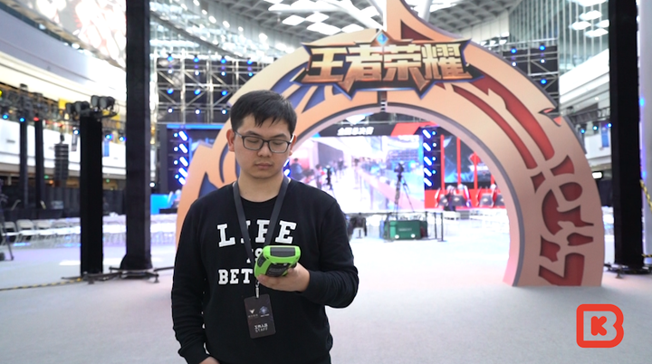
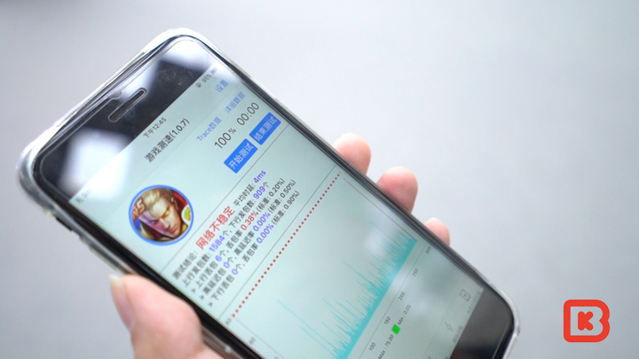
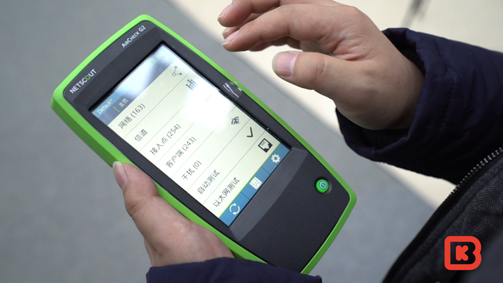
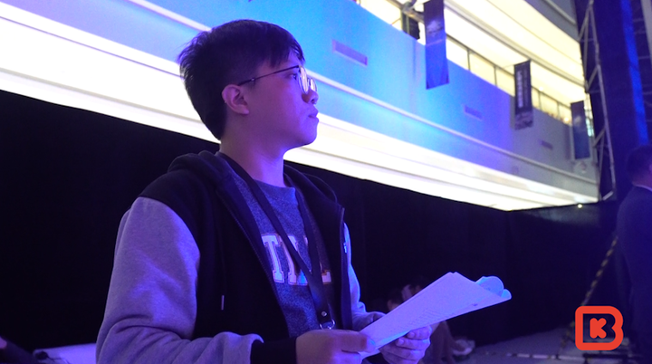
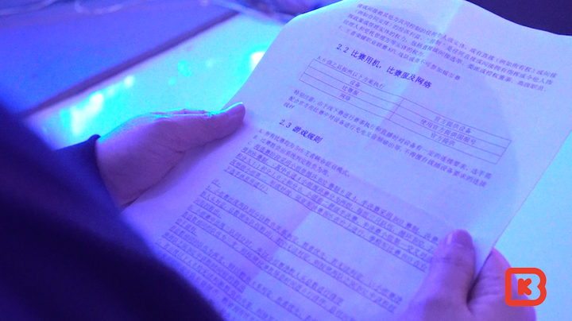
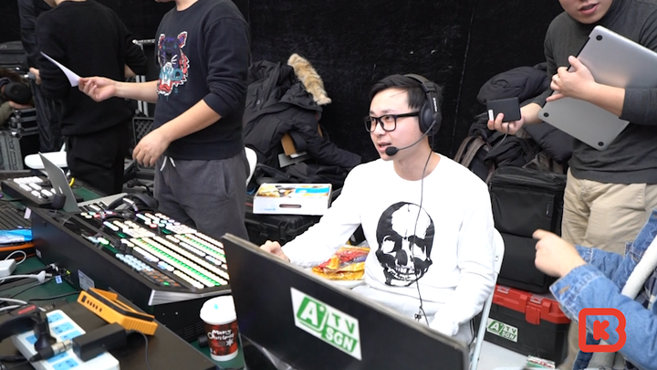
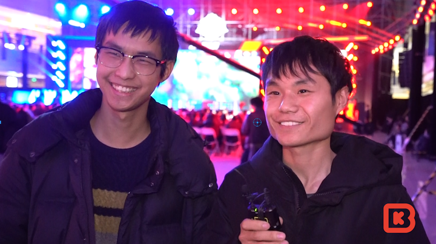

# Two Years On, Another Look at Mobile Esports

> An extra piece by BBKinG (Liu Yang), author of ONE MORE WAY: The History Behind Chinese Esports, published after the book. Translated from the Chinese original: [两年后，再看移动电竞](../../zh/appendix/04-两年后，再看移动电竞.md)
>
> First published in the author's Zhihu column on December 15, 2017: https://zhuanlan.zhihu.com/p/31942615
>
> This translation was reviewed against the Chinese original on August 3, 2026. If you spot a mistranslation, a wrong name, or a factual error, please [open an issue](https://github.com/bkingfilm/china-esports-history/issues/new) or send a pull request.

By BBKinG

If you were reading my Zhihu column two years ago, you probably remember that I did not think much of mobile esports at the time. On hardware, on software, on network conditions, and on how finely the controls could be handled, the mobile games of that period had none of it worked out properly.

Two years on, though, the runaway success of Honor of Kings (王者荣耀) is a slap in the face to that view, both on the ground and in the numbers.

The public still has plenty of doubts about mobile esports, all the same.

On December 10, 2017, the grand final of the Honor of Kings City Championship was held at Hopson One in Beijing, and I was invited along with a free hand to look at anything and ask anything.

So I collected the questions people had and went to find the people running the Honor of Kings project, to see how this City Championship, an event tied more closely to the general public and more approachable than most, deals with the problems that come with mobile esports.

Question 1: how do Honor of Kings matches guarantee a stable network at the venue?

Answered by Haris, operations lead for Honor of Kings

Answer: to solve the network problem on site, we use an offline server, which puts the players and the whole server on the same local area network. We developed a piece of software specifically for this, called Zhiying Wangyou (智营网优), to verify whether the handsets used at our events and the network at the venue can meet our tournament standard. In a large shopping mall like this one there are a great many wireless networks, and they interfere with one another, so we run network tests in advance and pick the least used channel to keep the event running stably.

Question 2: Honor of Kings skins carry stat bonuses. How do you keep the matches fair?

Answered by Dai Tingda, tournament operations, Honor of Kings

Answer: before the event we go through all the rules of the competition, and on the subject of skins we explain how their attributes affect play. We provide accounts with every hero and every skin unlocked for the competing players to use, and that guarantees fairness across the board.

Question 3: what model of phone is used for the matches? And what do you do about players with sweaty hands?

Answer: the Honor of Kings operations team tested every phone on the market, and the result was that the iPhone 7 Plus is the handset that runs Honor of Kings esports matches most smoothly.

Some players may want to ask what happens if sweaty hands are a problem. We check with our competitors before the event, and we can supply grip powder, tissues and towels to sort it out for them.

Question 4: how do you make an Honor of Kings match better to watch at the venue?

Answered by Gu Ming, live event director

Answer: to give the audience at this City Championship grand final a different experience, we do something with the lighting and the sound effects after a first blood, after a team fight is won, and after the big dragon and the little dragon are killed in game, so that the crowd gets a different visual experience.

Question 5: what is the difference between broadcasting a mobile esports event and broadcasting a PC one?

Answer: the biggest difference between the PC side and our mobile side, in broadcast terms, is that we have to route the phone signal into our own live feed through various pieces of conversion equipment. That is a problem we never run into on PC.

Question 6: having been through the Honor of Kings City Championship, how do you feel about it?

Answered by HanSir, team leader of the champions, SV

Answer: it has been quite hard going all the way through, because the City Championship is the largest of the open, all-comers events, and we ran into a lot of strong opponents. I hope we can get a good result in the KPL qualifiers.

We also interviewed two spectators at the venue who had reached the King rank. They raised a question of their own: they would very much like to take part in the offline rounds of the City Championship, but they do not know where to look for the announcements about those matches, and they want to know what channels exist for finding out. We passed that on to the organisers, and they will deal with the request as soon as they can.

You can see from this that mobile esports is far more flexible than PC esports when it comes to choosing a venue. I am told that many of the City Championship's regional stops were even held inside scenic tourist areas. That will push out the boundary of how widely esports can spread, and carry the idea of esports further into the general public.

My thanks to everyone who supported this. I hope there will be more chances in future to see how mobile esports develops.

Here is the full video of the event:

[
https://www.zhihu.com/video/925063781065854976](http://link.zhihu.com/?target=https%3A//www.zhihu.com/video/925063781065854976)
