# China's Fighting Game Scene: Frozen Youth

> An extra piece by BBKinG (Liu Yang), author of ONE MORE WAY: The History Behind Chinese Esports, published after the book. Translated from the Chinese original: [中国游戏格斗圈 凝固的『芳华』](../../zh/appendix/05-中国游戏格斗圈-凝固的『芳华』.md)
>
> First published in the author's Zhihu column on December 25, 2017: https://zhuanlan.zhihu.com/p/32326209
>
> This is a working translation awaiting review against the Chinese original. If you spot a mistranslation, a wrong name, or a factual error, please [open an issue](https://github.com/bkingfilm/china-esports-history/issues/new) or send a pull request.

By BBKinG

If you have ever spent any time around China's fighting game scene, you will notice that time inside it seems to have frozen at one particular moment.

Consider this. In 1998, a nine year old known as Xiaohai, the kid, ruled the arcade fighting game scene in Guangzhou. In 2007 he took the world grand final of Tougeki in Japan. And twenty years later, in 2017, the man standing at the summit of Chinese fighting games is still Xiaohai.

People in the scene tell me that if Xiaohai ever stops competing, China may simply run out of professional fighting game players. There are very few newcomers left, and the gap between them and the players at the top is far too wide.

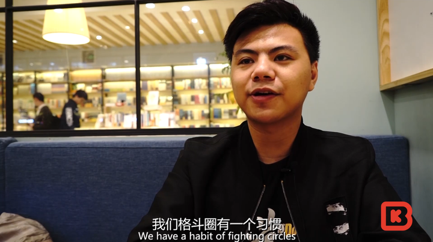

Why so few newcomers? You can probably guess.

The rise of the PC and the internet gave people many more ways to entertain themselves with games. Over the past twenty years the arcades never caught the wave of the internet age, and they were left behind in obscurity.

Copyright problems around game hardware and software pushed the fighting game companies to concentrate on consoles, and consoles were banned in China for more than twenty years, which left Chinese players with habits completely unlike those of players everywhere else in the world.

Take EVO, the huge and enormously influential fighting game tournament in North America. Relatively few people in China follow it or even know what it is.

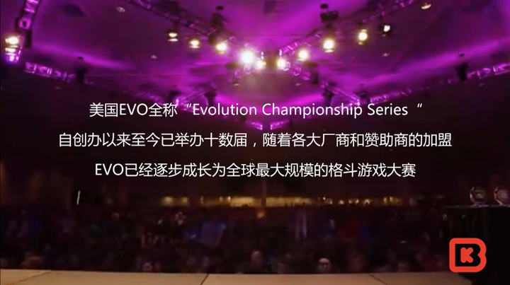

That very particular, at times distorted, history of development in China has also made the people who stayed in this scene very particular themselves.

Here is one example. When they compete these days, they will stubbornly commit to a single character in the game and treat it as their one true main.

That means that whatever a future patch does to that character, buff or nerf, they will not change their choice.

If you pick a different character and win the match, you still will not earn the respect of the scene. People will put the result down to the patch rather than to your ability.

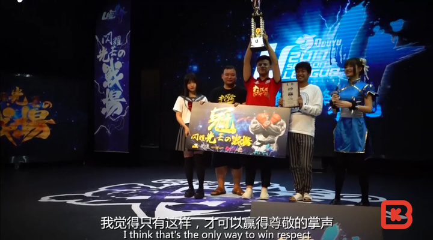

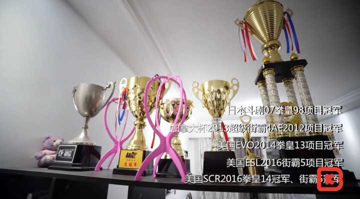

Under that near obsessive discipline, which fighting game devotees share all over the world, the techniques of the genre have developed to a point that verges on the miraculous.

One of them is the option select. Put simply, in the instant you commit to an attack, you also roll in a second answer that is the exact opposite of the first.

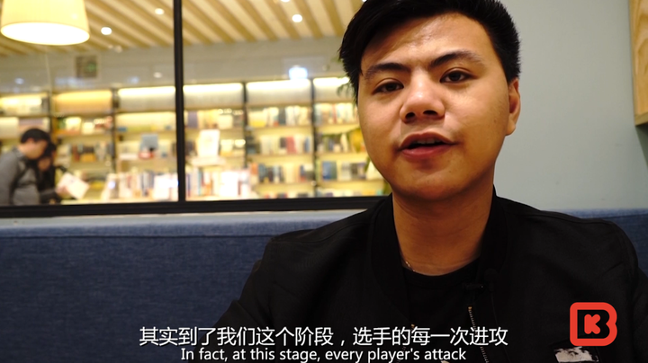

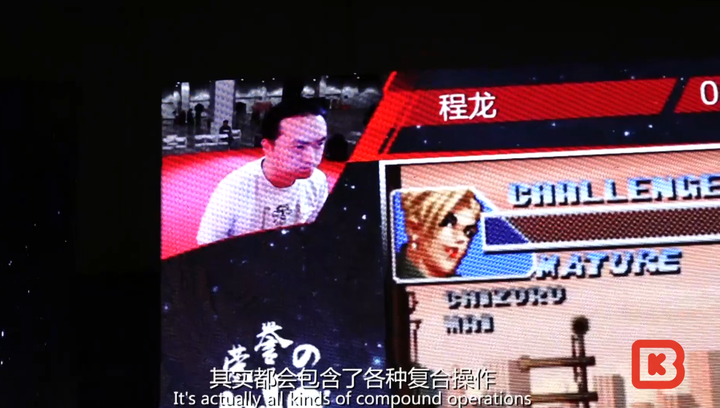

The principle behind it is this. When you attack, your opponent either blocks or runs. If he blocks, your attacks collide and the game produces a freeze, and that freeze wipes out every input you made in the instant before it.

So in the moment just before that freeze, if you have also rolled in an advancing follow-up attack, and your opponent does not block but simply backs away, then the freeze never happens. The move comes out, and it comes out while he is retreating. He has no time to block, and he gets hit.

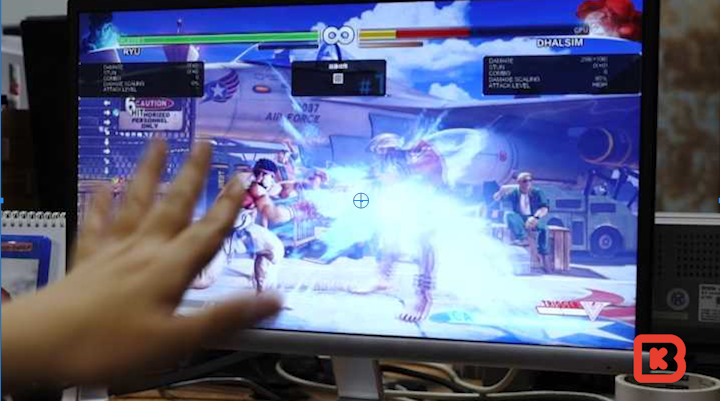

This way of using the freeze to erase an input was invented by Japanese players. The first time Xiaohai saw it at a major tournament, it struck him as superhuman. He watched, powerless, as the Japanese player's character followed up with an attack in an instant and caught his opponent completely off guard.

The technique is now basic equipment for a professional fighting game player, and the scene has built all sorts of set routines around it.

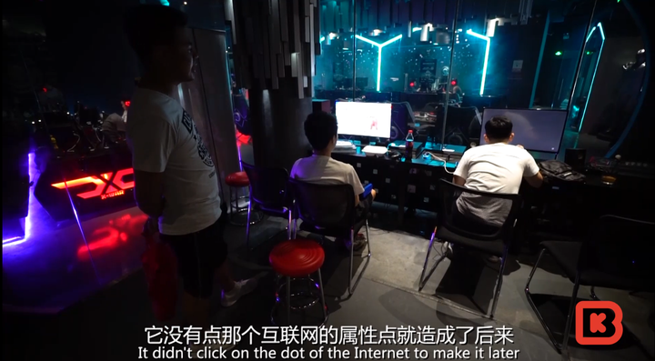

Xiaohai has spent more than twenty years as a professional, and he has been at the front rank the whole way through. Put like that, it counts as a record in the history of world esports.

After all, when he started out, the term Chinese esports did not yet exist.

That is part of why the fighting game scene has such complicated feelings about the word esports. It was only some time after streaming took off that the scene even began to connect more closely with the internet.

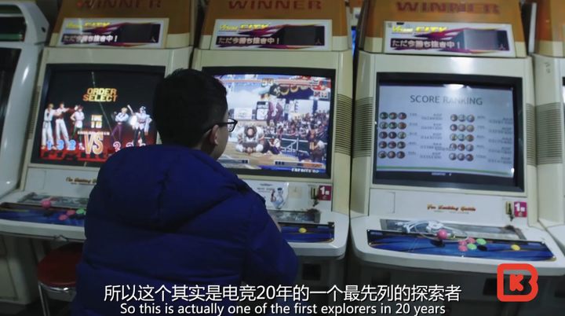

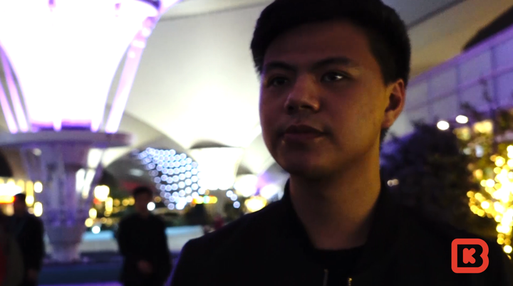

Zeng Zhuojun, born in 1989, is almost 29 years old.

He once had the kind of youth other people envied. Every weekend his father drove him to the arcades to compete. At 18 he stood on the stage of the world fighting game championship in Japan and won it, and he beat ten of Japan's top players one after another with a single hand on the controls. People called him an esports hero.

Everyone still calls him Xiaohai, the kid, but he knows perfectly well that his own youth is behind him.

The bloom of youth is gone. Watching him talk to his viewers on stream every day and turn up at one event after another with only a scattering of people in the seats, I always feel a regret I cannot quite put into words. At least we live in an age of moving images, and we still have the chance to bring our own youth back to the screen.

[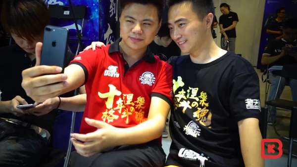
https://www.zhihu.com/video/928734557824507904](http://link.zhihu.com/?target=https%3A//www.zhihu.com/video/928734557824507904)

A short documentary by BBKinG

Heroes are immortal!

Let us put our own youth on the record!
