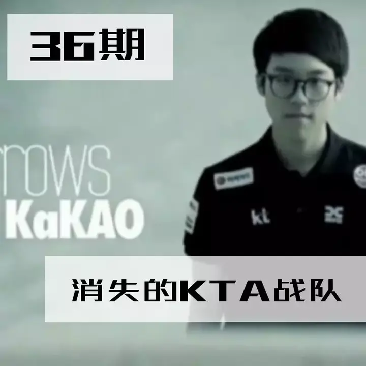
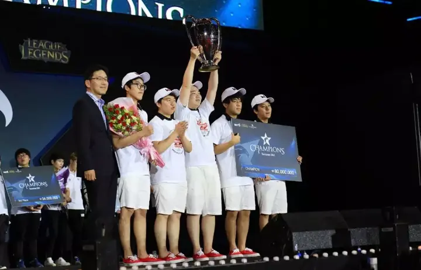
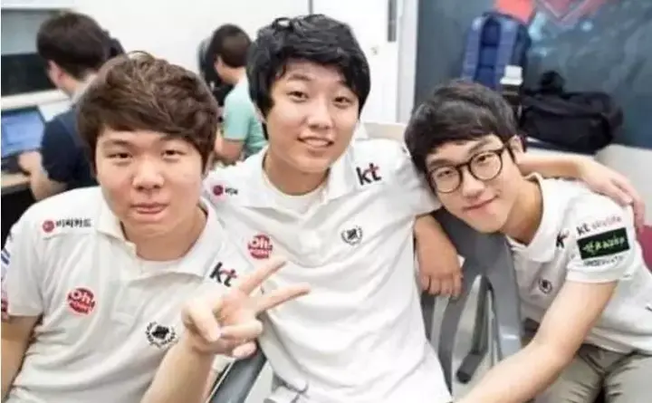
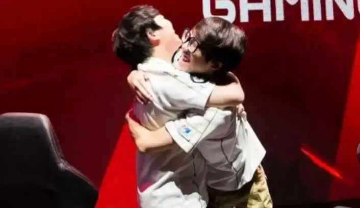
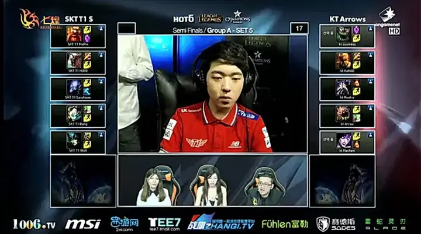
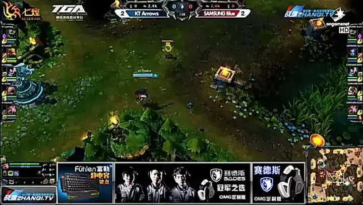
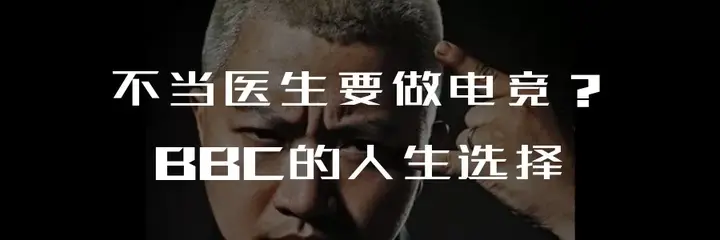
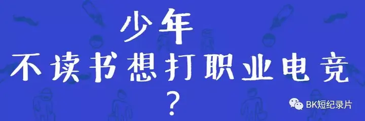

# A Casualty of Esports' Search for the Right Rules: Korea's KTA

> An extra piece by BBKinG (Liu Yang), author of ONE MORE WAY: The History Behind Chinese Esports, published after the book. Translated from the Chinese original: [电竞比赛规则探索的牺牲品 韩国KTA战队](../../zh/appendix/06-电竞比赛规则探索的牺牲品-韩国KTA战队.md)
>
> First published in the author's Zhihu column on April 16, 2018: https://zhuanlan.zhihu.com/p/35753492
>
> This translation was reviewed against the Chinese original on August 3, 2026. If you spot a mistranslation, a wrong name, or a factual error, please [open an issue](https://github.com/bkingfilm/china-esports-history/issues/new) or send a pull request.

By BK Short Documentaries (BK短纪录片)

**They were OGN's last champions, and the only team ever to win a Summer split and then miss the World Championship.**

Even now, people may remember that Rookie came out of KTA, the KT Rolster Arrows, and even that it won the Summer split, but they have forgotten whether it ever reached Worlds.

**The legend of KT**

KT, one of the league's old powers, has without question always been a legendary team. There is the match people bring up again and again, KTB and the two Zeds. And there is the star-studded KT Rolster that knocked SKT out of the playoffs this year and took its revenge.

KTB carried more than its share of curses, but the fate of KTA was bleaker still.

As a challenger, KTA once fought from the top rung of the playoff gauntlet to the final, winning the blind pick game every time, and threw in a comeback from two games down to take three straight, going from a team nobody backed to one the whole arena cheered.

But in the fight for the last ticket to Worlds they were the side defending the top spot, and Najin White Shield, who had climbed all the way from the bottom, beat them. Their Worlds run ended there.

They were the first team, and the last, to win a Summer split and still miss Worlds.

Their experience is what forced Riot to change the format, so that every later Summer split champion qualified as a seeded team.

That defeat also made Kakao realise how hard it was to qualify out of OGN. He decided to take his mid laner Rookie with him to the LPL, and that is how today's Invictus Gaming came about. All for one chance at Worlds, the two of them opened the curtain on what people called the LPL's "Self-Strengthening Movement" in Season 5.

That was probably the patch with the smallest champion pool OGN ever saw, and the one with the longest games. Baron and dragon then converted straight into gold, and there was no using their buffs to drive a game forward quickly the way teams do now.

Orianna, Zilean and Ziggs in the mid lane, Kog'Maw and Tristana as the AD carry, even Kassadin in the top lane. Games did not really begin until the forty minute mark. That was when four-protect-one took over the world, and for a while nothing could beat it.

KTA, though, stayed committed to its own fast early aggression. Kakao proved to the world that his place among the four great junglers was no empty title, and while everyone else laboured to drag games into the very late stages, KTA was ending them early. It was also KTA that beat Samsung Blue, the team that had drilled four-protect-one to perfection, in a blind pick game in the final, showing that four-protect-one was not an automatic win.

From then on, the strange thing about the LCK region was already settled. They stick rigidly to convention, and yet the team that ends up winning is always the one that breaks it.

**Kings of the blind pick**

Back when OGN still used the blind pick format that audiences loved most, KTA went the full five games in series after series, and in the deciding blind pick game it cut down one team after another with picks nobody expected and a fast, aggressive tempo. It went from a team nobody noticed to the dark horse of the playoffs, from obscurity to a final where the whole arena chanted KTA.

At the time they were not a star team and not a favourite for the title. Their run through the bracket looked so precarious that everyone expected them to fall at each round.

But every time, somehow, they dragged the series into the blind pick game and pulled it into KTA's rhythm. If they were playing today, with the blind pick format gone, what would have become of them?

**The final curtain**

Nobody could have imagined that Ggoong would take his team through three series in a row on Zed. If KTA had been the team that made it to Worlds, would there ever have been the story of OMG's three to nil?

When the rule that one organisation may only field a single team in the same league came in, OGN became the LCK, rosters were reorganised on a huge scale, and the story of this KTA slowly came to its close.

From the regret at the time to the blur it has become now, the story of this dark horse stayed in people's memory for less than three years. The distance between a crowd sighing over them and the world forgetting them was no distance at all.

- **Past pieces: search WeChat for BK短纪录片**

