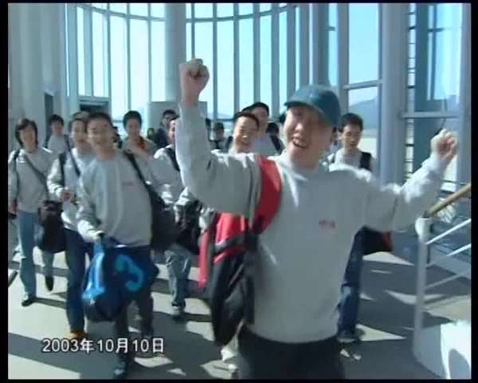
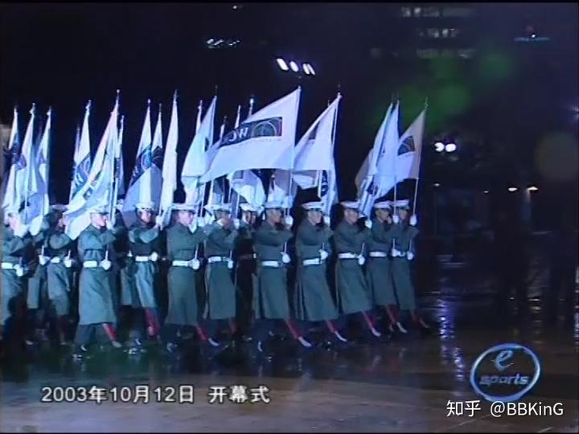
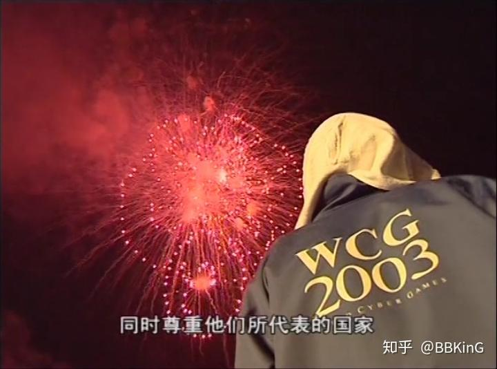
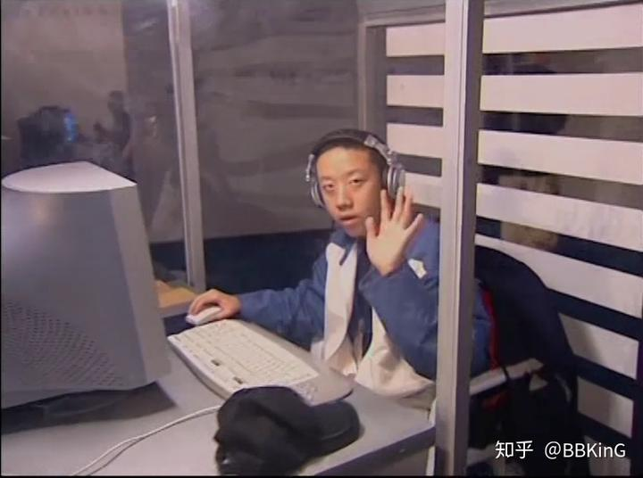
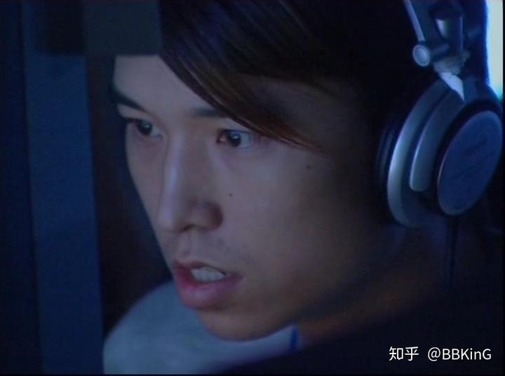
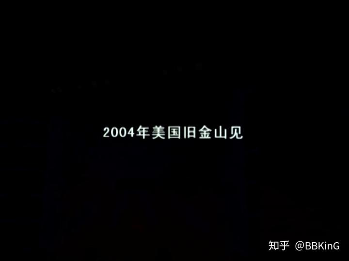

# The Dawn Before the Darkness: The Unaired WCG 2003 Documentary

> An extra piece by BBKinG (Liu Yang), author of ONE MORE WAY: The History Behind Chinese Esports, published after the book. Translated from the Chinese original: [黑暗前的黎明 WCG2003未播出的纪录片](../../zh/appendix/07-黑暗前的黎明-WCG2003未播出的纪录片.md)
>
> First published in the author's Zhihu column on May 4, 2018: https://zhuanlan.zhihu.com/p/36406132
>
> This is a working translation awaiting review against the Chinese original. If you spot a mistranslation, a wrong name, or a factual error, please [open an issue](https://github.com/bkingfilm/china-esports-history/issues/new) or send a pull request.

By BBKinG

This is the documentary Esports World, the CCTV5 programme, filmed at the WCG 2003 world grand final. According to the director at the time, only half of the film ever aired. The other half was still waiting to go out when the whole thing was stopped. It later came out on a DVD bundled with a magazine, and an esports fan who had kept that DVD sent me the video. I turned down the DVD itself. It belongs in his collection, and I could not take it.

[
https://www.zhihu.com/video/975699601358028800](http://link.zhihu.com/?target=https%3A//www.zhihu.com/video/975699601358028800)

In the video you will see many familiar veterans of Chinese esports. Fifteen years ago they were all around twenty. Now they are middle-aged men of thirty-five. The comments they left on WeChat Moments were all rather wistful. Things like, I was so thin back then.

Let me fill in some background.

2003 was the brightest year in the history of Chinese esports. From 1998 to 2003 the world's competitive titles, tournaments and operating models had influenced and educated China in every way, and Chinese esports was finally putting out shoots.

On the tournament side, WCG China had already spread to more than eight regional divisions, as far north as the three north-eastern provinces, as far west as Chengdu and Chongqing, along the eastern seaboard and down into Guangdong and Guangxi, covering the whole country. The national final was held at the badminton hall of the Olympic Sports Centre in Beijing. ESWC and CPL were still flush with money and courted by sponsors, and both had their own qualifiers in China.

On the sponsor side, the PC hardware manufacturers of the day, Asus, Dell, Lenovo and the rest, were spending wildly on national competitions large and small. It went so far that professional teams appeared whose whole business was chasing the tour around the country for prize money. There was no rule then limiting how many times a team could enter, and a team could even play more than one WCG regional division.

On the broadcast side, CCTV5 launched a programme called Esports World on April 4, 2003. Note that it was not the only show covering esports and games at that point. The major satellite channels had all been running games programmes of their own for several years.

Esports clubs were also beginning to turn professional. YollinY (Youling Diantong), the forerunner of WE, was already a fully professional team, with well known players such as Suho.

The end of the year was the high point. Esports was classified as an official sport, and that too was 2003.

A grassroots base among the public, mainstream channels to carry it, a green light from the government, and businesses willing to put up the money.

I cannot think of another year in the history of Chinese esports that stands comparison with 2003.

When the closing credits came up with the line "See you in San Francisco in 2004", it hurt more than I can say.

Because nobody at the time could have guessed that after the September 11 attacks the United States would tighten its visa vetting, and that in 2004 almost the entire Chinese WCG delegation would be refused visas. Only two players got through, one in FIFA and one in StarCraft.

In April 2004 the State Administration of Radio, Film and Television issued its notice, every games programme on the satellite and free-to-air channels was taken off the air, and the sponsors began to withdraw.

2003 is gone. I was nineteen that year, and I miss it.

There is a lot of other video from 2003 on that DVD, and I will be putting it out piece by piece. You can follow my WeChat public account.

**BK Short Documentaries (BK短纪录片)**
