# Chapter 7. Shan Jun's Puzzle: A Chinese Indie Game Developer

> A chapter from THE HISTORY BEHIND CHINESE GAMES, the author's unfinished second book, by BBKinG (Liu Yang). Translated from the Chinese original: [七 单隽的困惑 中国独立游戏人](../../zh/gamehistory/07-单隽的困惑-中国独立游戏人.md)
>
> First published in the author's Zhihu column on October 15, 2015: https://zhuanlan.zhihu.com/p/20262129
>
> This is a working translation awaiting review against the Chinese original. If you spot a mistranslation, a wrong name, or a factual error, please [open an issue](https://github.com/bkingfilm/china-esports-history/issues/new) or send a pull request.

Shan Jun (单隽) has had an unusual career. At fifteen he was writing real-time strategy games on his own. At nineteen he won the National University Student Game Competition (全国大学生游戏比赛) run by the University of Science and Technology of China. At twenty-three he became the youngest game project manager at Shanda. At twenty-seven he started his own company and released Kung Fu Strike: The Warrior's Rise (风卷残云), a 3D console fighting game, on Microsoft's Xbox Live Arcade, where it won a number of game awards in China and abroad.

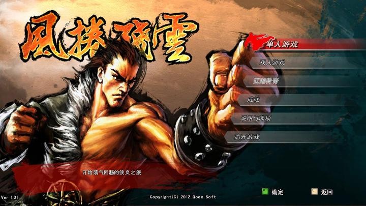

"What is an indie game developer?"

That was the first thing Shan Jun asked me, fresh back from Tokyo Game Show 2015, once he had read through my interview outline.

"Independent finances? Independent ideas? Independent production? Not doing it for the money? None of these seems to capture indie games completely or accurately." Shan Jun smiled as he set out his puzzlement over the term.

I had assumed that with everything Shan Jun has been through in the Chinese games industry, he would give me a simple, clear-cut answer.

Perhaps it is precisely because he has been through all of it that he knows the answer has never been simple.

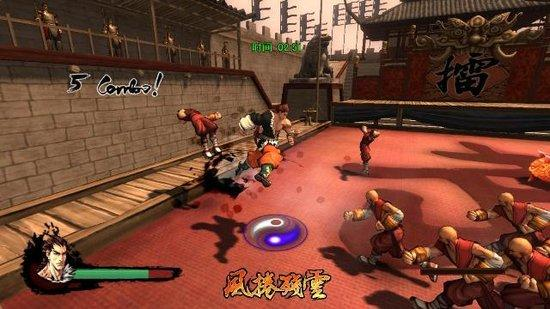

Shan Jun was born in Shanghai on August 30, 1981. As a small boy his whole family was squeezed into a room of less than ten square metres, and his parents divorced early. Years of that pressure and of upheaval at home shaped his character deeply: solitary and introverted, yet fiercely competitive and desperate to express himself.

Drawing opened a whole new world to him.

As a small child he drew cars and trains. In his first year of primary school it was Transformers, in his fourth year Saint Seiya. Every one of them was passed from hand to hand among friends and classmates, which gave him an enormous sense of achievement. So by junior secondary school he had his own collections of comics, fighting comics above all, and he drew more of them and went deeper into them as he went on.

By his first year of senior secondary school he was an experienced hand. Before starting a series he would write a 50,000-character script, then publish hand-drawn instalments of twenty pages each at regular intervals. Countless flights of imagination went into the work, and he even turned many of his classmates into characters, which spread his comics much more widely.

On one side, Shan Jun was soaring through one imaginary world after another of his own making.

On the other, his teachers and parents were caught between supporting him and stopping him. Fortunately, Shan Jun himself had no doubts at that stage. For a time he was convinced that drawing was his future.

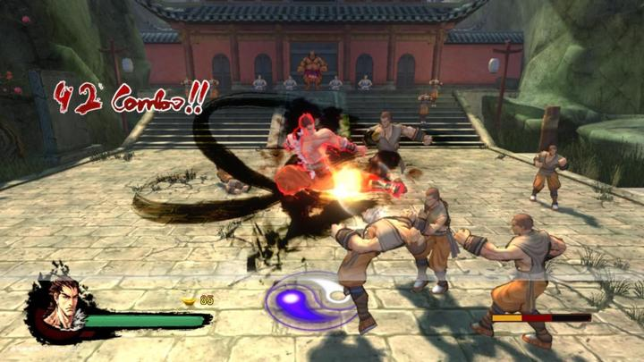

Then, in that same first year of senior secondary school, the school ran a computer programming course. It lasted only half a term, and it changed his life.

The course made him realise all at once that Contra, Pac-Man and Galaxian, the games he had played since childhood on trips with his father to the Huxi Workers' Cultural Palace, had been written with the very lines of program commands in front of him.

He was beside himself. At last he could create a world that was alive. His family had just bought a computer as well, which gave him far more time to study game programming.

So the card-based board game Shan Jun had designed out of boredom in class turned into a computer strategy game with attack and defence.

Then, painting pixel by pixel with a colour palette, he turned the tanks that had been lying flat on paper into vehicles that could drive around, with turrets that rotated, and players could even choose between different types of turret.

The world Shan Jun was building kept growing: soldiers carrying rocket launchers, missiles that could be fired, forces made up of several unit types, and eventually real-time head-to-head play.

Word spread, and classmates came round to his home in groups to play. But he had only one computer.

So he rewrote the program to split the screen down the middle, left and right.

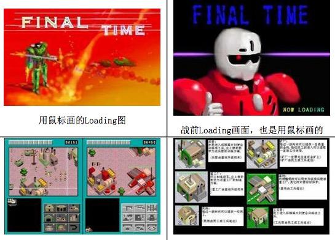

The only catch was that during a match somebody had to hold up a book to block each side's view of the other. The classmate on the left played with the keyboard, the one on the right with the mouse.

It looks a fairly silly arrangement now, but to a group of children in the late 1990s, being able to take part in a game world and create it themselves was a delight and a surprise no adult could imagine.

In 1999, Shan Jun was admitted to the fine arts department of Shanghai Jiao Tong University, where the university's strong computing electives and its library pushed his game programming on by leaps and bounds.

Shanghai Jiao Tong University had a rule that students could not keep their own computer on campus until their second year, so as soon as he got his machine in that second year he set about making a more complicated head-to-head game.

This one, Shan Jun said, had to be interesting for the people watching as well.

The idea came out of something he had experienced as a child. He had a relative who loved to sit at home alone playing strategy games, and even when he and other children came round as guests, all they could do was sit to one side and look on, sometimes for a whole day. It struck him then how good it would be if the people watching could share in the fun.

Carrying that thought with him, he talked it over with a great many friends and classmates, and with his elder brother Shan Hui (单晖), another keen gamer and now the producer of Tencent's Tiantian Kupao (天天酷跑). In the end he decided to design a game about robots fighting each other.

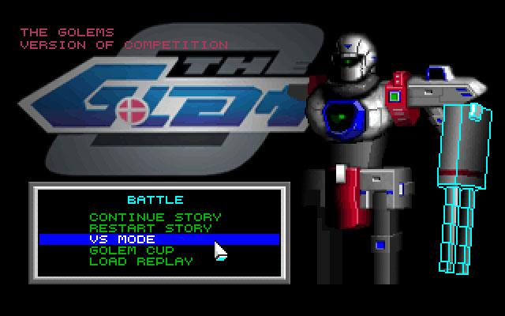

The way it played was unusual. Shan Jun designed several robots with different attributes: one with heavy firepower, one that grabbed an enemy to create an opening for its team-mates, one nimble enough to slip round behind an enemy and kick it up the backside, one built for long-range sniping, one for close-quarters fighting, and so on.

Rather than operating the robots live over a network, players stored preset commands for them on a floppy disk in advance, which meant writing a great deal of code to anticipate situations and act on them. The disks were then loaded onto the same competition machine and the two sides' robots fought it out by themselves.

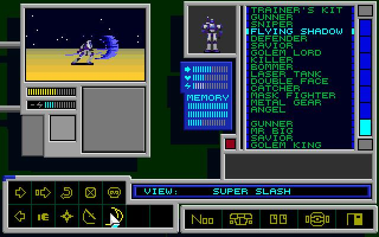

Put simply, what was being compared was the design of the artificial intelligence: whose robot could handle the unexpected more cleverly with no human at the controls.

Through the university computing society, Shan Jun organised a tournament at Shanghai Jiao Tong University, and it drew a good many curious gaming enthusiasts.

On the day it worked wonderfully. One program after another was brought out to compete, and the audience were doubled up with laughter, because some of the robots had been programmed badly enough to look adorably stupid, spinning round and round on the spot, or firing in every direction and hitting their own side. Others were formidable, reading every situation, and the room gasped again and again.

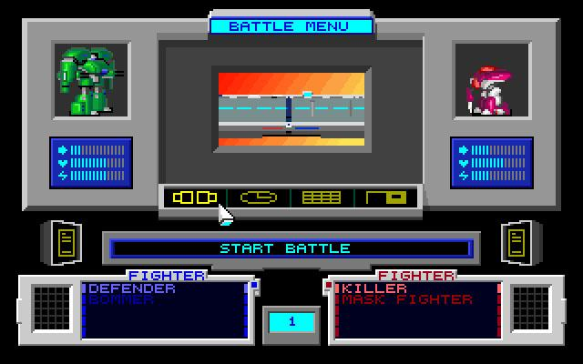

Shan Jun's elder brother was studying at the University of Science and Technology of China at the time. Having seen the game, he suggested taking it to the annual National University Student Game Competition that USTC ran. It was at that competition that Shan Jun won the first championship of his life.

What he gained most from it, though, was meeting a group of independent game developers.

One in particular, a young man from the University of Electronic Science and Technology of China in Chengdu who finished second in that competition, told him a great deal about low-level system programming he had not known before.

The most important of it was a technique for getting past the 640K conventional memory limit in DOS. In the pixel era most images were small and an entire game came to no more than a megabyte or two, but that limit still forced many developers to choose between a stable game and rich, complicated content. Once past it, Shan Jun could design bigger and more complex games.

So in his third year, at the invitation of a fellow student, Hu Ling (胡岭), Shan Jun joined a game development team at Shanghai Jiao Tong University. Another member of it would later become a famous game designer: Chen Xinghan (陈星汉), known internationally as Jenova Chen.

At the same time Shan Jun, who had been holding this back for years and had trained in karate for just as long, could finally start on the fighting game he had always most wanted to make. In two months he had a demo with 3D visuals running under DOS. The feel of the combat was the heart of it, and he had built in physics calculations as well.

This is how the demo of that fighting game ran under DOS.

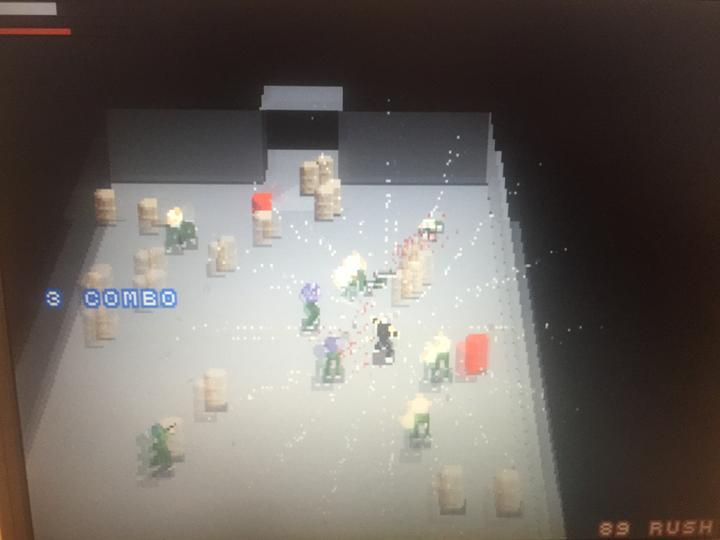

The price of being young

With a team and the technical skill behind him, Shan Jun's life was, broadly, heading in the right direction.

But being young, poor at communicating, short of experience working in a team and carrying a certain conceit that comes with early success, his own problems came out into the open at this point.

Shan Jun says young indie developers tend to be self-absorbed. The good side of that is plenty of independent thinking. Working in a team is another matter.

He had clearly not mastered where the balance lay. The team itself was a good one, but with too little communication and coordination, three group projects that everyone had high hopes for all fell short.

What is a shame is that none of it put him on his guard.

The year was 2003. Shan Jun was in his final year, and the Chinese online game industry, with Shanda at its head, was booming.

Shanghai Jiao Tong University, famous for computing, was naturally a first stop for recruiters, and Shan Jun's record of prizes at several game design competitions took him straight into Shanda's core research and development department.

After two weeks on customer support and two months in operations, Shan Jun returned to the development department of The World of Legend (传奇世界), where he was responsible for designing environments and levels.

Shan Jun says it was an exhausting year. As a devotee of Blizzard's Diablo II he had no love for Legend, but he worked hard all the same, because that was the only way to earn the chance to design a game himself.

A year later The World of Legend was a huge success, and at twenty-three Shan Jun got what he wanted and became Shanda's youngest game project manager, put in charge of developing Sanguo Haoxia Zhuan (三国豪侠传), a casual turn-based tactics game set in the Three Kingdoms.

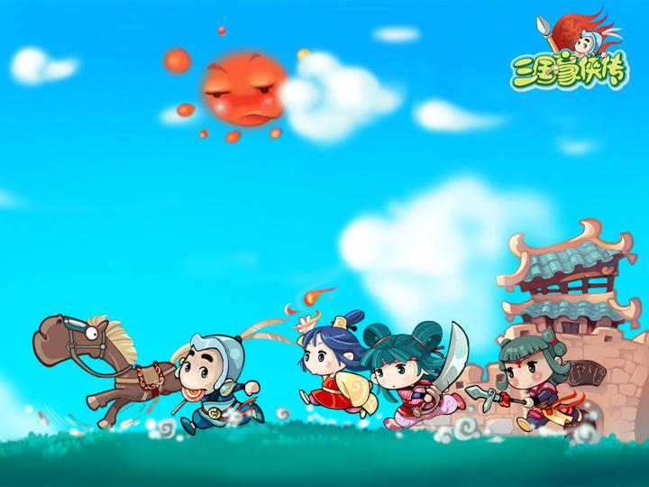

The core idea of the game was that you could carry on playing without waiting for anyone else's turn.

A demo was put together quickly. The balance of the numbers was badly off and Shan Jun was unhappy with it, but the operations side thought it was excellent. Unfairness, they argued, was exactly what drove players to seek progression. If unfair skills existed in the game, players would stay and keep playing.

But Shan Jun, young and idealistic, dug his heels in. He did not take the commercial advice from operations with any humility. He stuck to his own view of the game, balanced the numbers and insisted on slow progression.

At one company design meeting chaired by Chen Tianqiao (陈天桥), Shanda's boss even remarked that there was a rather good idea in Shan Jun's game and asked whether it could be made simpler still. Shan Jun contradicted him on the spot, saying that a developer ought to have something of his own to aim for. The atmosphere in the room froze instantly.

Looking back on that period, Shan Jun deeply regrets it. His arrogance and self-importance as a young man, he says, not only made him miss the golden years for learning what Chinese players actually wanted, but, more importantly, left many superiors and colleagues who had thought very highly of him thoroughly disappointed.

In 2006, after nearly two years in development, Sanguo Haoxia Zhuan was declared a failure. As the man in charge, Shan Jun could hardly avoid the responsibility, and Shanda dismissed him.

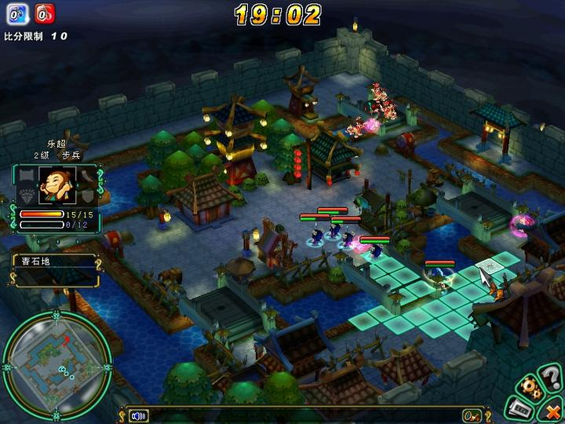

Shanda at that time looked to many people like paradise for a Chinese game developer: deep pockets and strong products. The9, which held the World of Warcraft licence, was only just getting started.

Being struck off at Shanda meant being publicly written off by the industry. Shan Jun had gone from paradise to hell in a single step.

Waking as if from a dream, he began to see his own part in it. He felt hard done by, but he also understood his own shortcomings, and decided he should get his feet on the ground and take a proper look at the casual and role-playing games that sold well in China, MapleStory among them.

From then on, Shan Jun says, he still held on to certain things, but a great deal about him changed.

After leaving Shanda, a friend introduced him to Shanghai Lingchan (上海灵禅), a company then just starting out in game software outsourcing, where he became a project manager.

Later, while working with Sega on a game project, Shan Jun happened to learn that Microsoft, laying the ground for bringing its Xbox console into China, had set up a game incubation centre in Chengdu ahead of time and wanted to pick out some homegrown Chinese games for the Xbox online store, Xbox Live Arcade.

For Chinese indie games and for Shan Jun alike this was a superb opportunity. XBLA was much like Apple's App Store today, only stricter, and a game that got onto it would be promoted by Microsoft officially to the whole world. So as long as the game was good, it meant a vast audience and real revenue.

XBLA lowered the barrier to publishing a game enormously, and made it possible for an indie game with only a handful of developers to stand genuinely on its own.

Shan Jun seized the chance. He built a demo in DOS called Crazy Mouse (疯狂老鼠), another small casual head-to-head game, and in under three months Microsoft had confirmed it would work with him, for the international Xbox market at that.

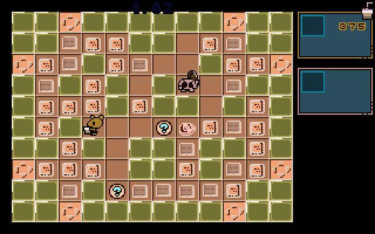

His confidence soared. The route of "indie games plus XBLA", sidestepping the domestic market and going straight for an international product, looked like one that could actually work.

"Looking back now, I really did think indie games were far simpler than they are." Shan Jun, sitting opposite me, was gently mocking himself.

In 2007, called on once again by his old university friend Hu Ling, Shan Jun resigned to start a company.

There were only two people in it. Hu Ling wrote the engine and the tools, Shan Jun the core logic, and the art and music were outsourced. That settled the direction from the outset: they would make the fighting game Shan Jun wanted to make and was good at. And so Kung Fu Strike: The Warrior's Rise, a 3D fighting game built specifically for Xbox Live Arcade, came into being.

Getting a platform recommendation was not so simple, though. There were two routes. One was to enter Dream Build Play, Microsoft's game competition. Win it and you had a chance of getting on, but the competition was fierce, with indie developers from all over the world, and the final round usually had forty or fifty games in it.

Over the next two years Shan Jun and Hu Ling took one third prize and two second prizes. Close, but not enough for XBLA.

The other route was to find a publisher Microsoft recognised and reach XBLA through them.

That route was almost the same one Shan Jun had faced before. Put simply, a commercial company is willing to invest in your game, and once it is on the platform and selling well, everybody shares in the profits.

By now it was 2007 to 2009. Tencent's casual online games were making enormous sums, while Shan Jun's console fighting game, made specifically for Western players, was plainly no longer part of the mainstream at home.

Two years went by without a publishing deal. Hu Ling and Shan Jun had almost burned through their savings, and the pressure at home was severe.

Hu Ling's wife was close to giving birth and he had to go to Australia to look after his family. Torn between the two, he offered to earn money over there and support Shan Jun so that the game could carry on. Shan Jun could not bring himself to accept, declined politely and set about finding another way forward.

At the end of 2009, with Chinese domestic gaming in fine health, Shan Jun was holding an indie game and had reached the end of the road.

He began to doubt his choices, to doubt the direction of the game, to doubt indie games themselves.

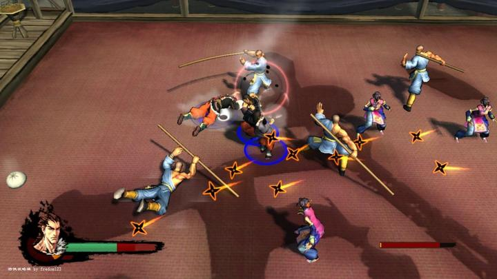

Then, at his most lost, the turn came from the last place he would have expected.

Shanda, his former employer, decided through its 18 Fund (18基金) to back Kung Fu Strike with an investment in the tens of millions of yuan and to give the team three years to build the product. Those were very good terms indeed.

Shan Jun put together a team of a dozen or so people straight away, and with Shanda's backing behind him he came to terms with a foreign game publisher almost instantly and confirmed the arrangement with XBLA.

He had money to make the game and a way onto the Xbox platform.

What two years of effort had failed to produce was done almost in a moment.

A happy ending?

I would very much like to end the piece here and tell you that Shan Jun and his indie game lived happily ever after.

But reality is always cruel, and the following two years brought two great reversals.

First, Kung Fu Strike sold 8,000 copies in its first month on sale and was well received by players in China and abroad, and some of them are still active on Baidu Tieba today. Yet at the critical moment when the game should have been pushed hard, the foreign company handling publishing fell out with Microsoft. All of that company's games were taken down, and Kung Fu Strike went off sale with them.

Second, Shanda's 18 Fund was abruptly discontinued. Shan Jun's team was halfway through its second game, at precisely the point where the old work was finished and the new had yet to bring anything in, and the money ran out.

In 2013, after weathering so much and holding on for so long, Shan Jun finally could not hold on any longer. Disheartened, he put aside every idea he had about making indie games and turned to commercial games, setting out once more on the hard road of carrying a demo around looking for backers. He was no longer struggling alone: behind him were more than twenty colleagues who had followed him for years, and behind them their own families and pressures.

Shan Jun says: "Going from starting a company for myself and making the games I liked, to being responsible for other people and making the games they like, is a big change in my life. There is nothing good or bad about it, and no conclusion to draw about right and wrong. I have not given up making the games I want to make. I am simply more mature now, and not as extreme as I used to be. So when I look again at the question of what an indie game is and what an indie game developer is, my answer is more complicated than before, and more down to earth."

Shan Jun, a Chinese indie game developer.
