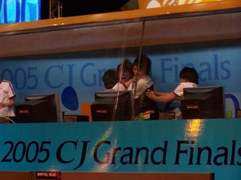
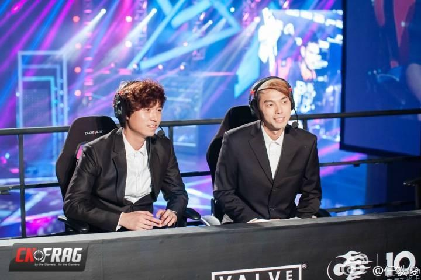
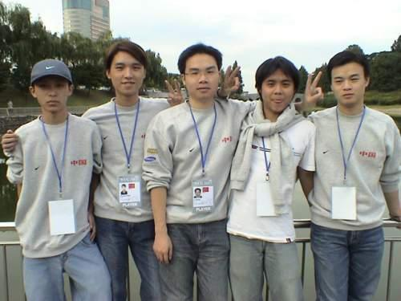
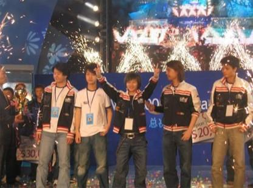

# 제30장. 세계적인 중국 카운터 스트라이크 인게임 리더, Alex 볜정웨이

> 《ONE MORE WAY: 중국 e스포츠의 이면사》 중 한 장. 저자 BBKinG(류양, 刘洋). 중국어 원문에서 번역: [三十 世界级中国CS指挥官 Alex卞正伟](../zh/chapters/30-世界级中国CS指挥官-Alex卞正伟.md)
>
> 저자의 즈후(知乎) 칼럼에 2014년 3월 2일 처음 게재: https://zhuanlan.zhihu.com/p/19691636
>
> 이 번역은 2026년 8월 1일 중국어 원문과 대조해 검토했습니다. 오역, 잘못된 표기, 사실 오류를 발견하시면 [이슈를 열어](https://github.com/bkingfilm/china-esports-history/issues/new) 주시거나 풀 리퀘스트를 보내 주세요.

어떤 사람이라야 세계적인 카운터 스트라이크 인게임 리더라고 할 수 있을까?

2005년 12월 11일, 베이징 서우강 체육관. 중국 wNv.Gaming 대 한국 프로젝트 케이알(Project_kr), 제3회 WEG 세계 결승의 카운터 스트라이크 우승 결정전이었다.

3전 2선승제였다. wNv는 첫 판을 내주고 한 판을 따라붙어 상대를 3세트로 끌고 갔다. 마지막 세트의 맵은 인페르노였다.

시작부터 wNv가 밀려 3대6까지 벌어졌다. 더 나빠질 수 없는 상황이었다. 돈이 떨어져 에코 라운드였고 살 수 있는 것은 권총뿐이었다. 장내는 긴장 속에 물을 끼얹은 듯 조용해졌다.

wNv의 주장이던 Alex는 모든 것을 걸고 한 번 승부를 보기로 했다. B 사이트로 돌진하는 것이었다.

한국 팀은 사력을 다해 막았고, B 사이트에서 치열한 근접 교전이 벌어졌다.

wNv는 sakula를 빼고 전원이 쓰러졌고, 상대도 B 사이트에 한 명만 남았다. 두 사람 다 물러설 생각이 없어 지척에서 뛰고 돌면서 총을 주고받았다. 그러다 sakula의 총알이 떨어졌고, 상대의 총알도 떨어졌다.

상대가 탄창을 가는 그 한순간에 sakula는 망설임 없이 나이프를 뽑아 몸을 돌려 붙으면서 상대를 찔러 죽였다.

그 라운드는 결국 내줬다. 그러나 경기장이 달아올랐다.

양 팀 선수도 장내 관중도 모두 미친 듯이 반응했다. 응원 소리에 지붕이 날아갈 것 같았다. wNv는 사기가 크게 올라 단숨에 8대7까지 갔고 경기는 후반으로 넘어갔다.

주장이자 인게임 리더인 Alex는 그래도 조금도 방심하지 않고 한국 팀의 날카로운 공세에 침착하게 대응했다.

마지막 라운드에서 프로젝트 케이알은 A 사이트를 주공으로 삼았다. wNv는 이를 정확히 읽고 제때 수비로 돌아왔다. 두 명을 내주는 동안 네 명을 잡았고 상대의 폭탄을 든 선수까지 끊었다. 그리고 아주 침착하게 마지막 한 명에게 함정을 만들어, 교차 사격으로 마지막 한국 선수를 잡아냈다.

최종 스코어 16대12로 wNv는 WEG 2005의 새 세계 챔피언이 되었다.

이겼다. 그 한순간에 꿈이 현실이 되었다.

Alex는 그때 가장 인상에 남은 것이 그 경기실이었다고 했다. 한국 쪽이 방음을 아주 잘해 둔 덕분에, 그가 문을 밀고 나온 그 순간에야 터져 나온 박수와 환호가 한꺼번에 귀로 쏟아져 들어왔다. 그 순간 그는 자기가 세상에서 가장 행복한 사람이라고 느꼈다.

Alex 볜정웨이(卞正伟).

NoA 등 세계 정상급 팀에서 뛴 유명한 노르웨이 카운터 스트라이크 선수 bsl은 Alex가 자기가 본 가장 신중한 리더라고 말했고, Team 3D의 전술 코치 bootman은 Alex야말로 가장 만나고 싶지 않은 인게임 리더라고 잘라 말했다.

온갖 찬사가 쏟아질 때도 Alex는 늘 겸손하고 예의 발랐고, 언제나 동료들을 넉넉하게 치켜세웠다. 여기에 밝고 준수한 외모와 스캔들 하나 없는 처신이 더해져, 후원사들에게 그는 카운터 스트라이크의 완벽한 얼굴이었다.

영광과 꿈이 모두 그 한순간에 모여 있었다.

(사진 왼쪽이 Alex 볜정웨이, 오른쪽이 유명한 전 카운터 스트라이크 프로 선수 117이다.)

이제 시간을 멈추고 되감는다. 세계가 천천히 어두워지고, 빛이 사라진다.

## 돈 없는 어린 시절과 꺾인 축구의 길

1982년 2월 28일, 아직 Alex라고 불리지 않던 볜정웨이는 충칭 주룽포구에서 태어났다. 아버지는 그가 중학생일 때 병으로 세상을 떠났다. 어머니는 발전소 노동자였고, 집에는 외조부모와 어머니 남동생의 아이들까지 돌봐야 할 식구가 여럿이었다. 그 무게가 전부 어머니의 얼마 안 되는 수입과 외할머니의 퇴직 연금에 얹혀 있었다.

그렇다. 이 이야기도 슬픔에서 시작한다.

Alex는 어려서부터 축구를 좋아해 네 살에 공을 차기 시작했다. 4학년 때 교사의 눈에 들어 전문 훈련을 받는 체육 특기 팀에 보내려 했지만, 학구를 옮기려면 호적을 옮겨야 했고 거기에 5,000위안이 들었다. 그때 집에서는 도저히 그 돈을 만들 수 없었다. 결국 프로의 길은 접고 여기저기 남의 팀에 끼어 동네 축구를 하러 다녔다.

드리블과 돌파를 겁내지 않아서 Alex는 중학교 3학년 때 이미 그 바닥에서 이름이 조금 알려져 있었다. 어느 날 공을 차다가 지나가던 코치의 눈에 들어 갑B 리그 팀이던 충칭 훙옌의 유소년 팀에 들어갔고, 마침내 프로 선수가 되었다. 숙식이 제공되고 훈련 수당은 월 800위안이었다. 많은 돈은 아니었지만 천성이 낙천적인 Alex에게는 그것만으로 충분했다. 먹여 주고 재워 주고 공을 찰 수 있는 데다 집에 보탬까지 되는데 이보다 더 좋은 일이 어디 있느냐는 것이었다.

좋은 날은 길지 않았다. 2년 뒤인 1999년 충칭 훙옌이 을급으로 강등되면서 후원하던 제조업체가 후원을 끊었고, Alex의 프로 선수 생활도 거기서 끝났다. 그때 그는 열일곱이었다. 받아들일 수 없었던 그는 다시 기업 팀의 동네 축구를 도우러 다녔다. 뒤에 한 부동산 회사 사장이 그를 눈여겨보고 이 팀을 갑B로 다시 올리겠다는 큰 뜻을 품었다. 가능성도 충분했다. 그런데 시내 기업과 관공서가 맞붙은 경기에서 승부 조작이 드러났고, 이 사장은 축구에 완전히 실망했다. 이길 수 없는 상대는 피하는 게 낫다는 울분을 안고 그는 미련 없이 축구를 접었다.

2001년 팀이 해체된 뒤 Alex는 다시 찰 공도 없고 수입도 없는 소용돌이에 빠졌다. 열아홉의 그는 깊은 실망과 막막함 속에서 무심히 축구의 꿈을 내려놓았다.

## 카운터 스트라이크, 그리고 다핑 원정

바로 그해 7월, Alex는 카운터 스트라이크를 처음 접했다. 아쉽게도 첫 만남은 유쾌하지 않았다. 몸이 3D 멀미를 하는 것인지 무엇 때문인지, 처음 해 보고 토할 만큼 속이 뒤집혔다. 그는 화를 내며 다시는 이 게임을 하지 않겠다고 했다. 그런데 나중에 보니 PC방 전체가 이 게임을 하고 있었다. 중국의 인터넷 카페로, 한국의 PC방과는 성격이 다른 공간이다. 친구들도 하고 있어서 그는 계속할 수밖에 없었다. 뜻밖에 그 뒤로는 멀미가 다시 오지 않았고, 할수록 더 좋아졌다.

두 달쯤 하고 나서 Alex는 카운터 스트라이크에 대회가 있다는 것을 알았다. 몸속의 승부욕에 다시 불이 붙었다. 그는 같은 반 친구들을 모아 팀을 만들고 매일 훈련하며 목표를 정했다. 충칭 발전소 사택 단지 안의 모든 팀을 이기겠다는 것이었다. 그 구역을 통째로 차지하겠다는 심산이었다.

뜻밖에 이 목표는 보름 만에 이뤄졌다. 단지 안에서 이름이 났을 뿐 아니라 세 팀을 흡수했다. 자신감이 단숨에 부풀어 올라, 그들은 주변에 강한 팀이 어디 있는지 수소문하며 사람들을 이끌고 밖으로 나가 세상을 겪어 보기로 했다.

정말로 하나 찾아냈다. 근처 다핑에 충칭 3위라는 팀이 있다는 이야기였다. Alex는 무리를 이끌고 버스를 한 대 통째로 빌려 자신감에 찬 채 도전장을 내러 갔다. 결과는 그의 표현대로, 상대 주전 두 명과 그 자리에서 급히 부른 일반인 세 명에게 완전히 박살이 났다.

기세는 그 자리에서 꺾였다. 한 무리가 말없이 상대 뒤에 서서 어떻게 하는지 지켜보고서야 알았다. 자기들은 MP5로 난사하는 것밖에 몰랐는데 상대는 AK와 M4로 점사를 했고, 수류탄과 섬광탄을 맞춰 전술을 썼으며, 자기들은 피하지도 않고 그대로 밀고 올라가기만 했다. 산적이 정규군을 만난 격인데 그렇게 기세등등하게 도장을 깨러 갔으니 망신도 그런 망신이 없었다. 촌뜨기 한 무리는 낯을 들지 못한 채 한마디도 없이 버스를 타고 돌아왔고, 팀은 얼마 뒤 소리 없이 흩어졌다.

Alex도 창피했지만, 지기 싫어하는 스포츠맨의 기질이 그를 정신 들게 했다. 그는 새 목표를 세웠다. 충칭 1위였다.

목표가 생겼고 문제가 어디에 있는지도 알았다. 그것이 소득이었다. 그래서 Alex는 해외 카운터 스트라이크 경기 리플레이를 내려받아 연구하기 시작했다. 적어도 방향은 맞았다. 다만 그는 그때 것은 연구라고 할 수도 없고 흉내였다고 말했다. 남이 걷는 대로 걷고 남이 던지는 대로 던졌을 뿐, 해외 팀이 왜 그렇게 하는지는 별로 생각하지 않았다. 대신 총 다루는 솜씨 같은 개인 기량은 점점 능숙해졌다.

그래도 2001년 중국 카운터 스트라이크의 발전 단계에서는 대다수가 아직 총싸움에 매달리던 때라, 해외 전술을 비슷하게 흉내 내는 것만으로도 충분했다. 그래서 Alex와 동료들이 만든 A4U 팀은 반년 만에 CBI가 주최한 카운터 스트라이크 대회에서 당시 충칭 1위이던 C4 팀을 꺾고 지역을 제패했다.

## 상하이, EVIL, 그리고 PC방에서의 무료 훈련

2002년 CBI 충칭 지역 우승은 충칭을 대표해 상하이에서 열리는 중국 결승에 나간다는 뜻이었다. Alex는 몹시 들떴다. 처음으로 충칭을 떠나 37시간 동안 딱딱한 일반석에 앉아 전국이라는 새 전장에 들어섰다.

새 전장, 새 상대, 새 높이였다. 그해 가장 눈에 띄는 카운터 스트라이크 팀은 단연 EVIL이었다. 당시 EVIL에는 이름난 분대가 셋 있었다. EVIL | UF, EVIL | FF, EVIL | GXU였고, 불운하게도 Alex의 팀은 1라운드에서 FF, GXU와 같은 조에 묶였다. 어떻게 당했는지는 굳이 말할 필요가 없다. 결국 FF가 파죽지세로 전국 우승을 차지해 5만 위안의 상금과 우레와 같은 박수와 찬사를 가져갔다. 2002년 기준으로는 아주 큰 상금이었다. 현장에서 그 광경을 그대로 겪은 Alex는 부러워서 견딜 수가 없었고, 이를 악물고 새 목표를 세웠다. 전국 챔피언이었다.

그런데 집에 돌아오자마자 그들은 정면으로 한 방을 맞았다. WCG 충칭 지역 조별 예선에서 JF 팀에 탈락했고 C4 팀이 또 1위를 가져갔다. 패배 뒤에 다시 학교로 돌아가겠다는 동료가 나왔고, A4U 팀은 그렇게 해체되었다.

다행히 그들을 이긴 JF 팀은 Alex를 높이 평가해 그와 동료 한 명을 데려갔다. 급여는 없었고 PC방에서 무료로 훈련할 수 있다는 대우뿐이었다. 2002년 e스포츠 팀에서는 아주 흔한 형태였다. 이 무료 훈련이라는 대우를 얕보면 안 된다. 갓 스무 살에 수입이 전혀 없던 Alex에게는 하늘 같은 혜택이었다. 하루 5위안의 PC방 요금을 아낄 수 있었고, 왕복 차비 4위안만 쓰면 자기가 좋아하는 일을 할 수 있다는 뜻이었다. 훈련이 고된 것은 Alex에게 두렵지 않았다. 가장 견디기 힘든 것은 밤새 훈련하는 동안 동료들이 밥을 사 먹을 때였다. 배가 고파 죽을 지경이라 침을 계속 삼키면서도 입으로는 웃으며 배가 안 고프다고 우겼다.

Alex는 여기까지 말하고 스스로 웃었다. 그 유명한 말을 기억하는가. 지금 아주 힘든 일도 언젠가는 웃으면서 이야기할 수 있다.

## DeviL, 그리고 길게 이어진 PC방 폐쇄

하늘은 부지런한 사람에게 보답한다. 언제라도 이 말을 얕보면 안 된다. Alex의 기회는 그렇게 조용히 찾아왔다.

2002년에는 전국의 카운터 스트라이크 열기가 이미 아주 뜨거웠다. 베이징의 DeviL 팀이 VIP 분대를 만들기로 했다. 숙식 제공에 월 1,200위안, 당시 중국 최고 수준의 프로 팀 대우였다. Alex는 초청을 받았다. 그런데 2002년 6월 많은 인명을 앗아 간 란지쑤 PC방 화재로 베이징의 모든 PC방이 문을 닫으면서 이 일은 12월까지 미뤄졌고, 그제야 Alex는 베이징에 갔다. 그때도 PC방은 영업이 허용되지 않아, 충칭 출신 네 명과 베이징 출신 한 명으로 이뤄진 DeviL | VIP 팀은 텅 빈 PC방에서 조용히 훈련하는 수밖에 없었다.

그런 불리한 환경에서도 Alex와 동료들은 2003년 1월 넷컴 컵에서 우승 후보 1순위이던 5DK 팀을 두 번 연속으로 꺾고 우승했다. 상금은 5,000위안이었고 Alex의 몫은 800위안이었다.

PC방은 여전히 문을 열지 못했고, 이것은 DeviL 팀의 총감독이자 PC방 주인이던 110에게 큰 골칫거리였다. 당시 e스포츠 대회가 뜰 수 있었던 데에는 새로 문을 연 큰 PC방들이 대회로 사람을 끌어모으려 한 이유가 컸다. 중국 하드웨어 업체들이 e스포츠를 대규모로 후원하기 시작한 것은 몇 해 뒤의 일이다. 그러니 그해 란지쑤 사건의 영향은 정말 멀리까지 갔다.

그런데 다른 한 가지에 비하면 란지쑤의 영향은 훨씬 작았다. 2003년 5월, PC방을 둘러싼 소동이 겨우 지나가 Alex와 동료들이 문을 열고 두세 번 훈련했을 무렵 사스가 왔다. 모든 오락 시설이 하룻밤 사이에 문을 닫았다. 충칭 출신 동료 세 명은 집으로 불려 갔고, Alex는 끝까지 남아 온라인으로 훈련을 이어 갔다. 사스가 지나갔을 때 WCG는 한 달 앞이었는데, 충칭 동료 세 명은 오지 않겠다고 했다.

이때 Alex에게는 화를 낼 여유조차 없었다. 급한 대로 다른 사람을 찾아야 했고, 전 EVIL | UF 소속 네 명 Mahdi, ipig, Sprite, Luckyboy와 연락이 닿았다. 청두 출신 넷과 충칭 출신 하나의 조합으로, 뒷날 이름을 떨치는 deViL*United 팀이 만들어졌다.

## 창단 한 달 만에 WCG 중국 대회를 휩쓴 팀

그때 deViL*U의 WCG 길목을 막고 선 상대들은 중국 카운터 스트라이크 역사상 가장 화려한 황금기의 진용이었고, 선수 대부분이 전설의 후광을 두르고 있었다. 카운터 스트라이크 전설의 원로 스타 KING이 이끄는 ICE 팀, Perfect, 냐오냐오(鸟鸟), OY, KinGZ, Butcher로 구성되어 우승 후보 1순위로 꼽히던 Evil | Zero 팀, 이름난 광둥의 Rainbow 팀, 전국을 돌며 대회 상금을 쓸어 담다가 상금 다툼이 실제 몸싸움으로까지 번진 것으로 유명한 유격대 China.V 팀, 얼마 전 deViL*U를 꺾고 베이징 지역 1위로 결승에 오른 광시의 NP 팀이 있었다. 그리고 Alex가 뒷날 들어가는 wNv도 그 안에 있었다는 것을 잊으면 안 된다. 카운터 스트라이크 역사를 조금이라도 아는 사람이라면 알 수 있듯이, 여기 언급한 팀은 하나하나가 창단한 지 한 달밖에 되지 않은 deViL*United에게 만만치 않은 상대였다.

이미 왔으니 붙어 보는 수밖에 없었다. 그런데 첫날에 그대로 뚫어 버렸다.

deViL*U는 위의 팀을 전부 패자조로 보냈다. 당연히 온라인에서는 엄청난 소동과 논쟁이 일었고 온갖 조작설과 음모론이 나왔다. 팬들만 받아들이지 못한 것이 아니라 다른 팀 선수들도 받아들이지 못했다. 그래서 둘째 날 패자조에 남은 네 팀은 안티치트 프로그램을 켜고 경기하자고 한목소리로 요구했다. 그래도 deViL*U는 그대로 뚫고 나갔고, 결승에서 E | Zero를 다시 꺾어 중국 대표로 한국에서 열리는 WCG 세계 결승에 나갈 자격을 얻었다. 그런데도 국내 포럼에서 의심하는 목소리는 계속 파도처럼 이어졌다.

이때 Alex는 그런 것에 신경 쓸 겨를이 전혀 없었다. 해외의 모든 것이 그를 너무 들뜨게 했기 때문이다. 2003년 전까지 중국의 카운터 스트라이크 대회에서는 말을 할 수 없었다. 경기를 이겨도 말을 못 하고 그저 나무 인형처럼 앉아 박수만 쳐야 했다. 아주 기이한 일이었고, 카운터 스트라이크 초기의 중국 특유의 대회 규정이었다. 이 기형적인 규정의 유래와 뒷날의 변화만으로도 논문 한 편은 따로 쓸 수 있으니 여기서는 펼치지 않겠다.

국내의 기형적인 규정 탓에 Alex는 WCG 2003 세계 결승에 가서야 알았다. 카운터 스트라이크 경기에서는 죽었을 때 말을 못 할 뿐, 게임 캐릭터가 살아 있는 한 말도 하고 환호도 하고 심지어 상대를 놀릴 수도 있다는 것이었다. Alex는 여기서 아주 신나게 놀았다. 게임의 재미를 마음껏 누린 것 말고도, 그는 여기서 세계적인 수준의 총 솜씨와 전술 운용을 가까이에서 봤다. 이것은 뒷날 그가 자기만의 전술 지휘 체계를 만드는 데 큰 밑거름이 되었다.

특히 WCG 결승에서 스웨덴 SK 팀이 미국 3D 팀을 꺾고 5만 달러짜리 상금 보드와 WCG 금메달을 들어 올리는 것을 본 뒤, Alex에게는 새 목표가 생겼다. 세계 챔피언이었다.

WCG가 끝났다. Alex와 동료들은 가시밭을 헤치고 나아가 중국 카운터 스트라이크에 처음으로 WCG 세계 8강이라는 성적을 안겼고, 마침내 전 세계에 자기 실력을 증명했다. 여기에 이르러서야 국내 포럼의 논란과 의심도 일단락되었다. 덧붙이자면 뒷날 중국 카운터 스트라이크는 WCG 세계 8강에 세 번 올랐고 그때마다 Alex가 있었다.

다시 그때로 돌아가면, CCTV의 《e스포츠 세계》가 WCG 2003을 처음부터 끝까지 따라 찍었고 온 국민이 보는 CCTV5에서 WCG 다큐멘터리를 몇 회 연속으로 내보냈다. deViL*U는 그렇게 떴고, 주장인 Alex도 떴다. 충칭 천바오가 Alex의 이야기를 특집으로 다루면서 가족이 그의 e스포츠 일을 보는 눈도 근본적으로 달라졌다. 그 자신의 처지도 크게 바뀌었다. 전에는 급여가 밀리지 않을지, 팀이 갑자기 해체되지 않을지 매일 걱정했는데, WCG 세계 8위를 하고 나자 중국의 모든 클럽이 Alex를 데려가려 했다.

## U팀에서 wNv로

여러 가지를 따져 본 끝에 Alex는 쑤저우 Su.Z 팀의 구단주 Oldfox가 내건 조건을 받아들였다. 원격으로 팀을 관리해도 되고, 선수마다 월 1,800위안을 주며, 팀 태그를 달고 대회에 나가기만 하면 된다는 조건이었다. 그는 U팀을 데리고 충칭으로 돌아갔다. 모든 것이 좋은 쪽으로 가는 듯했지만, WCG의 열정은 일상 훈련 속에서 천천히 사라졌고 그 자리를 안일함과 자만이 채우면서 팀은 계속 경기를 지기 시작했다. 승리에 가려져 있던 갈등과 문제가 하나씩 드러났다.

2004년 5월 U팀은 베이징에서 ESWC 결승을 치렀다. 패자조 우승으로 올라가 마지막에 wNv에 졌고, Alex는 분해서 울었다. wNv의 매니저 리제(李杰)와 마차오(马超)가 일부러 Alex를 찾아와 월 5,000위안을 줄 테니 새 올스타 팀을 만들라고 제안했다. 그러나 Alex는 받아들이지 않았다. 그는 포기하고 싶지 않았고 WCG에서 자기 팀으로 한 번 더 해 볼 생각이었다.

그런데 7월 WCG 중국 결승에서 Alex의 팀은 조별 예선에서 탈락했다. 그는 크게 상심했다. 이때 wNv의 매니저 리제와 마차오가 다시 찾아왔고, 마음이 식을 대로 식은 Alex는 환경을 바꿔 보기로 하고 wNv의 초청을 받아들였다.

wNv가 처음 만든 두 분대의 이름은 wNv.Nerver와 wNv.Wisdom이었다. 이후 통합과 조정을 거치면서 wNv.Nerver는 wNv.CN이 되었고, wNv.Wisdom은 Alex가 이끄는 wNv.Gaming이 되었다. 그때의 황금 진용은 다음과 같다.

wNv.CN: Ray, Bigun, Rap, Aqi, aPs

wNv.Gaming: 44'alex, tK, sakula, Jungle, mikk

2004년 12월, wNv.Gaming은 팀을 꾸리고 보름 훈련한 뒤 아오메이 왕중왕전에서 우승했고 CN이 준우승했다. 당시 wNv의 훈련 기지는 오피스 빌딩 안에 있었고 우승 트로피 전시실도 따로 있었다. 대우도 중국 최고 수준의 e스포츠 클럽에 걸맞았다.

Alex가 팀의 인게임 리더로 분명하게 정해진 것도 이때부터였다. 판 전체를 보는 사고를 하게 된 데다, 여러 해의 축구 훈련과 e스포츠 팀 훈련 경험을 정리하고 되짚으면서 그는 e스포츠 팀의 훈련과 관리에 대해 자기만의 이해와 체계를 만들기 시작했다.

Alex는 축구를 할 때 자기의 가장 큰 장점이 드리블과 돌파를 겁내지 않는 것이었다고 했다. 그런데 전문 팀에 들어가니 감독에게는 취사선택이 있고 선수들 사이에는 파벌이 있어서 개인의 장점이 천천히 갈려 나갔다. 그는 그것이 잘못이라고 봤다. 훈련은 사람마다 재능에 맞춰야 하고, 선수마다 자기 장점을 발휘하게 해서 자기 특징을 살리도록 북돋우면서 팀의 호흡과 이해를 맞춰야 팀의 힘이 온전히 터져 나온다는 것이었다.

## 황금기, 그리고 서울에서의 두 달

바로 이런 생각 아래, 2005년 설에 Sakula가 합류하면서 wNv.Gaming은 자기들의 전성기를 열었다. 먼저 프랑스에서 열리는 ESWC 출전권을 어렵지 않게 따냈고, 8연승으로 세계 8강에 올랐다가 마지막에 14대16의 근소한 차이로 Mouz에 졌다. 2005년 WCG도 소란스러웠다. 세계 결승이 카운터 스트라이크: 소스(CSS)를 종목으로 채택했는데, 이 게임은 카운터 스트라이크와 같아 보여도 카운터 스트라이크 1.6과는 본질적으로 달랐다. 그래서 wNv.CN은 중국 지역 우승으로 출전권을 얻고도 CSS를 전혀 연습해 본 적이 없어 자격을 포기했다. 2006년 WCG는 다시 카운터 스트라이크 1.6으로 돌아갔지만, 카운터 스트라이크 황금기가 저물면서 이 변화는 이미 큰 의미가 없었다.

다시 2005년의 wNv.Gaming으로 돌아가면, 그때 그들은 정말 패기와 활력이 넘쳤다고 할 만했다. 한국에서 열린 WEG 3시즌 아시아 예선에서 wNv.Gaming은 일본을 탈락시키고 또 다른 중국 팀 AS를 꺾었다. 위 사진의 117이 있던 팀이다. 그리고 2005년 11월, 1위 자격으로 AS와 함께 아시아를 대표해 한국으로 가서 두 달 일정의 WEG 리그에 참가했다.

이 두 달 동안 wNv.Gaming의 수준은 완전히 달라졌다. 여기서 먼저 WEG를 칭찬해야겠다. 3시즌에 그들은 한국 CJ 미디어에서 20억 원의 투자를 받았고, 덕분에 WEG는 모든 선수를 서울의 아주 좋은 호텔에 묵게 하며 매일 훈련시킬 만한 예산을 갖췄다. 일정도 아주 잘 짜여서 한 주에 한두 경기만 치르면 되었다. 그래서 팀마다 다음 상대를 아주 꼼꼼히 연구할 수 있었고 상대를 겨냥한 전술을 짤 시간도 충분했다. Alex와 동료들은 전술 이해라는 면에서 큰 도움을 받았다. 후반에는 상대 선수들의 자리 배치만 보고도 어디로 움직일지 예측할 수 있었고, 상대가 스타일을 바꾼 것을 알아채면 곧바로 새로운 대응을 내놓을 수 있었다.

이것이야말로 e스포츠의 매력이다. 머리와 배짱을 겨루고 조작과 실행을 겨루며 팀의 지혜와 호흡을 한계까지 끌어내는 것이다. wNv.Gaming은 할수록 신이 났고 할수록 자신이 붙었다. 결국 전승으로 두 달의 해외 수업을 마치고 국내로 돌아와 한국 프로젝트 케이알과 마지막 승부를 벌였다. 이 글의 첫머리에 나온 그 장면이다.

## 내리막

사실 나는 이 글을 이 순간에서 끊고 싶다. 노력한 사람이 마침내 꿈을 이뤘다. 얼마나 완벽한 결말인가.

지난 십몇 년 동안 나는 e스포츠 프로젝트를 많이 했지만, 뼛속으로는 여전히 열광적인 카운터 스트라이크 애호가다. 나에게는 아마 어떤 게임도 카운터 스트라이크만큼 나를 미치게 하지 못했을 것이다. 과장 없이 말해 카운터 스트라이크는 내 청춘이다. 그래서 나는 개인적으로 이 글의 끝에 이렇게 한 줄 쓰고 싶다. 그 뒤로 그들은 행복하게 살았다.

그러나 현실에 동화는 없다. 삶은 계속되었고, 그것도 무너지는 모양으로 계속되었다.

Alex는 꿈과 목표를 모두 이루고 나자 막막함이 함께 왔다고 했다. 세계 챔피언까지 해 봤는데 새 목표가 어디에 있는지 알 수 없었고, 훈련량도 예전의 절반에 미치지 못했다. 특히 2006년 WEG 마스터스 우승과 ESWC 중국 우승을 하고 나서는 자기들이 대단하다는 생각이 더 커졌다. 계속되는 승리는 사람을 맹목적인 자신감에 빠지게 만든다.

지금 그 시기를 돌아보면 그는 되짚을 것이 많다고 한다. 많은 경기를 2대1로 이겼는데, 이는 이미 지기 시작했다는 뜻이었다. 상대는 자기들을 연구하며 격차를 좁히는데 자기들은 나아지지 않고 낡은 전술을 그대로 쓰고 있었다.

경종은 결국 울렸다. 2006년 ESWC에 프랑스까지 갔지만 2차 조별 예선도 통과하지 못하고 탈락했고, 기대에 부풀어 있던 국내 팬들은 크게 놀랐다.

귀국한 뒤에도 wNv는 정신을 차리기는커녕 극단으로 갔다. 대대적인 선수 교체를 해서 CN 분대의 Aqi, Bigun을 Gaming의 tK, Mikk와 맞바꿨다. 그 뒤 WSVG, WCG, KODE5 등 국내 선발전에서 잇따라 우승했지만, 서로 경쟁하는 관계가 되면서 선수들 사이의 거리는 점점 멀어졌다.

특히 KODE5 세계 결승에서 NIP에 진 뒤 모든 갈등이 한계점까지 쌓였다. Alex의 표현으로는 기초를 제대로 다지지 않은 건물 같아서 작은 풍파에도 무너진다는 것이었다.

결국 선수들이 술을 많이 마신 어느 자리에서 각자 마음에 묻어 둔 원망이 터져 나왔다. 먼저 말다툼이 있었고, 그다음 Jungle이 화를 못 이겨 Aqi를 한 대 쳤다. Aqi는 손에 잡히는 술병을 들어 되받아치려다가 오히려 자기 손을 다쳤고 여러 바늘을 꿰맸다. 이것은 보름 뒤 이탈리아에서 열린 WCG 세계 결승에서 wNv.Gaming이 16강에서 한국 팀에 지는 결과로 곧장 이어졌다.

귀국한 뒤에도 다들 여전히 정신을 차리지 못했다. Alex, Jungle, tK 세 사람만 남기고 나머지 두 자리는 계속 바꿨고, 여기저기서 사람을 빼 와 갈아 끼우기까지 했다. 2006년부터 2007년 설까지 계속 사람을 바꿨다.

그리고 이 무렵 카운터 스트라이크의 황금기는 이미 저물어 가고 있었고, 워크래프트 3의 황금기마저 거의 끝나 가고 있었다. 국내에서는 도타가 싹트기 시작했고, 카운터 스트라이크는 하는 사람도 보는 사람도 이미 아주 적었다.

Alex는 2005년 WEG 우승의 그 순간에 멈췄더라면 얼마나 좋았겠느냐고 했다.

그러나 인생에 만약은 없다.

2010년 12월, WEG의 후신인 WEM 대회에 나간 뒤 여러 곳을 떠돌던 Alex는 완전히 지쳤다. 그는 정식으로 은퇴하고 쑤저우의 벤큐에 들어가 e스포츠 홍보 일을 맡았다. 2012년에는 쑤저우에서 결혼해 가정을 꾸렸고, 일하는 틈틈이 카운터 스트라이크 회고 영상 시리즈를 만들어 2003년부터 2011년까지 여러 경기 리플레이의 뒷이야기와 전술을 되짚었다.

인터뷰가 끝날 때 나는 포즈를 잡으면 사진을 한 장 찍겠다고 했다. Alex는 곧바로 자기 대표 동작을 취했고, 여전히 밝고 장난스럽게 웃었다. 다만 눈가에 주름이 조금 생겨 있었다.

세계적인 중국 카운터 스트라이크 인게임 리더, Alex 볜정웨이.
