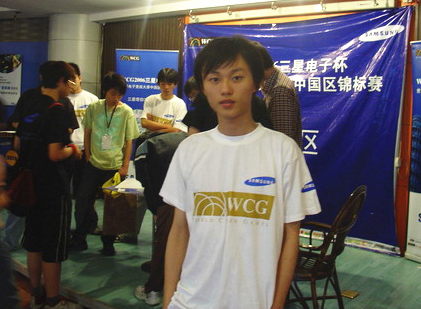

# 제41장. 줄을 바꿔 e스포츠를 하다, 류이펑

> 《ONE MORE WAY: 중국 e스포츠의 이면사》 중 한 장. 저자 BBKinG(류양, 刘洋). 중국어 원문에서 번역: [四十一 另起一行做电竞 刘义峰](../zh/chapters/41-另起一行做电竞-刘义峰.md)
>
> 저자의 즈후(知乎) 칼럼에 2016년 3월 28일 처음 게재: https://zhuanlan.zhihu.com/p/20584882
>
> 이 번역은 검토를 기다리는 작업본입니다. 오역, 잘못된 표기, 사실 오류를 발견하시면 [이슈를 열어](https://github.com/bkingfilm/china-esports-history/issues/new) 주시거나 풀 리퀘스트를 보내 주세요.

성공한 프로 e스포츠 선수는 많이 썼다. 오늘은 성공하지 못한 사람을 하나 쓰려 한다.

류이펑(刘义峰), 인터넷 아이디는 다오바투(刀疤兔), 전 《워크래프트 3》 프로 선수다. 다오바투는 칼자국이 난 토끼라는 뜻이다. 중국 워크래프트 3를 지켜본 사람이라면 그의 또 다른 이름 SoZ.afeng을 들어 봤을지도 모른다. 보다시피 이것은 '리샤오펑(李晓峰, Sky)'처럼 찬사와 영예로 가득한 이름이 아니다.

오히려 반대다. 류이펑이 선수 생활에서 낸 최고 성적은 ESWC 2005 워크래프트 3 종목의 중국 지역 3위가 전부였고, 상금 5,000위안은 1년이나 밀린 뒤에야 받았다.

더 나쁜 것은 2006년 WCG 항저우 지역 예선에서 이기고 싶은 마음이 앞선 나머지 초보적인 실수를 저질러, 중국 e스포츠 역사에 이름난 흑막 사건 '푸훠류(复活流)', 곧 부활 빌드 사건을 일으켰고 숱한 비난과 욕설을 받았다는 것이다.

거대한 부정적 기운에 마음이 식은 그는 프로 선수 무대에서 서서히 물러났고, e스포츠 대회 PGL의 무대 뒤 일로 자리를 옮겼다. 그러나 대회가 한창 힘을 받던 결정적인 시기에 2008년 금융 위기를 만났다. 자금이 끊긴 채 2010년까지 버티다가 끝내 어쩔 수 없이 e스포츠 업계를 떠나 베이징에서 상하이로 돌아왔다.

장수 하나가 공을 이루는 동안 만 사람의 뼈가 마른다는 말이 있다. 이때의 류이펑은 어느 모로 보나 그 마른 뼈 가운데 하나였다.

떠밀리듯, 그는 줄을 바꿔 처음부터 다시 시작하는 수밖에 없었다.

2011년, e스포츠의 타오바오 모델이 아직 자리를 잡기 전에 웹 게임 《선셴다오(神仙道)》와 유명인의 공동 운영이 중국 e스포츠판의 많은 스타에게 100만 위안 단위의 첫 목돈을 벌게 해 줬다.

많은 e스포츠 애호가가 이 대목을 좋아하지 않는다는 것을 나도 안다.

그러나 금융 폭풍에서 막 살아남은 중국 e스포츠에 웹 게임 공동 운영의 이 물결은 강심제이자 더없이 큰 안심거리였다. e스포츠가 스스로를 먹여 살릴 수 있고, 그것도 아주 잘 살아갈 수 있다는 것을 증명했기 때문이다.

바로 이 목돈이 많은 방송인에게 자기 타오바오 가게를 키울 밑천을 줬고, 그래서 '영상 + e스포츠 + 타오바오' 모델이 자리 잡는 속도가 빨라졌다. 중국 e스포츠 업계에 오래 남는 영향이었다.

그리고 이 일을 성사시킨 사람이 바로 그 마른 뼈, 지금 '신둥 네트워크(心动网络)'의 운영 총괄이자 《선셴다오》 프로젝트 책임자인 아펑(阿峰), 류이펑이다.

지금 아펑은 게임 업계의 전설 같은 사람이 되었다. 그러나 그는 자기가 가장 그리워하는 것이 여전히 프로 선수로 e스포츠의 꿈을 좇던 시절이라고 말한다.

1983년 8월 11일, 아펑은 상하이 청황먀오(城隍庙) 부근에서 태어났다. 청황먀오는 도시의 수호신을 모신 사당으로 상하이 옛 시가의 중심이다. 초등학교 때부터 그에게는 게임기와 컴퓨터가 있었으므로 또래보다 게임을 일찍 접했고 주위 사람들보다 더 잘했다.

상하이의 중점 학교인 '스베이 고등학교(市北高中)'에 붙은 뒤, 아펑의 게임 재능은 PC방에서 마음껏 드러났다. PC방은 중국의 인터넷 카페(网吧)로, 한국의 PC방과는 성격이 다른 공간이다. PC방에 있는 경쟁 게임이라면 무엇이든 그가 1등이었다. 그곳에서 그는 스타이자 고수였고 존재감이 강렬했다.

그러나 성적은 곤두박질쳤다. 대학에 들어가기는 했지만 아주 좋지 않은 곳이었고, 2학년 때는 아홉 과목 가운데 체육 한 과목만 통과했다. 2003년 그는 퇴학당해 집으로 돌아갔다.

막막해진 아펑은 어머니에게 e스포츠 프로 선수를 한번 해 봐도 되겠느냐고 물었고, 어머니는 그러라고 했다.

집에서 돈을 내어 새 컴퓨터를 사 줬고, 그는 반년 동안 집에서 워크래프트 3를 연습했다. 연말에는 상하이 지역 CBI 대회에 나가 2위를 했다. 상금은 200위안뿐이었지만 1위가 MagicYang이었고, 상위 두 사람은 무료로 베이징에 갈 수 있었다. 그가 처음으로 멀리 집을 떠난 길이었다.

이 작은 승리는 그의 자신감을 크게 키웠고, 자기가 이 길을 갈 수 있을지도 모른다는 어렴풋한 느낌을 줬다.

그 뒤 2004년 ESWC 상하이 지역 예선에서 뛰어난 모습을 보인 덕에 아펑은 상하이 SOZ 팀 주장의 눈에 들었고, 마침내 월급 1,000위안의 프로 선수가 되었다. 급여는 적었지만 프로 선수가 되겠다는 꿈은 이룬 셈이었다.

다만 e스포츠는 애초에 걷기 좋은 길이었던 적이 없다.

어느새 2006년이 되었고 WCG 항저우 지역 예선이 돌아왔다. 3년의 프로 생활로 아펑은 조금 이름이 알려졌지만 하루빨리 성적을 내야 했다. 그 자신도 승리를 몹시 갈망했다.

WCG 예선은 단판 승부였다. 아펑의 첫 경기 상대는 이름을 전혀 들어 본 적 없는 일반 참가자였고 원래대로라면 아주 수월한 판이었다. 그런데 뜻밖에도 아펑이 졌다. 첫 라운드에서 탈락했다는 뜻이었다.

그래서 이기고 싶은 마음이 앞선 아펑은 그 상대에게 이 자리를 자기에게 넘겨 줄 수 있겠느냐고, 상금을 나누겠다고 이야기했다.

그 상대는 애초에 WCG에 한번 참가해 보자는 마음으로 온 사람이었고 프로로 나갈 계획도 없었으므로 그러겠다고 했다.

아펑은 이 기회를 붙잡아 단숨에 모든 선수를 꺾고 항저우 지역 우승을 차지했으며, 베이징에서 열리는 WCG 중국 지역 결승에 나갈 기회를 얻었다.

그러나 대회가 끝난 뒤 누군가 아펑의 예선 경기 리플레이를 찾아냈다. 확인해 보니, 첫 경기에서 탈락한 사람이 어떻게 지역 우승을 할 수 있는가?

순식간에 온갖 비난이 사방에서 쏟아졌다. 대회가 짜여 있었다, 선수가 되살아났다, 상대가 매수당했다, 심판이 편파 판정을 했다는 것이었다. 당시 중국에서 가장 큰 워크래프트 3 게시판이던 [http://Replays.net](http://replays.net)에서는 아펑의 '푸훠류' 이야기가 열흘 동안 도배되었고, 하나같이 그를 규탄하는 목소리였다.

그 시절을 돌아보며 아펑은 자기가 그때 너무 어렸고 자신을 증명해 줄 승리 한 번을 너무 갈망한 나머지, 경기 규칙과 개인의 신용을 지키는 일을 소홀히 했다고 말했다.

그 일이 있은 뒤 아펑은 사람의 신용이 아주 중요한 것임을 깨닫기 시작했다. 끝내 모두를 이기더라도 신용을 잃으면 모든 것을 잃는다는 것이다.

그 뒤 몇 해 동안 아펑은 해설도 해 보고 대회도 만들어 봤다. 0에서 다시 시작해 베이징의 CIG와 PGL에 자기 자취를 남겼다. 특히 PGL이 세 번째 시즌에 이르렀을 때는 온라인 시청이 이미 50만 IP에 이르렀고, 그는 희망의 빛을 보기 시작했다.

그러나 당시 e스포츠 대회는 스스로 돈을 버는 힘이 없어 후원사에 기댈 수밖에 없었다. 그런데 후원사들이 e스포츠를 대하는 태도는 일정하지 않았고, 그들은 e스포츠의 전환율도 인정하지 않았다. 그래서 PGL이 그렇게 뜨거웠는데도 타이틀 스폰서 비용은 현금 10만 위안에 의류 10만 위안어치가 전부였다.

이런 돈으로는 e스포츠를 발전시킬 수 없었다.

여기에 2008년 세계 금융 위기까지 겹쳐 후원사들이 모조리 달아났다. 3년을 버티던 아펑은 어쩔 수 없이 상하이로 돌아왔다.

이 금융 위기는 아펑에게 e스포츠의 약점이 무엇인지 똑똑히 보여 줬다. 수익화 능력이었다.

이 물음을 안고 그는 다시 일자리를 찾기 시작했다. 어느 날 고등학교 선배인 자오위야오(赵宇尧, 지금 신둥 네트워크 COO)와 이야기를 나누다가, 당시 VeryCD 뎬뤼(电驴, 신둥 네트워크의 전신)가 마주한 문제가 e스포츠와 정확히 반대라는 것을 알게 되었다. 뎬뤼는 파일 공유 프로그램 eMule의 중국어 이름이다.

당시 신둥 네트워크는 게임으로 트래픽을 돈으로 바꾸는 일에서 이미 아주 풍부한 경험을 갖고 있었다. 특히 데이터 모니터링 쪽에서는 매우 효율적인 백엔드 분석 시스템을 갖춰, 트래픽을 한 번 흘려보낼 때마다 그 수익을 정확하게 계산해 낼 수 있었다.

그러나 트래픽을 어디서 구할 것인가. 이것이 당시 신둥이 마주한 어려운 문제였다. 이 문제를 풀기 위해 신둥은 360이나 텐센트 같은 큰 채널에 이익의 70%를 넘겨주면서까지 트래픽 유입을 얻어 왔다.

그렇다면 엄청난 관심도와 트래픽을 가진 e스포츠도 큰 채널로 볼 수 있지 않을까? e스포츠와 웹 게임이 서로의 모자란 곳을 채워 줄 수 있지 않을까?

2011년 초, 아펑은 이 물음을 안고 신둥에 들어가기로 했다. 새 모델을 검증할 기회를 기다리기로 한 것이다.

다만 그 기회가 이렇게 빨리 올 줄은 몰랐다.

아펑은 2011년 3월의 어느 날을 영원히 잊지 못한다고 했다. 신둥 네트워크 CEO 황이멍(黄一孟)이 계약서 하나를 들고 그의 옆으로 와서, 이 프로젝트를 자네가 맡으라고 말한 날이다.

그 게임이 당시만 해도 아직 반제품이던 《선셴다오》였다.

물론 프로젝트 책임자라고 해서 처음부터 자기 생각대로 할 수 있는 것은 아니었다. 그래서 그는 먼저 신둥이 그동안 해 오던 게임 운영 관례대로 큰 게임 채널에서 트래픽을 끌어왔다. 석 달 뒤에는 큰 채널을 거의 다 돌았고, 채널마다 돈을 아주 잘 벌었다.

신둥은 아주 기뻐했고 사용자를 데려올 채널이 더 있기를 바랐다.

때가 무르익었다고 본 아펑은 회사를 설득하기 시작했다. e스포츠 스타는 모두가 놓치고 있던 큰 채널이고, 브랜드 홍보에서든 트래픽 유입에서든 뒤지지 않는다는 것이다. 큰 채널과 같은 분배 비율을 주어 방송인들이 스스로 홍보하고 싶게 만들면 효과가 아주 좋을 것이라고 했다.

2011년의 e스포츠는 무너진 자리를 하나부터 다시 세워야 하는 상태였다. 다들 금융 위기라는 지진에서 이제 막 정신을 차리고, 스스로를 먹여 살릴 수 있어야 안정된 나날을 보낼 수 있다는 것을 깨달은 참이었다. 그래서 모두가 트래픽을 돈으로 바꾸는 방법을 찾고 있었다.

이것은 아펑이 파고들기에 아주 좋은 조건을 만들어 줬다. 10월의 어느 날, 아펑은 옛 e스포츠 친구 몇을 불러 《선셴다오》를 홍보해 주기만 하면 큰 채널과 같은 7 대 3의 분배 비율을 주겠다고 제안했다. 게다가 이익의 7할을 가져가는 쪽이 e스포츠 스타들이었다. 전에 없던 조건이었다.

여러 해가 지나 그 스타 가운데 한 사람이 나에게 말했다. 7 대 3이라는 말을 들었을 때는 아펑이 30%나 나눠 주겠다니 괜찮은 사람이라고 생각했고, 나중에 자기가 70%를 가져간다는 것을 알고는 다들 깜짝 놀랐다는 것이다.

새 모델이 생겼으니 이제 힘을 내는 일만 남았다. 저마다 자기 방식으로 나섰고, 《선셴다오》 홍보는 e스포츠판을 온통 뒤덮었다.

2012년 4월 《선셴다오》의 월 매출은 1억 위안을 넘었다. 아펑은 이것이 《선셴다오》라는 상품 자체가 뛰어난 데다 모두가 힘써 홍보한 결과라고 했다.

샤오창(小苍), 09, SKY, 스타크래프트 올드보이즈 등 적어도 50명이 넘는 e스포츠 스타가 이 홍보의 물결에서 첫 목돈을 벌었다. 그리고 이야기가 사람에서 사람으로 퍼지면서 다른 분야의 스타들까지 더 많이 나서서 함께 일하게 되었다.

'e스포츠 + 게임 공동 운영'이라는 서로 이득이 되는 모델은 크게 성공했고, 아펑은 이 모델을 신둥의 다른 게임에도 가져갔다. 《셴샤다오(仙侠道)》, 《장선(将神)》, 《선위안(深渊)》 같은 게임이다.

2016년 3월, 《선셴다오》의 고화질 리마스터 모바일판이 곧 나온다. 아펑은 이번에는 더 많은 스타와 방송인을 데려와 함께 홍보하고, 더 나은 게임으로 사람들에게 즐거움을 주겠다고 말했다.

줄을 바꾸니 더 멋지다, 류이펑.

## 편집자 주

중국 e스포츠가 자라 온 과정에서 많은 e스포츠 사람이 여러 이유로 자기가 깊이 사랑하던 업계를 떠나야 했다. 그들은 떠나서 당분간 e스포츠와 상관없는 일을 하고 있을지 몰라도, 여전히 이 업계가 어떻게 자라는지 아주 눈여겨보고 있다. 그리고 알맞은 때에 알맞은 지점을 잡아 새로운 경험과 생각을 들고 e스포츠로 돌아와, 이 업계에 새로운 성장점을 가져다줬다.

돌아온 것을 환영한다, e스포츠 사람들!
