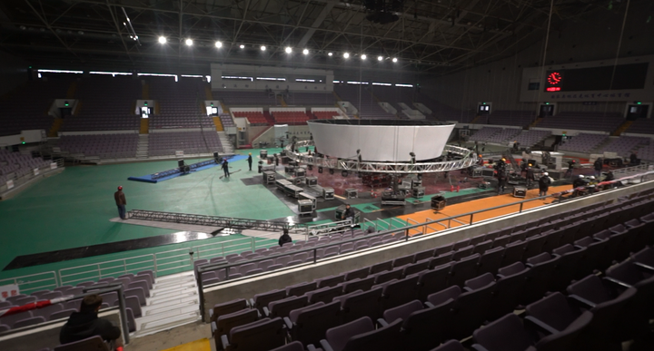
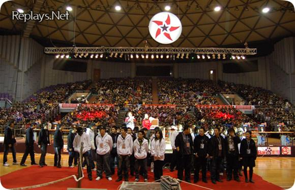

# 왜 대부분의 e스포츠 조직과 대회는 상하이에 있는가?

> 저자 BBKinG(류양, 刘洋)이 《ONE MORE WAY: 중국 e스포츠의 이면사》를 낸 뒤 발표한 e스포츠 사료 단편 가운데 한 편. 중국어 원문에서 번역: [为什么大多电竞组织和赛事都在上海](../../zh/appendix/03-为什么大多电竞组织和赛事都在上海.md)
>
> 저자의 즈후(知乎) 칼럼에 2017년 3월 3일 처음 게재: https://zhuanlan.zhihu.com/p/25551392
>
> 이 번역은 검토를 기다리는 작업본입니다. 오역, 잘못된 표기, 사실 오류를 발견하시면 [이슈를 열어](https://github.com/bkingfilm/china-esports-history/issues/new) 주시거나 풀 리퀘스트를 보내 주세요.

글. BBKinG. 옮겨 실을 때는 출처를 밝혀 주기 바란다.

이 글은 왜 상하이(上海)가 지금 중국 e스포츠의 중심이 되었는지만 말하지 않는다. 왜 자베이(闸北)의 상하이 마시청(上海马戏城) 일대가 중국 e스포츠의 중심이 되었는지까지 말해 줄 것이다. 마시청은 서커스 공연장이라는 뜻이다.

중국 e스포츠의 중심은 서쪽에서 동쪽으로 차츰 옮겨 왔다.

1998년 인터넷이 일어났을 때 e스포츠가 가장 뜨거웠던 곳은 연해가 아니라 내륙 깊은 곳이었다. 충칭(重庆), 청두(成都), 시안(西安), 심지어 우한(武汉)까지 상하이보다 잘 자라고 있었다. 중국에서 일찍 성적을 낸 e스포츠 선수인 마톈위안(马天元), 멍양(孟阳), CQ2000, 《카운터 스트라이크》의 Alex, 그리고 무대 뒤의 e스포츠 조직인 《스타크래프트》 시대의 8DA(八达)와 《카운터 스트라이크》 시대의 CCSK, 이들이 모두 쓰촨과 충칭 군단(川渝军团) 사람이었다.

[제13장. 쓰촨 군단의 선봉, 마톈위안](../13-matianyuan-sichuan-vanguard.md)

[제15장. 빈민가에서 나온 e스포츠 백만장자, 멍양](../15-mengyang-esports-millionaire.md)

[제30장. 세계적인 중국 카운터 스트라이크 인게임 리더, Alex 볜정웨이](../30-alex-bian-zhengwei-cs-commander.md)

같은 시기에 중심이 될 수 있었던 1선 도시가 하나 있었다. 베이징이다. 그러나 많은 인명을 앗아 간 란지쑤(蓝极速) PC방 화재와 사스(非典) 탓에 베이징의 PC방은 성장도 규모도 발목이 잡혔다. 여기서 PC방은 중국의 인터넷 카페(网吧)로, 한국의 PC방과는 성격이 다른 공간이다. 대회는 열 자리를 잃었고 e스포츠 분위기도 약해졌다.

초기에 내륙 지역에서 e스포츠가 뜨거웠던 이유는 무엇인가?

삶의 속도가 느렸고 학생이 많았으며 개인용 컴퓨터 보급률은 낮았고 PC방 규모는 컸다. 많은 PC방이 컴퓨터 200대에서 시작했고, 500대에서 1,000대를 갖춘 체인 PC방도 곳곳에 있었다. 장사도 잘되었으므로, PC방마다 손님을 끌려고 e스포츠 대회에 장소와 상금을 기꺼이 무료로 내놓았다. 이것이 1998년부터 2003년 전까지의 e스포츠 판도를 만들었다.

2002년, 청두에 있던 CCSK 사이트 안에서 한 차례 분가가 일어났다. 이유는 내 책에 있으니 여기서는 길게 말하지 않겠다. 다만 갈라선 결과가 중요하다. 한쪽은 베이징으로 가서 e스포츠 조직 Esai를 세웠고, 다른 한쪽은 상하이로 가서 하오팡(浩方) CGA 플랫폼을 만드는 데 참여했다.

중국 e스포츠에 북쪽은 Esai, 남쪽은 하오팡이라는 구도가 잡히기 시작했다.

이 시기에 베이징은 중국 e스포츠의 중심이 되었다. 큰 컴퓨터 제조사의 본사가 모두 베이징에 있었기 때문이다. 델, 아수스, 레노버, 삼성 같은 회사가 그때는 다들 e스포츠 후원에 무척 적극적이었다. 우리가 그때 베이징의 e스포츠 조직을 얼마나 부러워했는지 모른다.

2003년 나는 CGA에 들어갔고, 《카운터 스트라이크》가 뜨겁던 시기에 상하이의 하오팡 플랫폼이 새로운 e스포츠 포털 사이트가 되기 시작했다.

그러나 상하이에는 컴퓨터 제조사가 없었다. 그때 상하이에는 콜라나 나이키 같은 국제 브랜드가 많았지만, 그들에게 e스포츠는 지금까지도 중요한 광고 통로가 아니다. 그때는 더 말할 것도 없었다.

이해에 새로운 e스포츠 종목 하나가 일어나기 시작했다. 《워크래프트 3》다.

이해에 오래된 e스포츠 대회 하나가 기울기 시작했다. WCG다.

WCG는 해마다 베이징 올림픽 스포츠센터 배드민턴 경기장에서 총결승전을 열었다. 2003년 뒤로는 현장을 찾는 관객이 갈수록 줄었다. 그전에는 관중석이 다 찼는데 나중에는 안쪽 자리도 채우지 못했다. 베이징의 e스포츠 분위기가 가라앉기 시작했다.

이유는 복잡하다. 관객의 자리에서 보면 2001년에 견줘 WCG의 신선함이 줄었고 중국 팀이 나가서 낸 성적도 좋지 않았다. 큰 도시 사람들은 고를 것이 많고 눈이 높다. 행사에 볼거리가 없으면 사람은 줄어든다.

2004년 4월, 광전총국(SARFT)이 게임 프로그램의 무료 지상파 방송을 금지했다.

베이징 컴퓨터 하드웨어 업체의 투입이 줄기 시작했다. 이유는 간단하다. 얻는 것보다 잃는 것이 컸다. 생중계도 없고 텔레비전 보도도 없고 수익률도 다른 광고 통로만 못한 상황이었으니 집행이 줄어드는 것은 당연했다.

**e스포츠 중심으로서 베이징이 가진 강점은 그 뒤 몇 해 동안 계속 옅어졌다.**

2005년 상하이에서 눈에 띄지 않는 작은 일이 몇 가지 일어났다.

쉬윈보(许云波)라는 《워크래프트 3》 애호가가 미국에서 상하이로 돌아왔다. 그의 직함은 IGE 중국 대표처 책임자였다. IGE는 그때 세계 최대의 가상 아이템 거래상으로, 중국에서 《월드 오브 워크래프트》 골드를 사들여 전 세계에 팔았다. 물류가 없으니 비용은 낮고 이익은 높아 돈이 많고 씀씀이도 컸다.

《워크래프트 3》는 이미 e스포츠에서 가장 인기 있는 종목이 되어 있었고, [Replays.net](http://replays.net)은 CGA에 이어 새로운 e스포츠 포털 사이트가 되었다.

쉬윈보는 Replays.net의 충실한 이용자였고, 같은 상하이 사람인 Replays.net 창립자 Zax와 아주 가까웠다. 그래서 그는 돈을 들여 세계적인 《워크래프트 3》 팀을 하나 만들고 싶어 했다. 어차피 가상 아이템 거래 광고를 하는 데는 정책 위험이 따랐으니, 그 돈으로 팀을 하나 만드는 편이 낫다는 것이었다.

그렇게 그는 Replays.net을 사들였고, Zax는 KinG을 끌어들여 상하이에서 WE 클럽을 세웠다.

동시에 그는 GamesTV라는 영상 제작 팀도 하나 사들였다. 이 대목을 눈여겨보라.

그해에 세계적인 대회 《StarsWar 국제 스타 초청전》이 나왔다. 전 세계 최정상 《워크래프트 3》 선수들을 상하이로 불러 겨루게 한 대회였다. Moon과 Grubby를 비롯해 많은 선수가 상하이에 처음 왔다.

2006년 초 상하이 창닝 국제체조센터에서 열린 StarsWar 2는 대단히 성공적이었다. 중국 e스포츠 대회의 현장 관중 기록을 세웠고 온라인 생중계는 25만 IP가 지켜보았다. 오프라인 대형 대회와 온라인 생중계와 후원사를 묶은 모델이 새로운 길이라는 것을 처음으로 증명한 자리였다.

바로 이 대회에 본사를 상하이에 둔 타이완 컴퓨터 메인보드 제조사가 마케팅 담당 두 사람을 보내 컴퓨터를 대 주었다. 그들은 e스포츠의 거대한 영향력을 눈으로 보았고, 그 뒤로 e스포츠 후원에 온 힘을 쏟기 시작했다. 이 회사가 **기가바이트(技嘉科技)**다.

2006년이 되자 쉬윈보는 GamesTV에 영상 전송 허가증이 없어서 앞으로 커 나가는 데 문제가 생길까 걱정했다. 그래서 GamesTV와 상하이 원광(上海文广) SITV의 유시펑윈(游戏风云) 채널의 합병을 밀어붙였다.

이것이 유시펑윈GamesTV라는 이름의 유래다. 그리고 원광에는 스튜디오 단지가 하나 있었다. **상하이 자베이 광중시로(广中西路)의 환웨이 멀티미디어 밸리(幻维多媒体谷)**다. 상하이 마시청에서 아주 가깝고, 예능 프로그램 《자유하오난얼(加油好男儿)》을 녹화하던 곳이기도 하다. 2007년 G리그가 바로 여기서 태어났고, 《자유하오난얼》이 쓰던 그 장소를 그대로 썼다.

그리고 지금 상하이 자베이 뤄촨둥로(洛川东路)에 있는 둥팡CJ(东方CJ)의 본사도 2008년 SITV에 넘어갔다. 지금 유시펑윈이 있는 자리다.

그리하여 2007년부터 중국 e스포츠 선수와 카메라 앞뒤에서 일하는 사람들, 그리고 줄곧 상하이에서 《스타크래프트》 대회를 해 온 PLU, 갓 세워진 NeoTV, 베이징의 GTV 같은 e스포츠 조직과 클럽이 상하이 마시청 일대에 자주 드나들기 시작했다.

**강팀과 경기를 잡기 편하도록 클럽들이 상하이로 모여들기 시작했다**

WE 클럽은 초기에 시안에서 훈련했다. 시안 숙소에 차이나유니콤(联通) 회선이 있어 외국 상대와 붙을 때 속도가 빨랐고, KinG도 시안 사람이었기 때문이다. 뒤에는 관리를 편하게 하려고 2006년 클럽 전체가 상하이로 옮겨, 자베이에서 멀지 않은 바오산구(宝山区)에 단독주택 한 채를 빌렸다.

《워크래프트 3》 시대에 국내에서 WE와 맞설 수 있는 클럽은 베이징의 EH뿐이었다. 그러나 성적으로 보면 WCG 2연패의 Sky를 비롯해 Suho, infl, TED 같은 《워크래프트 3》 프로 선수를 거느린 WE의 이름값이 훨씬 컸다.

연습 경기를 팀 단장들이 사람을 통해 일일이 잡아야 하던 시절이라, 많은 클럽의 카메라 앞뒤 사람들도 상하이에 자주 오기 시작했고 바오산의 그 주택을 드나들었다.

**상하이는 대회 장소를 신청하기 쉬웠다**

같은 시기 베이징에서는 대회를 여는 일이 갈수록 어려워졌다. 업체의 투입이 줄어든 것만이 아니라 장소 승인도 성가신 일이 되었다. 베이징에서 행사를 하면 정책의 영향을 크게 받았고, e스포츠 대회에 외국인이 참가하면 국가체육국(国家体育局) 수준의 승인 문서까지 있어야 했다.

반면 상하이에서는 행사 장소를 신청하는 일이 비교적 간단했다. 상업화 정도가 높았기 때문이다. 회사가 합법이고 비용만 다 내면 경찰과 소방 절차가 아주 투명했다. 상하이에서 행사를 여는 일은 갈수록 쉬워졌고, 2010년 뒤로는 e스포츠 대회를 여는 데 국가의 승인 문서조차 요구받는 일이 드물어졌다.

2007년 WCG는 NeoTV가 상하이로 가져와 열었고, 중국 총결승은 상하이 광다 회의전시센터(光大会展中心)에서 치렀다.

WCG라는 브랜드는 그때 거의 죽기 직전이었다. 뒤에 NeoTV가 다시 일으켜 세웠고, 상하이의 게임 업체 몇 곳을 끌어들여 함께 열었다. 차이나조이(ChinaJoy)와 비슷한 방식으로 WCG의 전시회형 사업 모델을 열었다.

NeoTV는 중국 지역에 《도타》 종목을 넣었고, 2013년 마지막으로 문을 닫을 때까지 인기도 사업성도 아주 좋았다. 안타깝게도 뒤에 삼성이 사업을 휴대전화 쪽으로 돌리면서 WCG를 하지 않게 되었고, NeoTV로서도 어쩔 수 없었다.

**지금의 중국 e스포츠 문화 중심**

짚어 둘 만한 것은, 몇 해 전 NeoTV 본사가 있던 상하이 쓰항 창고(四行仓库)가 헐리게 되면서 NeoTV도 자베이의 상하이 마시청 일대로 옮겼다는 점이다.

PLU도 타이창(太仓)에서 몇 해 동안 LPL을 치른 뒤 자베이의 상하이 마시청 일대로 옮겼다.

GTV의 텅린지(滕林季)는 2013년 무렵 GTV에서 나와 유시펑윈에 들어갔다. 그의 동료 Miss도 같은 해에 상하이로 와서 유시펑윈에 들어갔고 자베이 뤄촨둥로 근처에 살았다. 뒤에 텅린지가 세운 NiceTV와 그 뒤의 VSPN도 자베이의 상하이 마시청 일대에 있다.

야오모(妖魔), BBC, 117, 하이타오(海涛) 들은 유시펑윈에서 나온 뒤 ImbaTV를 세웠고, 이곳도 자베이의 상하이 마시청 일대에 있다.

2011년 ACE 연맹이 세워졌고 사무실은 다닝 인터내셔널(大宁国际)에 두었다. 여기도 자베이의 상하이 마시청 일대다.

2013년 WE의 모회사가 주장 크리에이티브 센터(珠江创意中心)로 들어갔다. 지금은 파무레이(伐木累) 앱을 만들고 있고, 이곳도 자베이의 상하이 마시청 일대다.

지금 주장 크리에이티브 센터에는 EDG 클럽과 Snake 클럽, 그리고 왕쓰충(王思聪)의 바나나 계획(香蕉计划) 본사와 판다TV(熊猫TV)가 들어 있다.

2016년 라이엇 게임즈(Riot Games) 중국 법인이 다닝 음악광장(大宁音乐广场) 뒤로 옮겼다. 여기도 자베이의 상하이 마시청 일대다.

올해 LPL 결승전 장소는 상하이 정다광창(正大广场)으로 잡혔고, 얼마 전 끝난 ImbaTV의 SLi 스타 리그(群星联赛)는 상하이 국제체조센터에서 열렸다. 뒤에는 모바일 게임 대회 몇 개도 상하이에서 열린다는 말이 들린다. 그렇게 된다면 중국에서 가장 큰 e스포츠 대회는 사실상 모두 상하이에서 열리는 셈이다.

사실 나는 다닝 링스 공원(大宁灵石公园) 안에 대형 e스포츠 경기장을 하나 짓고 싶다. 바로 상하이 마시청 지하철역 옆이고, e스포츠 회사가 다 근처에 있으며 클럽도 멀지 않다. 이곳이 앞으로 중국 e스포츠 문화의 중심이 되고 나중에 e스포츠 테마파크까지 들어선다면, 푸둥(浦东) 엑스포 전시장 쪽보다 자리가 훨씬 좋다.
