# 《중국 e스포츠의 이면사》 신간 발표회

> 저자 BBKinG(류양, 刘洋)이 《ONE MORE WAY: 중국 e스포츠의 이면사》를 낸 뒤 남긴 신간 발표회 기록. 중국어 원문에서 번역: [《中国电竞幕后史》新书发布会](../../zh/appendix/09-新书发布会.md)
>
> 저자의 즈후(知乎) 칼럼에 2015년 12월 5일 처음 게재: https://zhuanlan.zhihu.com/p/20393445
>
> 이 번역은 검토를 기다리는 작업본입니다. 오역, 잘못된 표기, 사실 오류를 발견하시면 [이슈를 열어](https://github.com/bkingfilm/china-esports-history/issues/new) 주시거나 풀 리퀘스트를 보내 주세요.

글. BBKinG

인생은 한 번 또 한 번 치르는 시험 같다. 어제 나는 또 시험장에 들어갔다. 잘 봤는지 못 봤는지는 상관없다. 나와 함께 시험을 치러 주겠다는 오랜 친구들이 이만큼 있다는 것을 알았으니 그것으로 충분하다.

2015년 12월 4일, 나는 《중국 e스포츠의 이면사》 신간 발표회를 열었다. 나는 이날을 평생 기억할 것이다.

[
《중국 e스포츠의 이면사》 발표회 영상, 무대 뒤의 거물들이 잇달아 모습을 드러내다. 유쿠(优酷) 온라인 재생, 고화질로 볼 수 있다.
http://v.youku.com/v_show/id_XMTQwNDg5NTIwNA==.html?from=y1.7-2](http://link.zhihu.com/?target=http%3A//v.youku.com/v_show/id_XMTQwNDg5NTIwNA%3D%3D.html%3Ffrom%3Dy1.7-2)

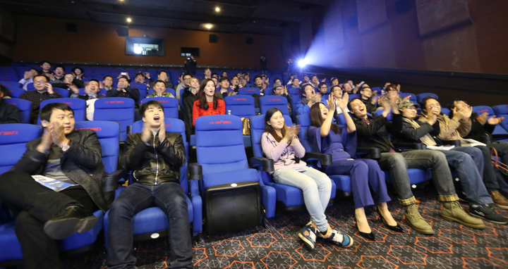

왕샤오펑(王晓鹏), 곧 손 없는 형이라는 뜻의 우서우거(无手哥)도 현장에 와 주었다. 고맙다!

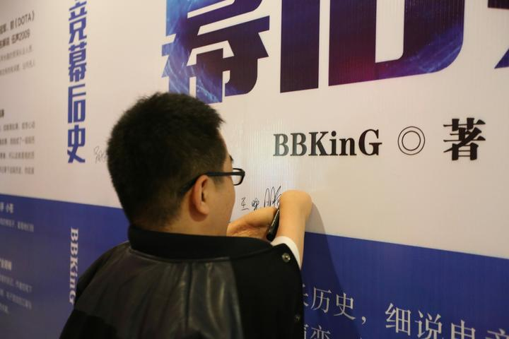

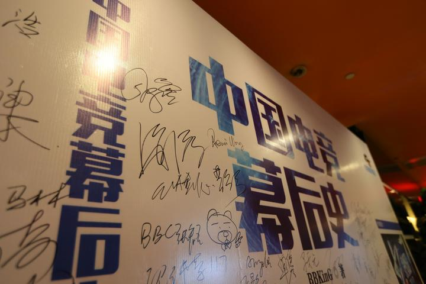

전 WE와 뉴푸(牛铺)의 동료들이 다 왔다. 고맙다!

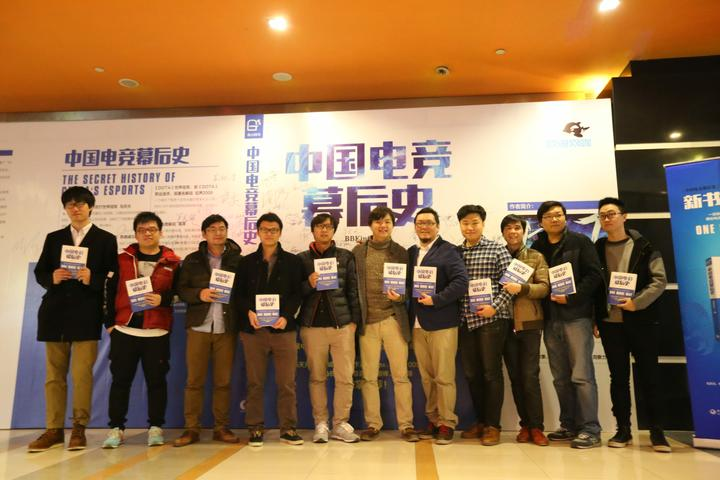

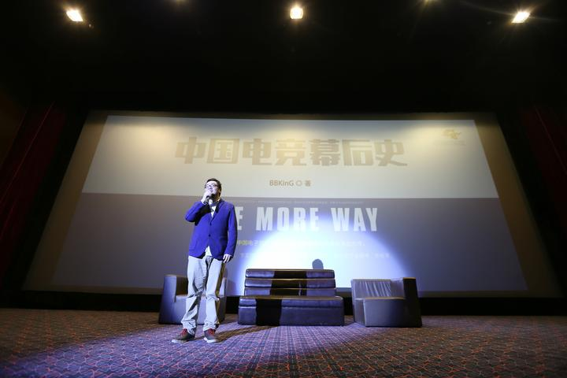

천왕(天王)도 왔다. 고맙다!

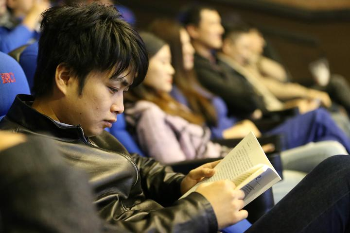

소파에 앉은 이 사람들은 다 무대 뒤의 사장들이고 WCG 중국 지역을 연 사람들이다. 왼쪽부터 Neo 슝젠밍(熊剑明, NeoTV의 창립자), Ken(현 NeoTV 사주), 왕줴(王珏, 전 NeoTV 감독), 저우닝(周宁, 스타크래프트 올드보이즈를 뒤에서 움직인 사람)이다.

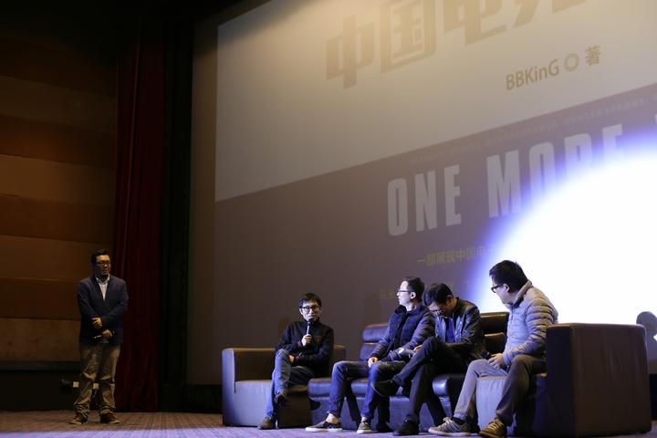

카운터 스트라이크 시대의 두 미남, 117과 Alex다. 맨 왼쪽은 BBC다.

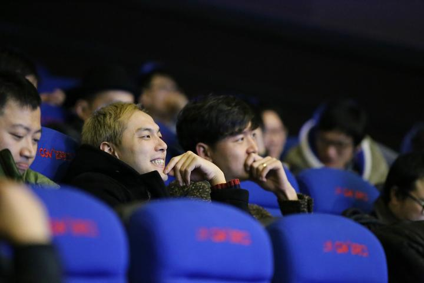

아래 이 조는 무게가 상당하다. 왼쪽부터 전 블리자드의 우젠(吴健), 왕샤오둥(王晓东), bunny, brett다. 네 사람 모두 블리자드 차이나 e스포츠 팀의 구성원이었다. 우젠은 《월드 오브 워크래프트》의 주청(九城) 시절과 블리자드 시절을 관통한 핵심 팀 구성원이고 스타크래프트 고수이기도 하다. 맨 오른쪽은 텐센트 게임즈의 보비(波比)로, 전 TGA 책임자이자 리그 오브 레전드 마케팅 책임자다.

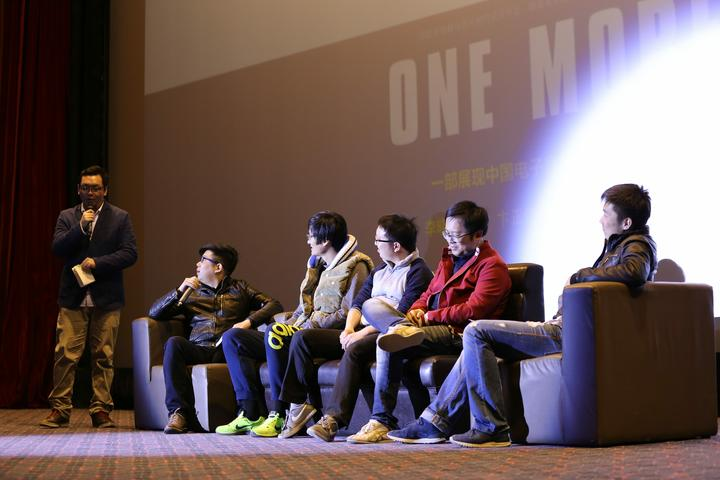

이 조는 다 옛 동료들이다. 왼쪽부터 BBC, 117, 쓰쓰(丝丝), 페이잉(飞影)인데 상하이 카운터 스트라이크 시대를 겪은 사람이라면 아마 다들 알 것이다. 이어서 라오장(老张, 전 유시펑윈(游戏风云) 감독), 양천(杨晨, CCSK 원로이자 CGA 시대의 마케팅 총괄), 하이타오(海涛)다.

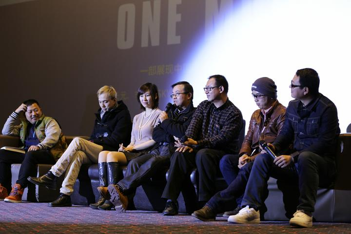

아래 이 조는 오랜 친구들이다. 왼쪽부터 ZAX(WE, [http://Replays.net](http://replays.net), StarsWar, 뉴푸(牛铺)의 창립자), 샤오창(小苍, 전 워크래프트 3 프로 선수이자 현 게임 스트리머), 류이펑(刘义峰, 전 워크래프트 3 프로 선수, 신둥 네트워크(心动网络)의 《선셴다오(神仙道)》 프로젝트 책임자), 그리고 SKY(설명이 필요 없다!)다.

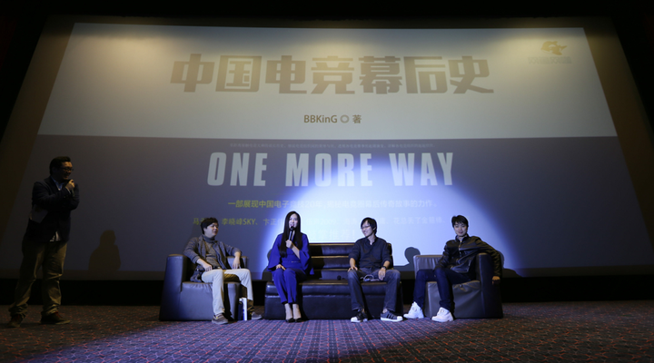

이 조에도 다들 익숙한 사람이 많다. 왼쪽부터 EVA젠신(EVA剑心, 젠신 패치 팩을 만든 사람), 우서우거 왕샤오펑(王晓鹏), 마톈위안(马天元, 중국 최초의 WCG 세계 챔피언 금메달 획득자 가운데 한 사람), 린슝마오(林熊猫), MagicYang, 슝 변호사(熊律师)다.

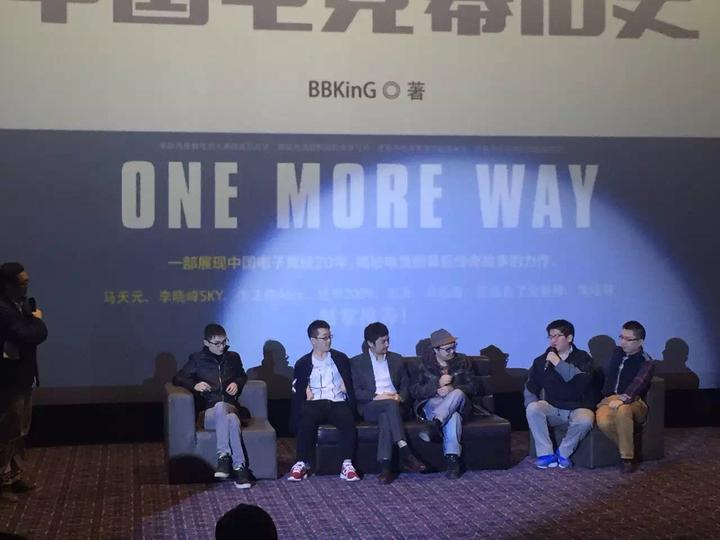

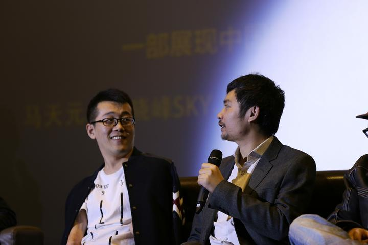

모자를 쓴 사람이 전 블리자드 대중화권 총경리 다이진허(戴锦和)다.

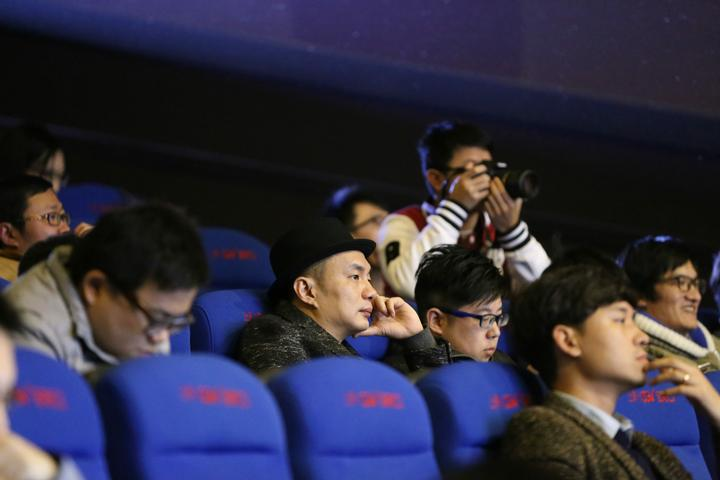

라오양(老杨)의 마지막 발언에는 눈물이 날 뻔했다. 발표회 전 과정을 담은 영상은 되도록 빨리 내놓겠다.

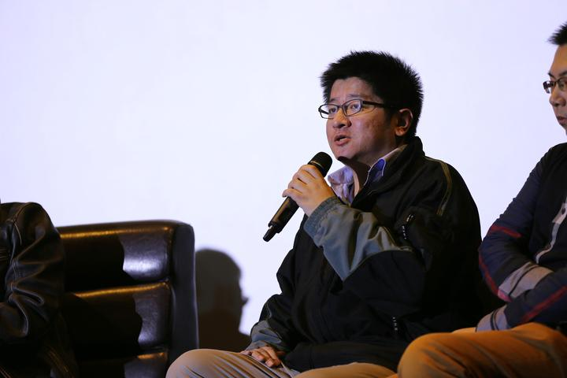

마지막으로 왕위 PC카페(网鱼网咖), 그중에서도 황펑(黄锋)에게 고맙다. 황 사장은 내가 신간 발표회를 열지 말지 망설이고 있을 때 발표회를 후원하겠다고, 그것도 아무 대가도 바라지 않는다고 말해 주었다. 덕분에 여러 해 서로 만나지 못했던 우리 e스포츠 사람들이 다시 모일 기회를 얻었다. e스포츠를 위해 묵묵히 애써 온 무대 뒤의 사람들에게 고맙다.

다음 책이 나올 때는 더 크고 더 좋게 열고 싶다. 다들 아이를 데리고 와서 가족 모임처럼 해도 좋겠다! 참석해 주신 여러분께 다시 한번 고맙다. 정말 폐를 많이 끼쳤다!

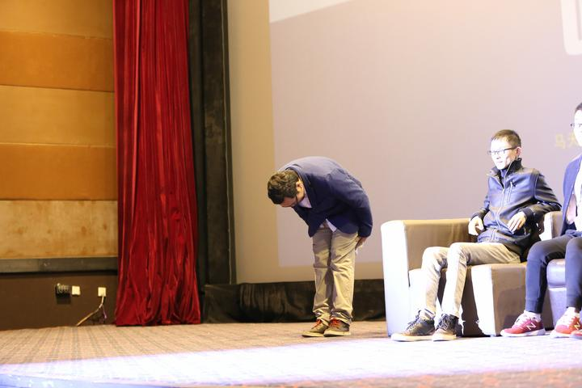

내 타오바오 서점 주소는 다음과 같다. [중국 e스포츠 이면사, e스포츠 판 무대 뒤의 전설 같은 이야기를 밝힌다, 3권 무료 배송](http://link.zhihu.com/?target=https%3A//item.taobao.com/item.htm%3Fspm%3Da230r.7195193.1997079397.7.qyc2Ur%26id%3D524860854215)

휴대전화에서는 아래 그림을 길게 누르면 QR 코드를 인식할 수 있다.

