# 번외편. 보스턴 야구 관전기

> 저자 BBKinG(류양, 刘洋)이 계획했으나 끝내지 못한 두 번째 책 《중국 게임의 이면사》 중 번외 한 편. 중국어 원문에서 번역: [番外篇 波士顿棒球记](../../zh/gamehistory/番外-波士顿棒球记.md)
>
> 저자의 즈후(知乎) 칼럼에 2014년 9월 25일 처음 게재: https://zhuanlan.zhihu.com/p/19856082
>
> 이 번역은 2026년 8월 4일 중국어 원문과 대조해 검토했습니다. 오역, 잘못된 표기, 사실 오류를 발견하시면 [이슈를 열어](https://github.com/bkingfilm/china-esports-history/issues/new) 주시거나 풀 리퀘스트를 보내 주세요.

8월에 미국 동부에 머무는 내내 경기를 한 번 보고 싶었다. 아쉽게도 가장 보고 싶었던 NBA는 10월에야 개막했고, 아이스하키와 미식축구는 열리고 있었지만 일정이 번번이 어긋났다. 그러다 우연히 MLB(메이저 리그 베이스볼)의 공식 사이트를 들여다보다가, 보스턴 레드삭스와 휴스턴 애스트로스의 이 경기가 마침 내가 보스턴을 떠나기 하루 전날에 열린다는 것을 알았다. 그래서 서둘러 레드삭스 공식 사이트에서 이 표를 샀다.

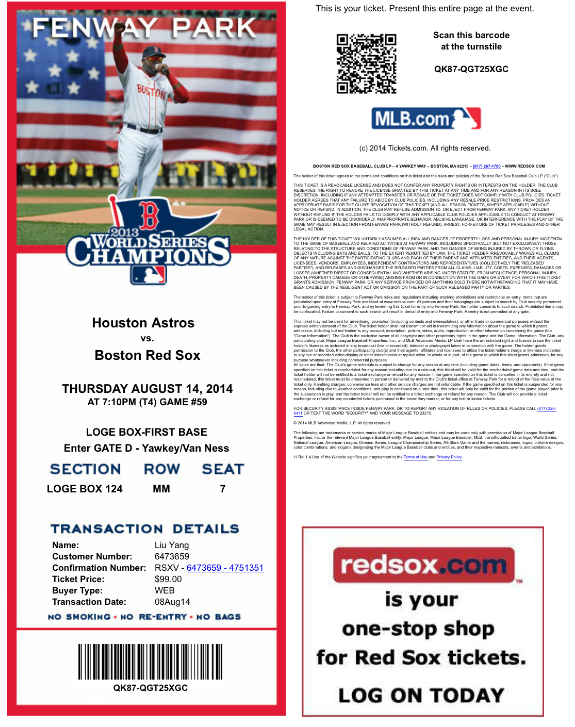

미국에서는 많은 표를 인터넷으로 살 수 있다. 시스템이 표를 메일로 보내 주면 집에서 출력해 두었다가 그날 들고 가서 입장할 때 스캔하면 된다.

본론으로 돌아가자. 보스턴 레드삭스의 홈구장은 펜웨이 파크(Fenway Park)다. 역사가 긴 구식 구장으로 좌석은 3만 7000석 가까이 된다. 도심에서 멀지 않고 지하철로 바로 갈 수 있어 교통도 편하다. 가는 길 내내 레드삭스 유니폼을 입은 사람들이 보여서 정말 축제 같은 기분이 들었다.

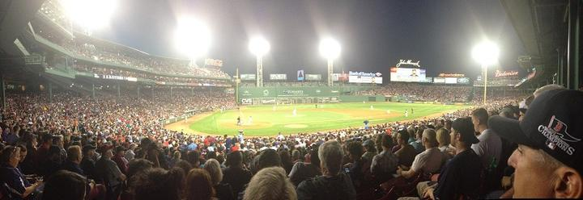

아래는 보스턴 지도다. 오른쪽 가운데로 튀어나온, 고층 건물이 많은 저 일대가 도심이다. 왼쪽 위 20번 자리가 하버드 대학교, 가운데 다리 옆 21번 자리가 매사추세츠 공과대학교(MIT), 왼쪽 아래 23번 자리가 바로 펜웨이 파크다. 보스턴은 대체로 어디든 가깝다. 자전거를 한 대 빌렸더니 이틀 만에 다 돌았는데, 뚱뚱한 나로서는 죽을 맛이었다.

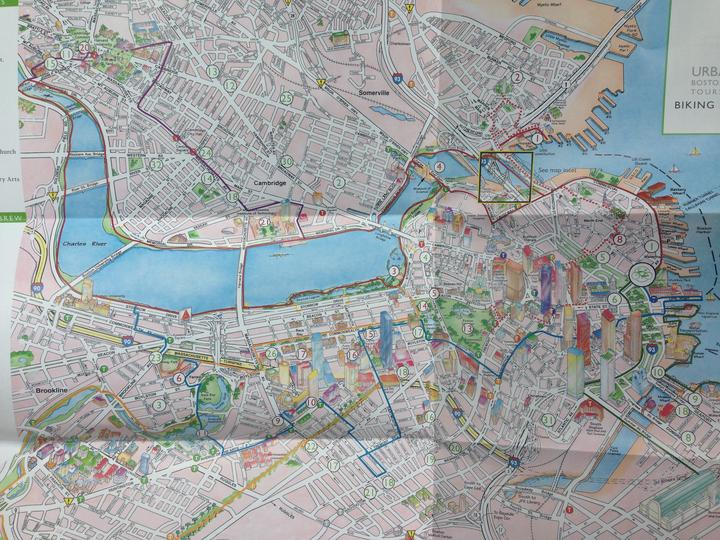

이제 뒤에 할 이야기의 밑자락을 깔기 위해 보스턴의 배경을 조금 늘어놓겠다.

보스턴 사람들은 운동을 아주 좋아한다. 도시의 연혁을 찾아보니 이 도시는 1630년 9월 17일 영국에서 건너온 청교도 이민자들이 세웠다. 전통적으로 백인이 다수인 전형적인 도시다. 청교도는 도덕 규범이 대단히 강해서 자신에게 엄격했고 교육도 매우 중시했다. 그래서 보스턴 지역은 교육 수준에서나 치안에서나 좋은 바탕을 갖추게 되었고, 건강한 자기 절제와 진취적인 태도가 이 도시의 정신이 되었다.

달리 말하면 규칙과 팀워크, 기술에 대한 요구가 대단히 높은 야구는 태생부터 보스턴의 것이다. 실제로 이곳이 현대 야구의 발상지다. 영국 이민자들이 전통적인 크리켓을 손보고 다른 놀이들을 결합해 완전히 새로운 규칙을 만들었고, 200년 뒤에는 야구 리그를 세워 규격화의 길로 들어섰다.

아래 사진은 보스턴을 가로지르는 찰스강(Charles River)이다. 강변에는 달리는 사람들뿐이고 강에는 온갖 요트와 조정 보트가 떠 있다. 보스턴 사람들은 운동을 정말 사랑한다.

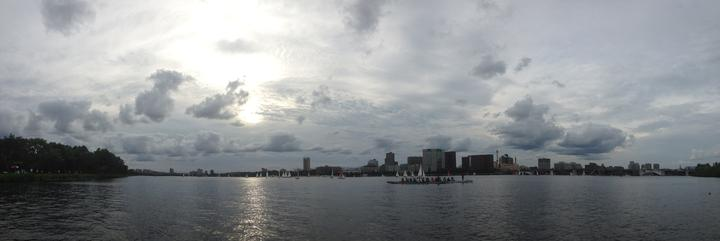

미국인은 야구를 규격화하는 데 200년 넘게 더듬어 온 끝에 지금에 이르렀다. 반면 중국 e스포츠는 1998년에 시작해 2011년 무렵 리그를 세우기까지 13년밖에 걸리지 않았다.

여기서 알 수 있듯 인류가 새로운 종목을 더듬어 나가는 속도는 빨라지고 있고, 업계를 규격화하고 통합하는 데 걸리는 시간도 짧아지고 있다. 다만 방향은 대체로 같다. 선수를 관리하고 대회를 조율하며 선수 이적을 감독하고 업계 각 주체 사이의 이해를 균형 잡아, 모두가 건강하게 성장할 수 있게 하는 것이다.

보스턴의 역사를 다 읽고 나니 의문이 하나 생겼다. 중국 e스포츠의 성장을 길러 낸 것은 어떤 문화였을까? 물론 이것은 또 다른 주제이니 여기서는 펼치지 않겠다.

이야기를 앞으로 되돌리자. 경기 날 현장에 도착해서 내가 본 것은 진짜 축제였다.

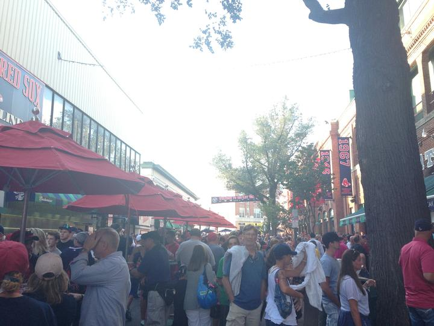

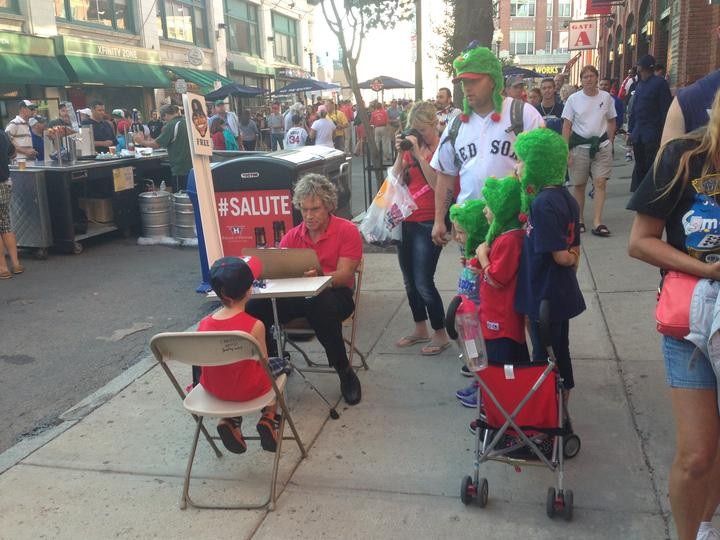

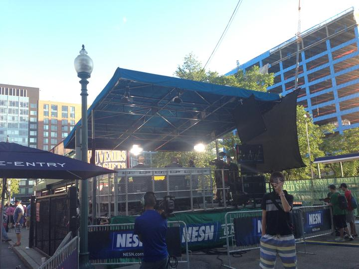

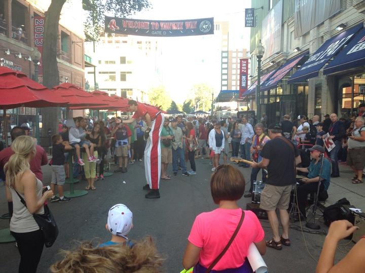

구장 주위에는 상점과 식당이 늘어서 있고 상품 종류도 대단히 잘 갖춰져 있다. 굿즈는 내가 아주 관심을 두는 분야라서 참고 자료로 사진을 많이 찍었다. 여기에 다 올리면 너무 많으니 한 장만 싣는다. 심지어 어린이를 겨냥한 제품도 잔뜩 만들어 두었다. 100년 넘게 번성해 온 스포츠는 역시 다르다.

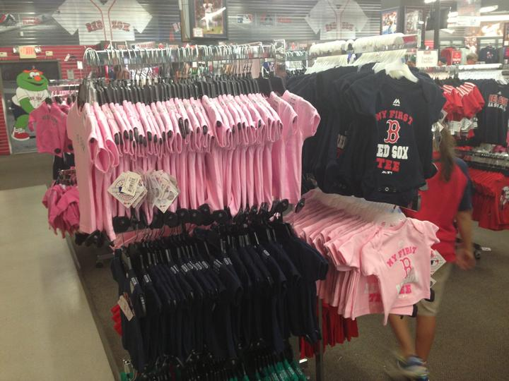

펜웨이 파크에서 촬영한 영화와 방송물이다.

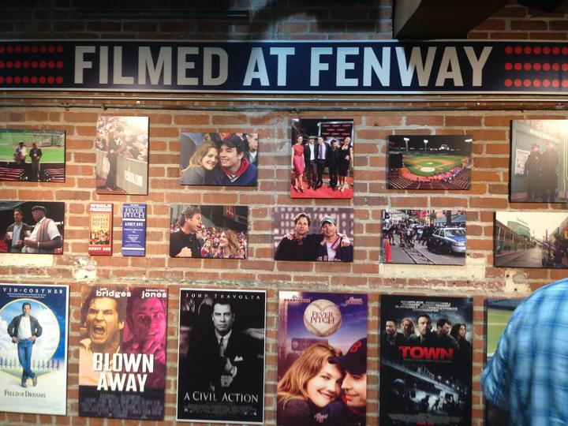

구장 안에서 파는 이탈리안 소시지(Italian sausage)다. 먹으면서 보면 아주 신난다.

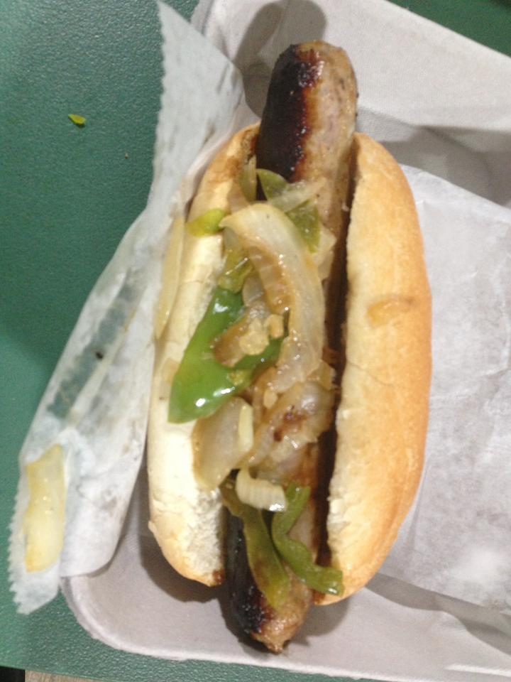

구장 주변을 어지간히 돌아본 뒤 안으로 들어가 자리에 앉으니 주위에 노인이 많았다. 내 옆에 앉은 노부부는 눈대중으로 둘 다 예순이 넘어 보였는데 두 시간을 운전해 경기를 보러 왔다. 할머니는 내가 야구 경기를 현장에서 보는 것이 처음이라는 말을 듣고는 저녁 내내 쉬지 않고 각 대목을 설명해 주었다. 무척 친절했다. 그런데 나에게 더 깊이 남은 것은 그녀가 휴대폰으로 인터넷을 뒤져 온갖 자료를 찾아내던 능숙한 솜씨였다. 그전까지는 중국의 모바일 인터넷 보급이 꽤 괜찮은 편이라고 여겨 왔는데, 그 뒤로도 미국 할머니들에게 휴대폰 앱 쓰는 법을 배우는 일을 몇 번 더 겪고 나니 내가 틀렸다는 생각이 절실히 들었다. 놀란 일이 하나 더 있다. 이렇게 큰 경기장인데 휴대폰 인터넷 신호가 처음부터 끝까지 아주 좋았다.

경기를 본 과정은 자세히 쓰지 않겠다. 대신 느낀 점 몇 가지를 적는다.

1. 야구의 규칙은 경기 전체의 흐름을 보는 재미가 있게 만든다.

보는 재미는 이런 데서 나온다. 규칙이 간단하고 분명하며 흐름의 완급이 힘 있게 오간다. 공 하나하나가 홈런으로 이어질 수 있고 이닝마다 크고 작은 고비가 있다. 이닝이 바뀌는 사이의 틈은 길지 않지만 나가서 화장실에 다녀오고 먹을 것을 사 올 만큼은 된다. 경기는 저녁 7시에 시작해 10시 반에 끝났다. 세 시간 반이었고, 다 보고 나서도 지하철을 타고 집에 갈 수 있었다.

시간과 흐름을 통제하는 것은 대단히 중요하다. e스포츠 대회가 더 널리 퍼지려면 규칙도 손봐야 한다고 생각한다. 지금 대회는 한번 시작하면 하루 종일 가는 일이 잦아서 주최 측도 지치고 관객도 지친다. 예전에 WCG가 차이나조이(ChinaJoy, 중국 최대 게임 전시회)화에 성공하기는 했지만, 그것이 e스포츠를 대중이 일상에서 소비하는 빠른 오락 상품으로 만드는 데 도움이 되지는 않는다.

내 생각에는 한 쿼터의 시간을 줄이고 쿼터 수를 늘려야 한다. 예전에 NBA가 전후반제에서 쿼터제로 바꾼 것처럼 경기의 흐름과 전체 시간을 함께 조정하는 것이다. 한 쿼터를 20분에서 30분 이내로 하고 전체 시간을 세 시간 안팎으로 묶으면, 남녀노소 누구에게나 맞는 저녁 오락거리가 된다.

우리는 영화나 콘서트 같은 형식에 가까워져야 한다. 대중의 오락 습관에 맞추는 것이지, 대중더러 e스포츠에 맞추라고 할 일이 아니다.

그런데 지금의 e스포츠 종목들은 그런 조정을 받아들이기 어려워 보인다. 흐름이 여전히 느린 편이다. 그렇다면 흐름을 조정해 대중 오락으로 들어가는 계획은 앞으로 나올 e스포츠 종목이 이뤄 줘야 한다는 뜻이다.

2. 경기를 둘러싼 세부의 설계

시작할 때 국가를 부르는 대목은 다들 알 것이다. 아주 짧은 영상을 하나 찍었으니 한번 보시기 바란다.

영상: [보스턴 레드삭스의 홈구장 펜웨이 파크, 경기 시작 전 국가 제창](http://v.youku.com/v_show/id_XNzYxMjQwNDgw.html), 유쿠

유명인을 불러 시구를 하는 것도 다들 아는 대목이지만 이번은 조금 달랐다. 왕년의 야구 스타 네 명이 함께 시구를 했다.

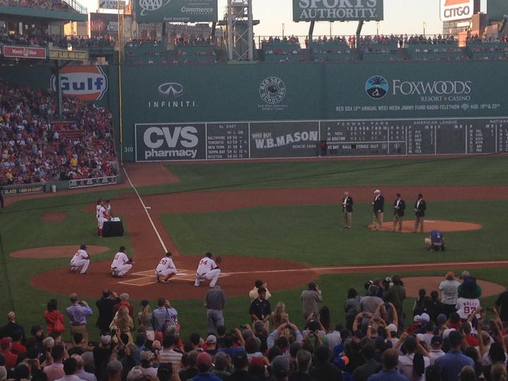

다음은 잘 모를 수도 있는 세부다. 이닝 사이에는 유명인이나 전쟁 영웅이 그라운드에 나와 모습을 보이고 관중은 일어서서 경의를 표한다. 노래가 나오기도 하는데, 사람들은 옆 사람의 어깨를 감싸고 함께 몸을 흔들며 부른다. 관중의 참여를 이끄는 안내 문구가 나오기도 하고, 카메라가 관중을 비추면 관중은 카메라 앞에서 온갖 모습을 보여 준다. 어쨌든 현장에서는 쉬는 시간에도 지루할 틈이 없다. 이런 두터운 운영 경험이 이 대회의 매력을 떠받치고 있다.

전에도 눈여겨보기는 했지만, 직접 현장에서 겪고 나서 우리 대회를 다시 돌아보니 고칠 곳이 정말 많았다.

마지막으로 하고 싶은 말은, 보스턴이라는 곳이 정말 괜찮다는 것이다. 환경이 아름답고 치안도 좋으니 꼭 한번 가 보시기를 권한다. 보스턴 랍스터의 완벽한 식감만을 위해서라도 한 번은 갈 만하다. 한 가지 귀띔하자면, 2파운드가 넘는 큰 랍스터를 꼭 시켜야 한다. 식감이 완전히 다르다. 값이 싸고 양도 넉넉해서 현지 사람들이 가는 가게로 바킹 크랩(Barking Crab)을 추천한다. 위의 그 지도 오른쪽 아래 9번 자리에 있다. 정말 끝내준다!

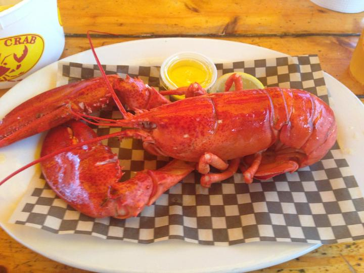
