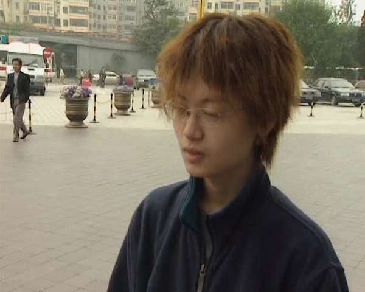
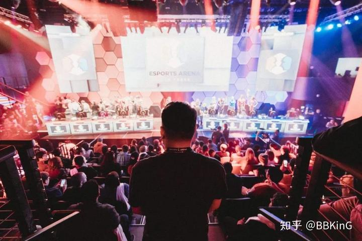
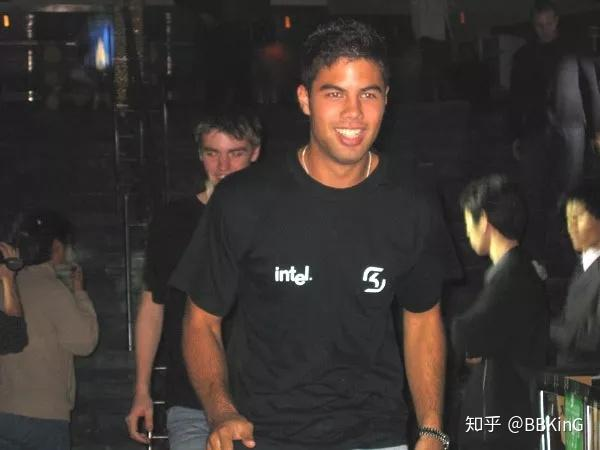
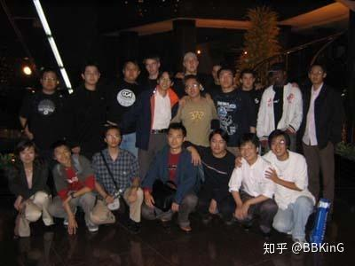

# 2003年瑞典SK戰隊訪華 改變了世界對中國電競的印象

> 《ONE MORE WAY：中國電競幕後史》作者 BBKinG（劉洋）在成書之後發表的電競史料散篇之一。譯自簡體中文原文：[2003年瑞典SK战队访华 改变了世界对中国电竞的印象](../../zh/appendix/08-2003年瑞典SK战队访华.md)
>
> 首次發表於作者的知乎專欄，2018 年 5 月 9 日：https://zhuanlan.zhihu.com/p/36649725
>
> 這是等待校對的工作稿。若您發現誤譯、用詞不合臺灣習慣或史實錯誤，歡迎[開一個 issue](https://github.com/bkingfilm/china-esports-history/issues/new) 或送出 pull request。

影片／CCTV5 電子競技世界

[
https://www.zhihu.com/video/977627792469368832](http://link.zhihu.com/?target=https%3A//www.zhihu.com/video/977627792469368832)

**在2003年之前，國外對中國電競是沒有什麼瞭解的。**

甚至說難聽一點，在那個淘寶和優酷還沒誕生的時代，國外對中國都不是很瞭解，外界瞭解我們的管道太少了，何況是剛起步的中國電子競技。

中國電競人出國比賽，就遇到過國外對手很驚訝地問，中國人還能用上電腦？

中國電競在那個時候不受人待見，一方面是成績並不亮眼，另一方面也是沒有面向國際的中國電競入口網站。

所以，有別的國家的電競組織來中國，就成了難得的交流機會。

2003年，這就是為什麼瑞典SK戰隊在取得WCG的CS項目世界冠軍後，受邀訪問中國會變成中國電競歷史上一個比較重要的時刻。

SK戰隊到了上海和北京2個地方，直面中國電競愛好者無比的熱情，幾百粉絲追著大巴的場面，是他們在其它國家沒見過的。

回國後，SK自發成為中國電競的宣傳大使，讓整個電競領域都領略到了中國電競的氛圍，一起來感受下CCTV5當年的紀錄片。

當時的我已經是CGA的記者了，參與了SK上海站的全程，感謝當年的浩方團隊，這是一段美好的回憶。

更多遊戲和電競短紀錄片 請搜尋公眾號 BK短紀錄片
