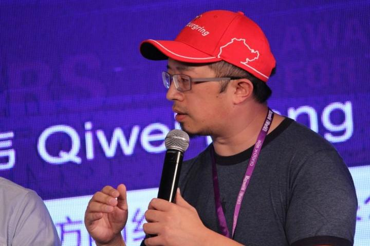

# 四 雪猹：我們錯過的不止是幾臺遊戲機

> 《中國遊戲幕後史》其中一章，作者 BBKinG（劉洋）未完成的第二本書。譯自簡體中文原文：[四 雪猹: 我们错过的不止是几台游戏机](../../zh/gamehistory/04-雪猹-我们错过的不止是几台游戏机.md)
>
> 首次發表於作者的知乎專欄，2014 年 9 月 30 日：https://zhuanlan.zhihu.com/p/19856097
>
> 這是等待校對的工作稿。若您發現誤譯、用詞不合臺灣習慣或史實錯誤，歡迎[開一個 issue](https://github.com/bkingfilm/china-esports-history/issues/new) 或送出 pull request。

2014 年 9 月 29 日，與眾多遊戲人的感慨萬千正好相反，Xbox One 中國版的正式解禁發售，在大多數遊戲愛好者中，似乎並沒有掀起什麼大的波瀾。

可能在大多數人眼裡，一個鎖區、沒多少正版遊戲可選、價格又比水貨貴的遊戲機上架，有什麼可高興的呢？

說到底，不就是一個遊戲機嗎？我們大多數人小時候沒玩過，現在不也過得好好的，我們能錯過些什麼呢？對我的生活似乎也沒有什麼影響啊。

對，在我跟雪猹聊完之前，我也是這樣想的。

雪猹，真名楊雪飛，1980 年出生於武漢，前《遊戲機實用技術》資深編輯，高級記者，筆名「多邊形」，他從小專攻主機遊戲領域，也是中國遊戲媒體第一個被派去美國報導 E3 遊戲展的編輯，親身經歷了很多國內外主機的發展過程，也是本次微軟中國 Xbox One 發行活動的座上賓。

雪猹親眼見證了中國主機遊戲市場的一步步分崩瓦解，也深入感受過國外主機遊戲越做越精美的發展歷程，通過這兩條線的對比，我們可以更清晰的理解中國和國外遊戲文化的巨大差異，以及為什麼國外很不錯的遊戲到了中國會水土不服，我們自己做出來的遊戲為什麼會如此急功近利。

## 雪猹特殊的童年

雪猹的母親在武漢友誼商店工作，同時代的人可能知道，友誼商店，在早期就是專門針對在華外國人開的商店，後來開放成對大眾銷售外國貨的商場。

於是，這讓雪猹在很早的時候，就接觸到了大量國外的新奇商品，比如，他 1984 年就玩過美國雅達利遊戲機，87 年就玩到了任天堂的紅白機。

在這樣一個環境下長大，使得他非常喜歡接觸最新最好的東西。

當然，電子遊戲是每個孩子的最愛，而在他十多歲時，中國的電腦並沒有普及，也就更談不上什麼電腦遊戲了，於是，街機和包機房，變成了他經常光顧的地方。

## 包機房

估計，這是一個在很多人的記憶裡，都有些模糊了的名詞。他區別於 98 年之後的電腦房，因為包機房專門做主機遊戲，比如，紅白機、超級任天堂、以及後來的 PS。

通常，包機房裡邊都放著一排電視，電視下邊的櫃子都帶一個裝著遊戲機和手柄的抽屜，半拉開的抽屜，雜亂的線，各式各樣的手柄，你記起來了嗎？這便是我們的童年。

對於雪猹來說，他的童年，就是在武漢三鎮犄角旮旯大隱於市的幾個包機房中度過的，家庭並不富裕的他，在這些時不時被查抄關停的小黑屋裡，打遊擊般的接觸到了從超任、3DO、PS、SS、DC 以及 PS2 等遊戲主機。

相對於現在來說，那時候玩個主機遊戲是蠻困難的。

首先，在 2000 年國家出明確規定禁止遊戲機之前，有很長一段時間，遊戲機和遊戲廳，都是被潛規則般的算在「黃賭毒不良場所」內的，這是無照經營的地下小黑屋，時不時的被封停清理，以及社會負面標籤，就先使得很大一批主機用戶流失了。

接著是主機遊戲的高門檻

小的方面，存檔都是個問題，公用的遊戲機，存檔經常會被別人覆蓋掉，剛開始要想辦法藏存檔，後來實在不行，只好偷偷咬牙省錢，買個相對於孩子來說非常昂貴的記憶卡。

大的方面，在超任的時代，出現了磁碟機，說起來很慚愧，這個東西主要的作用就是方便盜版，它把正版卡帶中的 Rom 提取出來，寫進 3.5 寸軟碟中，之後就可以在磁碟機上玩，不用另外買正版了。

磁碟機的出現，以及超級任天堂豐富的遊戲選擇，加速了主機的普及，特別是超任的普及，那時的包機房裡，幾乎都是超任，但是，相對於現在，90 年代初超任+磁碟機三四千元的價格，還是一般家庭無法接受的。

值得一提的是，後來世嘉 MD 的價格就相對便宜了，所以，之後很多家庭條件稍微好一點的孩子，走上了日系遊戲那條路，比如，遊戲幕後史第一章裡寫的上海孩子吉川明靜。

可是，雪猹的家庭環境並不是太好。

他只能待在包機房裡玩，而且經常為了圖便宜，要去包夜，老闆晚上回家睡覺，就把他鎖在小黑屋裡，讓他自己玩。

在沒有網際網路，遊戲雜誌也不好買的時代，攻略是徹底沒有的，過關只能靠與周圍朋友交流心得。

可鎖在小黑屋裡時，問誰呢？於是，在無數次解謎過不了關時，他就把英文謎題抄下來，然後回家查字典，以至於，他在初中時，英文就已經非常好了，高中還學了些日語。

從小外語好，這幾乎是我採訪過的眾多成功幕後遊戲人的共同特點。

雪猹也因此有機會走上更大的舞臺。

2002 年，經常混跡各大遊戲論壇的他，突發奇想，寫了一個《潛龍諜影 2》的同人小說，引起了《遊戲機實用技術》編委「東方蜘蛛」的注意，把這篇文章推薦給了《遊戲·人》雜誌，之後他開始進入遊戲媒體圈，憑藉對主機遊戲和國外動態的瞭解，得到了很多約稿。

其中最大的一個約稿，來自《遊戲機實用技術》編輯 Gouki，Gouki 當時想做一個《潛龍諜影》的專輯，希望雪猹寫一個 Gameboy 版的攻略，雪猹做得很認真，為了製作遊戲裡每個關卡的全地圖，他用了一個很笨但是很實用的辦法，在模擬器裡走一步截一張，然後再用 PS 把圖全拼接起來。

幸運的是，這個項目還沒做完，雪猹就被直接拉到了《遊戲機實用技術》深圳的編輯部成為正式員工，因為雜誌當時正好想找一個英文好，又懂遊戲的人來充實編輯力量。

老話總是很經典：機會，永遠只給有準備的人

當時國內最大的兩本主機遊戲雜誌，一個是《電子遊戲軟件》，一個就是《遊戲機實用技術》，這裡有必要介紹一下這兩本雜誌。

《電子遊戲軟件》創刊於 1994 年 6 月，最開始叫《GAME 集中營》，是中國第一本正式遊戲雜誌，後來因為 1995 年發了一篇很經典的社論《烏鴉烏鴉叫》抱怨中國主機遊戲的境遇，撞在電玩嚴打的槍口上，被一度停刊，後來改名《電子遊戲軟件》才得以重生，建議大家看看這篇社論，[電軟最經典的文章《烏鴉·烏鴉 叫》](http://link.zhihu.com/?target=http%3A//games.qq.com/a/20111108/000189.htm)

即使在 20 年後的今天看，這篇文章對遊戲盜版市場的危害，以及行業短視的警告，依然振聾發聵。

《遊戲機實用技術》創刊於 1998 年，2001 年改為半月刊，巔峰時期月銷量超 30 萬。

雪猹說，2003 年，當他進入這個雜誌的編輯部時，感覺自己像進入了天堂一樣，因為不但能見到之前久仰的很多編輯，比如 Gouki、沙迦、勝負師等等，還能免費玩到各式各樣他之前根本買不起的遊戲機。

能免費玩遊戲，還有工資拿，還有什麼能比這更開心的事情？這還不卯足了勁幹？

很快，他的努力就有了回報。

2004 年，他和 Gouki 兩人被派去美國報導 E3 遊戲展，這一年他 24 歲，也是他第一次出國，之後的幾年裡，《遊戲機實用技術》雜誌即使在資金並不寬裕的情況下，依然堅持每年派他們去美國 E3，東京 TGS 做報導，這種長遠的戰略眼光為中國遊戲行業帶來大量第一手的資訊。

雪猹十分感激這段時光

他說，沒有想到自己能在如此年輕的時候，接觸到外面的世界，特別是瞭解到主機遊戲的過去和未來，讓他可以有更多的角度來看待整個遊戲行業的發展。

## 世界主機遊戲顛覆史

雪猹認為，主機遊戲發跡於美國七十年代。雅達利的興起，除了它非常有遠見的遊戲街機轉家用機戰略，還有它建立一個開放式的遊戲平臺，為大量遊戲的接入奠定了基礎，但是這個平臺的管理非常粗放，雅達利沒有對遊戲的品質進行有效管控。

特別是錯誤的實行了「數量壓倒品質」的政策後，出現大量粗製濫造的遊戲，於 1983 年，最終爆發著名的「Atari Shock」雅達利衝擊事件，被失望的用戶市場徹底拋棄。

幾款爛遊戲竟然拖垮了整個北美遊戲主機市場，這讓正處於黃金時期的雅達利一落千丈。

1983 年，任天堂抓住了機會

他們在推出紅白機時，吸取了雅達利的教訓，建立了平臺，並且加強了對遊戲的監管，不僅在品質上，還在數量上對 FC 平臺的遊戲進行了嚴格的控制，這一顛覆式的進步使得遊戲的標準和品質有了大幅度提高，主機遊戲又開始復興，也讓任天堂成為新的時代霸主。

而所謂，成也蕭何，敗也蕭何。

任天堂之後對遊戲製作商過於苛刻的監管，也讓他們走向了另一個極端。

## 新挑戰者 次世代主機

1994 年，在索尼和世嘉已經推出使用光碟的次世代主機 PS 和 SS 後，任天堂依然固執的在自己的第三代主機 N64 上堅持使用卡帶，並且依然堅持它老一套苛刻的控制體系，要求他的遊戲供應商們，也使用成本和效率都已相對過時的卡帶，這造成了業界和玩家的牴觸。

而這件事導致的最嚴重後果，就是著名遊戲開發商「史克威爾」把原本要發在 N64 上的《最終幻想 7》（臺譯《太空戰士》）改移到了索尼的 PS 上，以當時《最終幻想》系列在業界的影響力，以及當時任天堂與索尼劍拔弩張的對峙關係，這簡直就是對任天堂的致命一擊！

索尼趁熱打鐵，提出口號：所有遊戲在這裡集合

挑戰者再次顛覆了任天堂的那套平臺體系

索尼依然監控遊戲品質，但放開了對遊戲供應商的部分控制，讓他們可以自己控制每個遊戲的發行數量，不再像任天堂那樣要求必須交錢給他們來製作拷貝。而且索尼還降低了每張遊戲的授權金，讓利給遊戲公司，這大大提高了遊戲生產者的積極性。

同時，在 N64 推出之前，由於任天堂打造的便攜式 3D 遊戲主機 Virtual Boy，因為其過於超前的理念，無法得到很好的技術支援而失敗，任天堂的骨幹設計師 GameBoy 之父 橫井軍平 引咎辭職，公司元氣大傷。

任天堂從此開始走向衰落。

索尼崛起後，一直到 2001 年微軟 Xbox 的出現，這個行業再次被顛覆，這個是後話了，我們過幾年再說。

## 再來看看中國這段時間在幹什麼

90 年代包機房被各種查封，大眾買不起主機，國內各種山寨紅白機，盜版遊戲，還有幾次試圖想進入中國市場卻失敗的世嘉，1997 年，世嘉和國內的四通集團聯合推出的世嘉土星（SS）最終失敗，關於這件事，推薦大家看另一篇文章 [因為世嘉、所以遊戲](http://link.zhihu.com/?target=http%3A//biz.163.com/06/0315/11/2C8JR5LK00021GLI.html)，裡邊詳細講述了世嘉在中國的戰略，以及當時的時代背景。

之後有了一些試圖想打擦邊球的，比如，把主機整合成掌機，走曲線擦邊球的神遊公司，我個人認為，這個公司的能力已經突破了人類極限了，不但拿下了任天堂的代理，而且直接把那麼強勢的任天堂商標換成了神遊的 LOGO，這事即使現在來看，都是非常匪夷所思的，相當於你不但是蘋果手機的中國總代理，而且還把蘋果的標全換成了自己的頭像，最神奇的是，蘋果還同意了。

2003 年，索尼也是累死累活的終於搞定了所有手續，準備開啟 PS2 的國行銷售，結果也是發售的前一天被莫名其妙的通知延期發售，6 天後才又悄然上市。跟這次 Xbox One 國行的發售經歷幾乎一模一樣。

但是，無論這些打擦邊球的，還是歷經九九八十一難，明媒正娶進來的，最後都失敗了。

因為正版遊戲的審核被卡住了。

堂堂國行正版的機器，卻沒什麼遊戲可玩。這對於需要源源不斷的新遊戲來提升硬體銷量的遊戲主機來說，是個致命傷。

回首這 30 年，我們錯過了真的就是這幾臺遊戲機嗎？

雪猹說，由於硬體支援的區別，主機遊戲的製作標準遠遠高於 PC 遊戲，從 70 年代到如今，40 年過去了，國外那些當初玩著主機遊戲長大的遊戲人，如今已經成為現代遊戲行業的中堅力量，他們在那樣優秀的遊戲下耳濡目染做出來的遊戲，我們要如何超越？這首先就是一個文化積澱的問題。

而且，國人在中國電腦 PC 配置和網路狀況的長期影響下，即使把很多優秀的遊戲現在就拿進來，還是會出現水土不服的現象，越是精美、複雜的大型遊戲在中國死得越快，很多主機遊戲改成 online 版後，必須要做大量的減法，才能入鄉隨俗。

所以遊戲人歡呼雀躍，只是因為這可能是一個市場培育的開始，雖然我們心裡都很清楚，想開花結果，起碼還需要再等待十到二十年的薰陶過程，但是至少這算是起了個頭吧。

這還僅僅是文化修養上的差距

而我們可能會錯過的最要命的一個東西

恐怕是新一波的工業革命浪潮

如今，聲稱只是以娛樂為中心的 Xbox One，放在你家客廳裡，你可以聲控，無需藉助任何設備，就可以用動作指揮，可以播放音樂、電視、網際網路購物，可以打視訊電話，可以連接更多的設備。

等等，你看過《鋼鐵俠》嗎？

還記得裡邊那個從智能交互，到軍事級運用，無所不能的管家賈維斯嗎？

你還認為

我們錯過的，真的只是幾臺遊戲機嗎？

-------------------------------------

中國遊戲幕後史

每個人都有故事，只要有你足夠的耐心和洞察力
