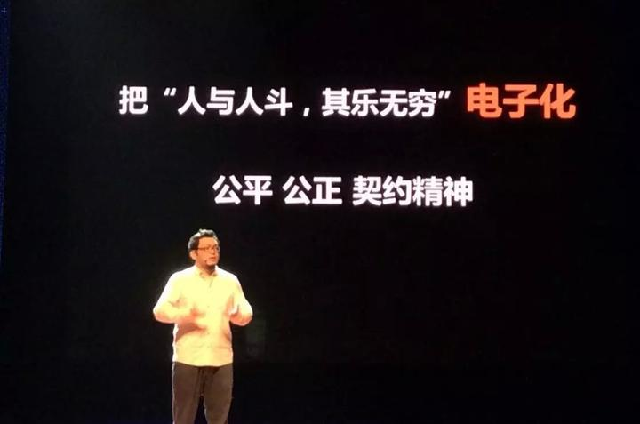

# 序章 讓路更多一些 我在 TEDx 講中國電競

> 《ONE MORE WAY：中國電競幕後史》其中一章。作者 BBKinG（劉洋）2015 年在 TEDxSuzhou 的演講。譯自簡體中文原文：[让路更多一些 我在TEDx 讲中国电竞](../zh/chapters/序章-TEDx演讲-让路更多一些.md)
>
> 首次發表於作者的知乎專欄，2015 年 5 月 16 日：https://zhuanlan.zhihu.com/p/19975183 完整演講影片在 Bilibili：[TEDx演講 中國電子競技 讓路更多一些](https://www.bilibili.com/video/BV1ts411U7tz/)
>
> 這是等待校對的工作稿。若您發現誤譯、用詞不合臺灣習慣或史實錯誤，歡迎[開一個 issue](https://github.com/bkingfilm/china-esports-history/issues/new) 或送出 pull request。

經常有人問我，電子競技到底是什麼？

其實很簡單，我認為，電子競技就是把「人與人鬥，其樂無窮」的這個過程電子化了。只是必須以公平、公正和契約精神為前提。

所以，與一些人看法不同的是，我認為，任何遊戲都可以做出電子競技模式，任何人都可以成為電子競技選手，我們周圍，很多年齡大的人在網路上玩鬥地主打橋牌，小孩子坐在一起用 iPad 玩憤怒的小鳥（臺譯《憤怒鳥》）比誰分高，女孩子玩體感遊戲兩個人飆舞，年輕人組隊玩的 DOTA、英雄聯盟，以及未來會越來越完善的 3D 虛擬技術遊戲，這些項目只要在公平、公正和契約精神的前提下發展，就會衍生出比賽、明星、俱樂部、媒體、直播平臺等等複雜的電競體系。

這就是我理解的電子競技，說起來好像不到一分鐘就結束了，但是這背後是全世界無數電競人十多年的艱難探索和嘗試。

1999 年，韓國人建立了世界上第一個專業遊戲電視臺 OngameNet，就是現在依然很有名的 OGN，同年他們成立了韓國電子競技協會 Kespa，也就是說，韓國人在 1999 年就建立了這樣一個電子競技模式。

**電視臺 + 電子競技 + Kespa**

這是個很厲害的模式，如果我們仔細分析這個模式，電視臺天生擁有推廣管道和商業變現能力，電子競技賽事做產品，Kespa 強化了行業規則，讓每個鏈條都可以環環相扣，穩定發展。

而且韓國的遊戲電視頻道的覆蓋率非常高，2006 年，OGN 在韓國接入了 1300 多萬戶家庭，而這一年韓國的總人口才 4700 多萬，再加上韓國政府的支持，他們的電競賽事贊助商都是大韓航空、三星、現代這樣的大國企，一方面是廣泛的群眾基礎，再加上完整的商業模式，這讓韓國電子競技從一開始就進入了一個良性循環的狀態。

同時期的中國電子競技，在 2004 年之前發展得非常快，大家透過 WCG、CPL 和 ESWC 等國際賽事，開始見識到韓國電子競技商業化運作的成功，他們的模式也被我們認為是當時最好的模式。

所以當 2003 年 11 月 18 日，中國電子競技被國家體育局設立為中國第 99 個體育項目時，我們非常開心，一方面因為我們終於可以名正言順地把韓國電子競技的模式在中國搞起來了，另一方面中國很多衛視都已經開設了遊戲節目，比如，旅遊衛視的《遊戲東西》，上海電視臺的《遊點瘋狂》，西安電視臺的《遊戲俱樂部》，CCTV5 的《電子競技世界》，而且這些節目的收視率都名列前茅，可以說，中國電子競技在那一刻有著無與倫比的資源和市場前景。

而這一切，都停止在 2004 年 4 月 12 日，那一天廣電總局發布了《關於禁止播出電腦網絡遊戲類節目的通知》，剛才說的那些節目，全部被停掉了，這意味著從那一刻起，韓國電子競技的那條路，在中國徹底堵死了。

所幸的是，中國電子競技愛好者和電競人都沒有放棄，我們找到了一條新的路，也是我們當時唯一的一條路。

**網際網路 + 電子競技**

可是，怎麼走呢？我們當時並不是太清楚，但是天無絕人之路，一個新的網際網路技術出現了。

它叫 P2P 串流媒體直播技術，這個技術簡單地說就是，讓網路上的影片看的人越多速度越快，2004 年，國內也出現了以此技術為核心的 PPLIVE 和 PPS 這樣的直播平臺，讓中國電子競技也找到了新的模式。

**P2P 直播平臺 + 電子競技賽事 + 贊助商**

也正是這個模式，讓中國電競愛好者，從 2005 年開始，只需要坐在家裡或者網咖（大陸稱網吧，與臺灣的網咖並非同一種場所）裡就可以看到中國乃至世界級的電競比賽，特別是 2005 年和 2006 年的 WCG 世界總決賽，WE 俱樂部的 SKY 李曉峰獲得 WCG 兩連冠時，身披國旗站上領獎臺那一刻，全世界的電競愛好者都同步看到了，也就是在這之後，我們出去跟廠商談合作的時候，終於不用先花一個小時解釋什麼是電子競技了。

可是，客觀地說，這種模式受時代的限制太大了，即使到現在，經過了這麼多年的網際網路的用戶培養，如今在網路上看影片直播的觀眾數量跟傳統媒體相比，依然差距巨大，這就更別說 10 年前了。

所以，這個模式讓電子競技在很長的一段時間裡，只能飢一頓飽一頓地活著，根本談不上發展。

而這個時期電子競技活得最滋潤的模式是什麼？大家猜一下？

**富二代模式**

大家別笑，如果不是這些對電子競技非常熱愛的富二代，中國電子競技可能走不過那個最困難的時期。

可是，這個模式又有一個很大問題，它不穩定，這個錢說斷就斷了。

於是，當 2008 年世界金融危機來臨的時候，沒有贊助商，推廣管道太窄，變現模式基本沒有的電子競技又一次跌回了黑暗中，很多電競組織被打散，很多電競人被迫去了其它行業。

在 2008 年到 2010 年的這 3 年裡，中國電競人吃了很多苦頭，但是現在回頭看，這是很值得的，正因為那 3 年的全行業蕭條，讓電競人和電競愛好者都深深地意識到了一個問題，這個行業光靠理想是發展不下去的，我們必須要有自己的產品、自己的推廣管道、自己的變現模式，才能活下去，就像郭德綱說的，我們必須要活得很好，才談得上發展，才談得上壯大。

所以到 2010 年金融危機過去之後，我個人認為此時的中國電子競技才算開始成熟了。

而在這一年也發生了幾個非常重要的事情，2010 年 12 月 8 日，優酷上市了，上市之前，就開始大力推遊戲頻道，特別是電子競技，很多 DOTA 的退役選手和解說，開始在優酷上開自己的頻道。

也是這一年，團購網站的概念興起了，網頁遊戲聯合營運的模式出現了，以及最重要的一點，90 後 20 歲了。

簡單地說，這一年電子競技不但突然有了新的推廣管道，還增加很多變現手段。

2011 年有個遊戲服裝品牌，他的創建人也是電競愛好者，他有很多做服裝的資源，他把電競和自己的資源整合在一起，做出了印遊戲圖案的服裝，然後他找到一個知名解說幫他做推廣，沒想到這個解說開了個淘寶店，第一個月就做到 30 萬的月銷售額了，之後每個月都在翻。

大家突然發現，原來電子競技還能這樣玩呀，於是很多電競明星和解說紛紛開起了自己的淘寶店，賣東西，最開始是賣跟電競比較相關的滑鼠鍵盤這種周邊，後來產品種類也越來越多，現在不但有服裝、周邊、零食，還有箱包、生活用品、旅遊產品，甚至成人用品等等。其中就有大家經常聽到的肉鬆餅模式，很多人嘲笑肉鬆餅模式，可是我認為肉鬆餅模式的成功意味著中國電子競技的新模式也就此誕生。

**優酷 + 淘寶 + 電子競技**

我個人認為，這個模式的出現具有劃時代的意義，我把這個模式稱為自我關注度變現。這意味著中國電子競技，從此有自己的推廣管道，有了自己的產品、自己的變現方式，從這一刻起，即使沒有贊助商，沒有富二代，電子競技也可以活下去了。

可是在這個時候，另一個存在多年的矛盾終於被激化了。

我把它叫中國電子競技的泡沫戰爭。

這種泡沫戰爭在中國電子競技發展的這 17 年裡，打了好幾次，其中最大的一場發生在 2010 年 DOTA 的時代，由於電競行業展現出的影響力越來越大，所以吸引了很多資本的瘋狂湧入。

他們進來之後做的第一件事情，就是搶這個行業的核心資源，電競選手，當時的挖人大戰已經打瘋了，他們是無視合約違約金的，比如，你俱樂部跟選手簽的合約裡寫違約金是 50 萬，100 萬，他們是直接把這個錢扔在你臉上，然後說，這個人我要定了，就把人挖走了。

當這個泡沫戰爭打到最後時，所有參戰的俱樂部發現自己都是輸家，因為花出去的錢根本賺不回來，於是，大家開始意識到，這個事不能這麼搞了，電子競技要重建契約精神，要有規矩。

於是，2011 年，中國 12 家最大的職業電子競技俱樂部，抱團成立了一個電子競技聯盟。

又經過這近 5 年的探索和完善，如今的中國電子競技已經形成了穩定的行業格局，聯盟提供了一種溝通協商的基礎，現在每個賽季結束後有專門的轉會窗口期，在這個時期裡俱樂部的經紀人可以去找其它俱樂部的負責人商談選手的轉會事宜，如果選手有出現作弊、代打、消極比賽，甚至是出席活動時的穿衣和言談舉止不合適，聯盟都有具體的條文做規範。

到了 2014 年 8 月，也就是去年，美國亞馬遜 9.7 億美金收掉電競直播平臺 Twitch 後，很多類似 Twitch 的直播平臺在中國火起來了，又一次引發了資本和大眾對電子競技的新一輪關注，電子競技的模式也變得更加複雜，我們過幾年再來評論它。

關於未來，我認為電子競技會像當年電影行業剛誕生一樣，它大幅度地降低了大眾休閒娛樂的消費成本和門檻，而且它比看電影還要方便、廉價，互動性強，這些都將帶來一場互動娛樂形式的新革命，並且會衍生出一個龐大的娛樂產業格局。

最後我要說，我今天的這個演講，並不是來說電子競技有多好多完美，大家都來玩吧，不是，電競只是這個社會的一個縮影，有很多問題我們還在尋找解決方法。

比如，我們經常接到家長的電話，跟我們說自己的小孩子要退學打電競，他什麼辦法都用過了，還是攔不住，希望我們能找個電競明星出面幫忙勸勸他的孩子，我們通常都會幫他勸的。

因為我曾經就是這樣一個小孩子，所以我知道，大部分小孩子的內心裡其實並不是十分確信自己適合走電子競技這條路的。他們只是在自己學業受挫之後，潛意識裡在給自己找新的出路。

可這正是問題的根源，除了高考那條獨木橋之外，我們的社會給小孩子提供的路太少了。於是，貌似精彩熱鬧的電腦、網際網路、遊戲，便成了他慌亂中抓住的救命稻草。

我其實根本不在意他是否選擇電子競技，我在意的是，他選的這條路他是不是真的喜歡，是否合適自己，並且知道該怎麼走？

而我們這一代人的責任，是努力地探索和開拓新的路子，建立一個可以包容孕育新文化的世界，讓我們的下一代敢想敢選能做，讓那些健康向上的次文化都有機會發芽生長。

這便是我這個演講的全部目的，謝謝大家
