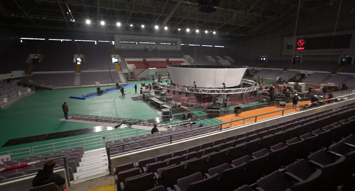
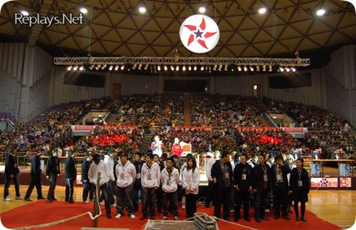

# 为什么大多电竞组织和赛事都在上海？

> 首发于知乎专栏（2017-03-03）原文链接：https://zhuanlan.zhihu.com/p/25551392

文/BBKinG 转载请注明出处

　　本文不但会告诉你，为什么上海会成为现在中国电竞的中心，还会告诉你，为什么闸北上海马戏城附近会成为中国电竞的中心。

　　中国电竞的中心，是从西往东的渐进。

　　98年互联网兴起，电竞最火的地方并不在沿海，而是内陆深处，重庆、成都、西安，甚至武汉都比上海发展的好，中国早期出成绩的电竞选手，马天元、孟阳、CQ2000，CS的Alex，还有电竞幕后组织，星际时代的八达、CS时代的CCSK，这都是川渝军团的人。

[十三 川军先锋 马天元](https://zhuanlan.zhihu.com/p/19626821)
[十五 贫民窟走出的电竞百万富翁 孟阳](https://zhuanlan.zhihu.com/p/19630299)
[三十 世界级中国CS指挥官 Alex卞正伟](https://zhuanlan.zhihu.com/p/19691636)

　　同时期本来有个一线城市可以成为中心的——北京，但是因为蓝极速网吧着火事件和非典，让北京的网吧发展和规模局限住了，比赛没了地方，电竞气氛也弱了。

　　为什么早期内陆地区电竞火？

　　生活节奏慢，学生多，个人电脑普及率低，网吧规模大，很多网吧都是200台机器起跳，500到1000台机器的连锁网吧比比皆是，而且生意好，每个网吧为了招揽生意，都愿意免费提供场地和奖金做电竞赛事，这造成了98年到2003年之前的电竞格局。

　　2002年，位于成都的CCSK网站内部发生了一次分家，原因我书里有，这里不多说了，分家的结果很重要，一队人去了北京成立了电竞组织Esai，另一队人去了上海，参与组建了浩方CGA平台。

　　中国电竞北Esai，南浩方的格局开始形成。

　　这个阶段，北京成为了中国电竞的中心，因为大的电脑厂商总部都在北京，戴尔、华硕、联想，三星，这些公司当时都很愿意赞助电子竞技，我们当时不知道有多羡慕北京的电竞组织。

　　2003年，我加入CGA了，上海浩方平台在CS火热的时代开始成为新的电竞门户网站。

　　可是上海缺乏电脑厂商，那时候可乐、NIKE这些国际品牌上海多，但是电竞对他们来说，即使到现在也不算是个重要的投放渠道，当时就更不用说了。

　　这一年，一个新的电竞项目开始兴起——WAR3

　　这一年，一个老的电竞赛事开始衰落——WCG

　　WCG每年在北京奥体羽毛球馆做总决赛，03年之后，去现场的观众就越来越少了，在这之前都是看台上都坐满的，后来，内场都坐不满了，北京的电竞气氛开始下降。

　　原因很复杂，从观众的角度说，相比2001年，WCG的新鲜感少了，中国队去国外的成绩也并不好，大城市的人选择多，眼界高，活动做的没什么看点，人就少了。

　　2004年4月，广电禁掉了游戏节目在开路电视的播放。

　　北京电脑硬件厂商的投入开始减少，原因很简单，得不偿失，在没直播，没电视报道，收益率不如其它广告渠道的情况下，投放自然会减少。

**　　北京作为电竞中心的优势在之后的几年里不断消退。**

　　2005年，上海发生了几件不起眼的小事。

　　有一个叫许云波的War3爱好者从美国回到了上海，他的身份是IGE驻中国代表处负责人，IGE是当时世界最大的虚拟物品交易商，从中国收WOW金币，卖给全世界，没有物流，成本低，利润高，财大气粗。

　　War3已经成为了电竞最热门的项目，

[http://Replays.net](http://link.zhihu.com/?target=http%3A//Replays.net)成为CGA之后新的电竞门户网站。

　　许云波是

[http://Replays.net](http://link.zhihu.com/?target=http%3A//Replays.net)的忠实用户，跟同是上海人的

[http://Replays.net](http://link.zhihu.com/?target=http%3A//Replays.net)创始人Zax很熟，于是，他想出钱成立一个世界级的WAR3战队，反正打虚拟物品交易的广告有政策风险，这些钱还不如用来做个战队。

　　于是，他收购了

[http://Replays.net](http://link.zhihu.com/?target=http%3A//Replays.net)网站，Zax拉着KinG一起在上海成立了WE俱乐部。

　　同时他还收了一个视频制作团队叫GamesTV，注意这个细节。

　　那一年推出了一个世界级的赛事『StarsWar国际明星邀请赛』，邀请全世界最顶级的WAR3选手来上海参加比赛，很多选手都是第一次来上海，包括moon、grubby等等。

　　2006年初，在上海长宁国际体操中心举办的StarsWar2非常成功，创造了中国电竞赛事现场观众的纪录，线上直播有25万IP观看，第一次证明了『线下大型赛事+线上直播+赞助商的模式』是一条新的路子。

　　正是在这次比赛上，有一个总部在上海的台湾电脑主板制造商派了2个市场人员来提供电脑，他们目睹了电子竞技巨大的影响力，从那之后开始全力赞助电子竞技，这家公司叫**技嘉科技**。

　　到了2006年，许云波因为担心GamesTV没有视频传播许可证，将来发展上会有问题。于是，推动了GamesTV和上海文广SITV游戏风云频道的合并。

　　这就是『游戏风云GamesTV』的由来，而文广有一个演播厅群，就在**上海闸北广中西路幻维多媒体谷**，离上海马戏城很近，这里也是录制加油好男儿的地方，2007年，『G联赛』就诞生在这里，用的是好男儿同一个场地。

　　而现在位于上海闸北洛川东路的东方CJ的总部，2008年也给了SITV，也就是现在游戏风云的所在地。

　　于是，从2007年开始，中国电竞选手，台前幕后的工作人员，包括一直在上海做星际的PLU、刚成立的NEOTV、北京的GTV等等电竞组织和俱乐部，开始频繁的出没在上海马戏城附近。

**　　俱乐部为了约强队比赛方便，开始扎堆上海**

　　WE俱乐部早期是在西安训练的，因为西安的基地有联通的线路，打国外速度比较快，KING也是西安人，后来为了方便管理，2006年整个俱乐部移到了上海，在离闸北不远的宝山区租了一栋别墅。

　　在WAR3的时代，国内能跟WE抗衡的俱乐部，只有北京的EH，但从成绩上说，拥有WCG两连冠的SKY、SUHO、infl、TED等WAR3职业选手的WE，名气要大的多。

　　在训练赛只能靠领队们人肉约的年代，很多俱乐部的台前幕后人员，也开始频繁的来到上海，出入宝山的别墅。

**上海办比赛场地好申请
**

　　同时期的北京，办比赛开始越来越困难，不光是厂商投入减少，场地审批也成为一个麻烦的事情，在北京做活动，受政策影响很大，如果做的电竞赛事里有外国人参加，还需要国家体育局这一级的批文。

　　而在上海，做活动申请场地相对简单，因为商业化程度高，只要你公司合法，费用交齐，公安消防手续很透明，在上海办活动越来越简单，2010年之后，办电竞赛事，连国家批文都很少会要了。

　　2007年，WCG被NEOTV公司拿到上海做了，中国总决赛被放在上海光大会展中心。

　　WCG这个品牌在那个时候，几乎已经要死了，后来NEOTV重新做起来，拉着几个上海的游戏厂商一起办，有点类似Chinajoy，开创了WCG的展会商业模式。

　　NEOTV在中国区加入DOTA项目，直到2013年最后停办，人气和商业性都很好，可惜后来三星的业务转手机了，不做WCG了，NEOTV也没办法。

**　　现在的中国电竞文化中心**

　　值得一提的是，前几年，NEOTV总部所在的上海四行仓库要拆了，NEOTV也搬到了闸北上海马戏城附近。

　　PLU在太仓做了几年LPL后，也搬到闸北上海马戏城附近。

　　GTV的滕林季，2013年左右从GTV出来后，进入游戏风云，他的同事Miss也在同年来到上海，进入游戏风云，住在闸北洛川东路附近。后来滕林季，成立NiceTV以及后来的VSPN，也在闸北上海马戏城附近。

　　妖魔、BBC、117、海涛他们从游戏风云出来后，成立imbaTV，也在闸北上海马戏城附近。

　　2011年，ACE联盟成立，办公室在大宁国际，也在闸北上海马戏城附近。

　　2013年，WE母公司搬入珠江创意中心，现在做『伐木累』APP，也在闸北上海马戏城附近。

　　现在，珠江创意中心里有EDG俱乐部、Snake俱乐部，以及王思聪的『香蕉计划』公司总部、熊猫TV。

　　2016年，Riot Games中国公司搬到大宁音乐广场后面，也在闸北上海马戏城附近。

　　今年LPL总决赛的场地放在上海正大广场，刚结束的imbaTV办的SLi群星联赛是在上海国际体操中心举办的，后面听说几个手游的比赛也要放在上海，如果是这样的话，基本上中国最大的电竞赛事，都放在上海了。

　　其实，我很想在大宁灵石公园里修个大型电竞馆的，就在上海马戏城地铁站旁边，电竞公司全在附近，俱乐部也都离的不远，如果这里未来成为中国电竞文化中心，将来建成电竞主题公园，比浦东世博馆那边位置好多了。

『中国电竞幕后史』实体书29.9元包邮：

[中国电竞幕后史 电竞圈幕后传奇故事 淘宝店](http://link.zhihu.com/?target=https%3A//item.taobao.com/item.htm%3Fspm%3Da1z10.1-c.w5003-12952329584.1.pWkTys%26id%3D524860854215%26scene%3Dtaobao_shop)
