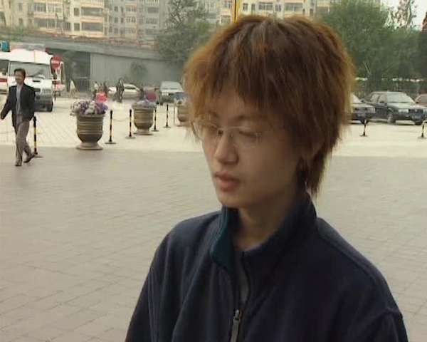
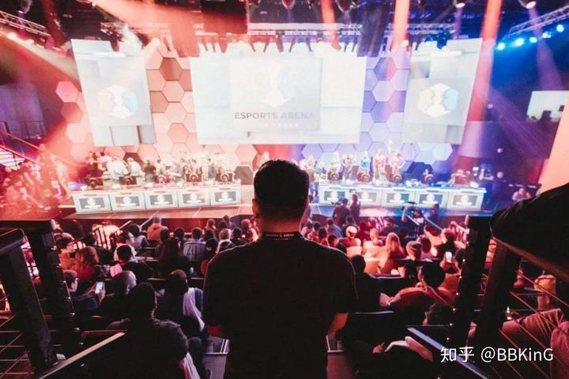
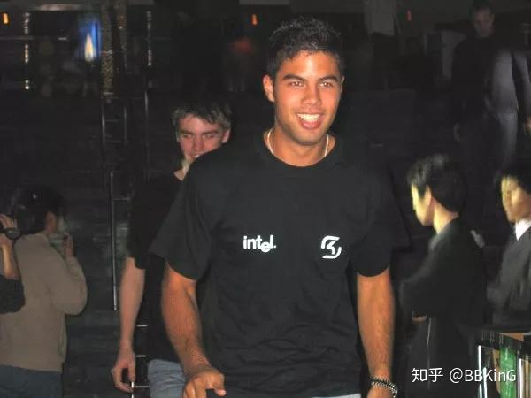
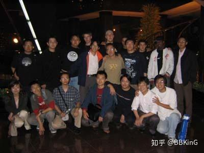

# 2003年瑞典SK战队访华 改变了世界对中国电竞的印象

> 首发于知乎专栏（2018-05-09）原文链接：https://zhuanlan.zhihu.com/p/36649725

视频/CCTV5 电子竞技世界

[

                                              https://www.zhihu.com/video/977627792469368832                          ](http://link.zhihu.com/?target=https%3A//www.zhihu.com/video/977627792469368832)
**　　在2003年之前，国外对中国电竞是没有什么了解的。**

　　甚至说难听一点，在那个淘宝和优酷还没诞生的时代，国外对中国都不是很了解，外界了解我们的渠道太少了，何况是刚起步的中国电子竞技。

　　中国电竞人出国比赛，就遇到过国外对手很惊讶的问，中国人还能用上电脑？

　　中国电竞在那个时候不受人待见，一方面是成绩并不亮眼，另一方面也是没有面向国际的中国电竞门户网站。

　　所以，有别的国家的电竞组织来中国，就成了难得的交流机会。

　　2003年，这就是为什么瑞典SK战队在取得WCG的CS项目世界冠军后，受邀访问中国会变成中国电竞历史上一个比较重要的时刻。

　　SK战队到了上海和北京2个地方，直面中国电竞爱好者无比的热情，几百粉丝追着大巴的场面，是他们在其它国家没见过的。

　　回国后，SK自发成为中国电竞的宣传大使，让整个电竞领域都领略到了中国电竞的氛围，一起来感受下CCTV5当年的纪录片。

　　当时的我已经是CGA的记者了，参与了SK上海站的全程，感谢当年的浩方团队，这是一段美好的回忆。

更多游戏和电竞短纪录片 请搜索公众号 BK短纪录片
