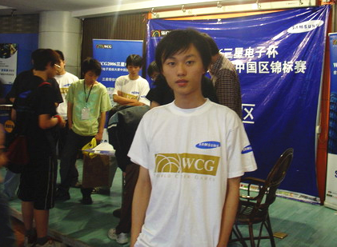

# 四十一 另起一行做电竞 刘义峰

> 首发于知乎专栏（2016-03-28）原文链接：https://zhuanlan.zhihu.com/p/20584882

中国电竞幕后史 四十一

另起一行做电竞 刘义峰

文/BBKinG

　　写了很多成功的职业电竞选手，今天来写一个不成功的。

　　刘义峰，网名刀疤兔，前《魔兽争霸3》职业选手，关注国内WAR3的人，可能听过他的另一个名字 SoZ.afeng。显然，这并不是一个像『李晓峰Sky』那样，充满鲜花与荣誉的名字。

　　正相反，刘义峰职业生涯的最好成绩，不过是在ESWC2005的WAR3项目中，拿了一个中国区的第三，5000块的奖金还被拖欠了一年。

　　更糟糕的是，在2006年的WCG杭州赛区中，他因求胜心切，犯下了一个低级的错误，闹出中国电竞历史上著名的一个黑幕事件『复活流』，受到大量的指责和谩骂。

　　巨大的负能量使得他心灰意冷，慢慢退出了职业选手舞台，转型去做电竞比赛PGL的幕后工作，可正在赛事发力的关键时期，碰上2008年的金融危机，在断粮的情况下挣扎到2010年，最终无奈的离开了电竞行业，从北京回到了上海。

　　一将功成万骨枯，此时的刘义峰，怎么看，都是根枯骨。

　　被迫，他只好另起一行，重新开始。

　　2011年，在电竞淘宝模式还没成型之前，网页游戏《神仙道》与名人的联运，让中国电竞圈的很多明星赚到了百万级的第一桶金。

　　我知道很多电竞爱好者并不喜欢这段经历。

　　可是，对于刚从金融风暴中存活下来的中国电竞来说，网页游戏联运这一波不但是一剂强心针，还是一颗硕大无比的定心丸，它证明了电子竞技能自己养活自己，而且能活的很好。

　　正是这一桶金，也让很多主播有了扩大自己淘宝店规模的本钱，从而加速了『视频+电子竞技+淘宝』模式的成型，对中国电竞行业影响深远。

　　而这件事的促成者，正是那根枯骨，现『心动网络』运营总监、《神仙道》项目负责人阿峰，刘义峰。

　　如今阿峰已经成为游戏业界的一个传奇，但是他说，自己最怀念的还是当初做职业选手，追逐电竞梦想的日子。

　　1983年8月11日，阿峰出生于上海城隍庙附近。从小学起，他就有游戏机和电脑玩，比同龄人早接触游戏，也比周围的人玩的更好。

　　在考入上海重点『市北高中』后，阿峰的游戏天赋在网吧里得到了充分的展示，只要是网吧里有的竞技游戏，他都能玩到第一，在这里他是明星、大神，有着强烈的存在感。

　　可是学习成绩也一落千丈，考了个大学也很差，读到大二时，9门课只及格了1门体育，2003年被退学回家。

　　阿峰很迷茫，对他母亲说，能不能让他试试看做电竞职业选手，母亲同意了。

　　家里出钱给他买了新电脑，在家练了半年的WAR3，年底参加了上海地区的CBI比赛，拿了个第二名，虽然奖金只有200块，但是第一名是MagicYang，前两名还可以免费去北京，这是他第一次出远门。

　　这场小胜让他信心倍增，隐约觉得自己好像可以走这条路。

　　之后又因为在2004年ESWC上海赛区的表现出众，阿峰受到上海SOZ战队队长的赏识，终于成为一个职业选手，月薪1000元。虽然工资少，但也是圆了自己职业选手的梦。

　　不过，电子竞技从来就不是一条好走的路。

　　转眼到了2006年，WCG杭州赛区，3年的职业生涯，虽然让阿峰小有名气，但是还是要尽快出成绩了，他自己对胜利也有着极强的渴望。

　　WCG的预选赛是一局定胜负的，阿峰第一场的对手是一个完全没听说过的路人，这本来是很轻松的一局，没想到阿峰竟然输了，这意味着他第一轮就被淘汰了。

　　于是，求胜心切的阿峰就跟那个对手商量，是否可以把这个名额让给自己，阿峰可以分他奖金。

　　他的对手本来就是抱着参与一下WCG的心态来的，也没有往职业方向发展的计划，于是就同意了。

　　阿峰抓住这个机会，一鼓作气击败所有选手，拿到了杭州赛区的冠军，获得了去北京参加WCG中国区总决赛的机会。

　　不过，赛后有人把阿峰打预选赛的录像翻了出来，一查，第一场就被淘汰的人，怎么还能拿到赛区冠军呢？

　　一时间，比赛黑幕，选手复活，对手被收买，裁判黑哨的指责声铺天盖地的袭来，在当时中国最大的WAR3论坛[http://Replays.net](http://link.zhihu.com/?target=http%3A//Replays.net)上，阿峰被刷了十天的『复活流』，清一色的谴责声。

　　回忆那段过去，阿峰觉得自己当时太年轻，太渴望一场胜利来证明自己，却忽视了比赛规则和个人信誉的遵守。

　　在那次事件后，阿峰开始意识到，人的信誉是非常重要的一件事情，哪怕你最后赢了所有人，失了信誉，也会失去所有东西。

　　之后的几年里，阿峰尝试过做解说，做比赛，从0开始，在北京的CIG、PGL都留下了他的身影，特别是PGL做到第三季的时候，已经有50万IP的在线观看了，已经让他看到了希望的曙光。

　　可是，由于当时的电竞赛事缺少自我变现能力，只能依靠赞助商，可是赞助商对待电竞的态度即不稳定，也不认可电竞的转化率，所以PGL做到如此火爆，冠名费也只不过10万现金+10万的服装。

　　这些钱是无法让电子竞技获得发展的。

　　再加上2008年的世界金融危机，把赞助商全吓跑了，阿峰在挣扎了3年后，无奈回到了上海。

　　这场金融危机让阿峰看清楚了电子竞技的短板——变现能力。

　　带着这个困惑，他开始重新找工作。有次在跟高中时的学长赵宇尧聊天时（现心动网络COO），发现当时摆在VeryCD电驴（心动网络前身）面前的问题，正好跟电竞相反。

　　当时的心动网络在用游戏进行流量变现上，已经有着非常丰富的经验，特别是在数据监控方面，已经形成了一套非常高效的后台分析系统，可以精确的计算出每一次导流后的详细收益。

　　可是，去哪里找流量？是当时心动面临一个难题。为了解决这个问题，心动不惜让出70%的利润分成比例给360、腾讯这样的大渠道换取流量导入。

　　那么，有着巨大关注度流量的电竞，是否也可以算是一个大渠道？电竞和网页游戏是否可以互补？

　　2011年初，带着这个问题，阿峰决定加入心动，等待一个验证新模式的机会。

　　只是没想到这个机会来的如此之快。

　　阿峰说，他永远忘不了2011年3月的一天，黄一孟（心动网络CEO）拿着一个合同，走到他旁边说，这个项目你负责一下。

　　这个游戏就是当时还是半成品的《神仙道》。

　　当然，虽然是项目主管，阿峰也不可能上来就按自己的想法做，于是，他先按心动之前的游戏运营惯例，从大的游戏渠道进行导流，3个月后，几乎所有的大渠道都找完了，每个渠道都很赚钱。

　　心动很高兴，希望有更多的渠道可以导入用户。

　　阿峰觉得时机成熟了，说服公司相信电竞明星是一个被忽视的大渠道，而且从品牌宣传到流量导入都不差，如果可以给他们一个跟大渠道一样的分成比例，激发主播主动推广的欲望，效果会非常好。

　　2011年，此时的电竞，百废待兴，大家都刚从金融危机的地震下都醒过神来，意识到必须要能自己养活自己，才能过上稳定的日子，于是，所有人都在找流量变现的方法。

　　这也给阿峰的切入创造了非常好的条件，10月的一天，阿峰找来了几个过去的电竞老友，提出只要可以推广《神仙道》，可以给7：3的大渠道分成比例，而且是电竞明星们拿利润的7成，这是前所未有的。

　　很多年后，其中一个明星对我说，当他听到7：3的时候，觉得阿峰挺不错的，竟然愿意分给30%，后来知道是自己拿70%后，都震惊了。

　　新模式有了，那就加油干吧！八仙过海，各显神通，《神仙道》的推广在电竞圈铺天盖地。

　　2012年4月，《神仙道》的月流水就过亿了，阿峰说，这是《神仙道》产品本身的优秀，再加上大家努力推广的结果。

　　小苍、09、SKY、星际老男孩等等，至少50多个电竞明星在这波推广中赚到了第一桶金，并且一传十，十传百带动了更多其它领域的明星来主动合作。

　　『电子竞技 + 游戏联运』的双赢模式获得了巨大的成功，阿峰把这个模式也带到了心动的其他游戏，比如，《仙侠道》、《将神》、《深渊》等游戏。

　　2016年3月，《神仙道》高清重制版手游 即将上线，阿峰说，这一次会带着更多的明星和主播一起来合作推广，用更优秀的游戏产品，为大家带来快乐。

　　另起一行更精彩，刘义峰

编者按：

　　在中国电竞发展的过程中，有很多电竞人都因为种种原因，被迫离开了他们深爱的行业，虽然他们离开了，做着可能跟电竞暂时无关的工作，但是他们依然非常关注电竞行业的发展，并在合适的时机，合适的切入点，带着他们新的经验和思路，重新回到电子竞技，给这个行业带来了新的成长点。

　　欢迎回家！电竞人！

-------------------------------------------------

《中国电竞幕后史》已出版，现29.9元签名版包邮，我淘宝店有售

[首页-BBKinG的书店](http://link.zhihu.com/?target=http%3A//bbook.taobao.com)
