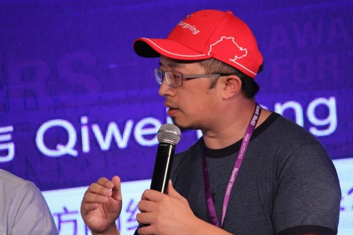

# 四 雪猹: 我们错过的不止是几台游戏机

> 首发于知乎专栏（2014-09-30）原文链接：https://zhuanlan.zhihu.com/p/19856097

中国游戏幕后史 四

“多边形”雪猹: 我们错过的不止是几台游戏机

文/BBKinG

　　2014年9月29日，与众多游戏人的感慨万千正好相反，Xbox One中国版的正式解禁发售，在大多数游戏爱好者中，似乎并没有掀起什么大的波澜。

　　可能在大多数人眼里，一个锁区、没多少正版游戏可选、价格又比水货贵的游戏机上架，有什么可高兴的呢？

　　说到底，不就是一个游戏机吗？我们大多数人小时候没玩过，现在不也过的好好的，我们能错过些什么呢？对我的生活似乎也没有什么影响啊。

　　对，在我跟雪猹聊完之前，我也是这样想的。

　　雪猹，真名杨雪飞，1980年出生于武汉，前《游戏机实用技术》资深编辑，高级记者，笔名“多边形”，他从小专攻主机游戏领域，也是中国游戏媒体第一个被派去美国报道E3游戏展的编辑，亲身经历了很多国内外主机的发展过程，也是本次微软中国Xbox One发行活动的坐上宾。

　　雪猹亲眼见证了中国主机游戏市场的一步步分崩瓦解，也深入感受过国外主机游戏越做越精美的发展历程，通过这两条线的对比，我们可以更清晰的理解中国和国外游戏文化的巨大差异，以及为什么国外很不错的游戏到了中国会水土不服，我们自己做出来的游戏为什么会如此急功近利。

　　雪猹特殊的童年

　　雪猹的母亲在武汉友谊商店工作，同时代的人可能知道，友谊商店，在早期就是专门针对在华外国人开的商店，后来开放成对大众销售外国货的商场。

　　于是，这让雪猹在很早的时候，就接触到了大量国外的新奇商品，比如，他1984年就玩过美国雅达利游戏机，87年就玩到了任天堂的红白机。

　　在这样一个环境下长大，使得他非常喜欢接触最新最好的东西。

　　当然，电子游戏是每个孩子的最爱，而在他十多岁时，中国的电脑并没有普及，也这就更谈不上什么电脑游戏了，于是，街机和包机房，变成了他经常光顾的地方。

　　包机房

　　估计，这是一个在很多人的记忆里，都有些模糊了的名词。他区别与98年之后的电脑房，因为包机房专门做主机游戏，比如，红白机、超级任天堂、以及后来的PS。

　　通常，包机房里边都放着一排电视，电视下边的柜子都带一个装着游戏机和手柄的抽屉，半拉开的抽屉，杂乱的线，各式各样的手柄，你记起来了吗？这便是我们的童年。

　　对于，雪猹来说，他的童年，就是在武汉三镇犄角旮旯大隐于市的几个包机房中度过的，家庭并不富裕的他，在这些时不时被查抄关停的小黑屋里，打游击般的接触到了从超任、3DO、PS、SS、DC以及PS2等游戏主机。

　　相对于现在来说，那时候玩个主机游戏是蛮困难的。

　　首先，在2000年国家出明确规定禁止游戏机之前，有很长一段时间，游戏机和游戏厅，都是被潜规则般的算在 “黄赌毒不良场所”内的，这是无照经营的地下小黑屋，时不时的被封停清理，以及社会负面标签，就先使得很大一批主机用户流失了。

　　接着是主机游戏的高门槛

　　小的方面，存档都是个问题，公用的游戏机，存档经常会被别人覆盖掉，刚开始要想办法藏存档，后来实在不行，只好偷偷咬牙省钱，买个相对于孩子来说非常昂贵的记忆卡。

　　大的方面，在超任的时代，出现了磁碟机，说起来很惭愧，这个东西主要的作用就是方便盗版，它把正版卡带中的Rom提取出来，写进3.5寸软盘中，之后就可以在磁碟机上玩，不用另外买正版了。

　　磁碟机的出现，以及超级任天堂丰富的游戏选择，加速了主机的普及，特别是超任的普及，那时的包机房里，几乎都是超任，但是，相对于现在，90年代初超任+磁碟机三四千元的价格，还是一般家庭无法接受的。

　　值得一提的是，后来世嘉MD的价格就相对便宜了，所以，之后很多家庭条件稍微好一点的孩子，走上了日系游戏那条路，比如，游戏幕后史第一章里写的上海孩子吉川明静。

　　可是，雪猹的家庭环境并不是太好。

　　他只能待在包机房里玩，而且经常为了图便宜，要去包夜，老板晚上回家睡觉，就把他锁在小黑屋里，让他自己玩。

　　在没有互联网，游戏杂志也不好买的时代，攻略是彻底没有的，过关只能靠与周围朋友交流心得。

　　可锁在小黑屋里时，问谁呢？于是，在无数次解谜过不了关时，他就把英文谜题抄下来，然后回家查字典，以至于，他在初中时，英文就已经非常好了，高中还学了些日语。

　　从小外语好，这几乎是我采访过的众多成功幕后游戏人的共同特点。

　　雪猹也因此有机会走上更大的舞台。

　　2002年，经常混迹各大游戏论坛的他，突发奇想，写了一个《潜龙谍影2》的同人小说，引起了《游戏机实用技术》编委“东方蜘蛛”的注意，把这篇文章推荐给了《游戏·人》杂志，之后他开始进入游戏媒体圈，凭借对主机游戏和国外动态的了解，得到了很多约稿。

　　其中最大的一个约稿，来自《游戏机实用技术》编辑Gouki，Gouki当时想做一个《潜龙谍影》的专辑，希望雪猹写一个Gameboy版的攻略，雪猹做的很认真，为了制作游戏里每个关卡的全地图，他用了一个很笨但是很实用的办法，在模拟器里走一步截一张，然后再用PS把图全拼接起来。

　　幸运的是，这个项目还没做完，雪猹就被直接拉到了《游戏机实用技术》深圳的编辑部成为正式员工，因为杂志当时正好想找一个英文好，又懂游戏的人来充实编辑力量。

　　老话总是很经典：机会，永远只给有准备的人

　　当时国内最大的两本主机游戏杂志，一个是《电子游戏软件》，一个就是《游戏机实用技术》，这里有必要介绍一下这两本杂志。

　　《电子游戏软件》创刊于1994年6月，最开始叫《GAME集中营》，是中国第一本正式游戏杂志，后来因为1995年发了一篇很经典的社论《乌鸦乌鸦叫》抱怨中国主机游戏的境遇，撞在电玩严打的枪口上，被一度停刊，后来改名《电子游戏软件》才得以重生，建议大家看看这篇社论，[电软最经典的文章《乌鸦·乌鸦 叫》](http://link.zhihu.com/?target=http%3A//games.qq.com/a/20111108/000189.htm)

　　即使在20年后的今天看，这篇文章对游戏盗版市场的危害，以及行业短视的警告，依然振聋发聩。

　　《游戏机实用技术》创刊于1998年，2001年改为半月刊，巅峰时期月销量超30万。

　　雪猹说，2003年，当他进入这个杂志的编辑部时，感觉自己像进入了天堂一样，因为不但能见到之前久仰的很多编辑，比如Gouki、沙迦、胜负师等等，还能免费玩到各式各样他之前根本买不起的游戏机。

　　能免费玩游戏，还有工资拿，还有什么能比这更开心的事情？这还不卯足了劲干？

　　很快，他的努力就有了回报。

　　2004年，他和Gouki两人被派去美国报道E3游戏展，这一年他24岁，也是他第一次出国，之后的几年里，《游戏机实用技术》杂志即使在资金并不宽裕的情况下，依然坚持每年派他们去美国E3，东京TGS做报道，这种长远的战略眼光为中国游戏行业带来大量第一手的资讯。

　　雪猹十分感激这段时光

　　他说，没有想到自己能在如此年轻的时候，接触到外面的世界，特别是了解到主机游戏的过去和未来，让他可以有更多的角度来看待整个游戏行业的发展。

　　世界主机游戏颠覆史

　　雪猹认为，主机游戏发迹于美国七十年代。雅达利的兴起，除了它非常很有远见的游戏街机转家用机战略，还有它建立一个开放式的游戏平台，为大量游戏的接入奠定了基础，但是这个平台的管理非常粗放，雅达利没有对游戏的质量进行有效管控。

　　特别是错误的实行了“数量压倒质量”的政策后，出现大量粗制滥造的游戏，于1983年，最终爆发著名的 “Atari
Shock” 雅达利冲击事件，被失望的用户市场彻底抛弃。

　　几款烂游戏竟然拖垮了整个北美游戏主机市场，这让正处于黄金时期的雅达利一落千丈。

　　1983年，任天堂抓住了机会

　　他们在推出红白机时，吸取了雅达利的教训，建立了平台，并且加强了对游戏的监管，不仅在质量上，还在数量上对FC平台的游戏进行了严格的控制，这一颠覆式的进步使得游戏的标准和质量有了大幅度提高，主机游戏又开始复兴，也让任天堂成为新的时代霸主。

　　而所谓，成也萧何，败也萧何。

　　任天堂之后对游戏制作商过于苛刻的监管，也让他们走向了另一个极端。

　　新挑战者 次世代主机

　　1994年，在索尼和世嘉已经推出使用光盘的次世代主机PS和SS后，任天堂依然固执的在自己的第三代主机N64上坚持使用卡带，并且依然坚持它老一套苛刻的控制体系，要求他的游戏供应商们，也使用成本和效率都已相对过时的卡带，这造成了业界和玩家的抵触。

　　而这件事导致的最严重后果，就是著名游戏开发商 “史克威尔” 把原本要发在N64上的《最终幻想7》改移到了索尼的PS上，以当时《最终幻想》系列在业界的影响力，以及当时任天堂与索尼剑拔弩张的对峙关系，这简直就是对任天堂的致命一击！

　　索尼趁热打铁，提出口号：所有游戏在这里集合

　　挑战者再次颠覆了任天堂的那套平台体系

　　索尼依然监控游戏质量，但放开了对游戏供应商的部分控制，让他们可以自己控制每个游戏的发行数量，不再像任天堂那样要求必须交钱给他们来制作拷贝。而且索尼还降低了每张游戏的授权金，让利给游戏公司，这大大提高了游戏生产者的积极性。

　　同时，在N64推出之前，由于任天堂打造的便携式3D游戏主机Virtual Boy，因为其过于超前的理念，无法得到很好的技术支持而失败，任天堂的骨干设计师GameBoy之父 横井军平 引咎辞职，公司元气大伤。

　　任天堂从此开始走向衰落。

　　索尼崛起后，一直到2001年微软Xbox的出现，这个行业再次被颠覆，这个是后话了，我们过几年再说。　　　　　

　　再来看看中国这段时间在干什么

　　90年代包机房被各种查封，大众买不起主机，国内各种山寨红白机，盗版游戏，还有几次试图想进入中国市场却失败的世嘉，1997年，世嘉和国内的四通集团联合推出的世嘉土星（SS）最终失败，关于这件事，推荐大家看另一篇文章 [因为世嘉、所以游戏](http://link.zhihu.com/?target=http%3A//biz.163.com/06/0315/11/2C8JR5LK00021GLI.html)，里边详细讲述了世嘉在中国的战略，以及当时的时代背景。

　　之后有了一些试图想打擦边球的，比如，把主机整合成掌机，走曲线擦边球的神游公司，我个人认为，这个公司的能力已经突破了人类极限了，不但拿下了任天堂的代理，而且直接把那么强势的任天堂商标换成了神游的LOGO，这事即使现在来看，都是非常匪夷所思的，相当于你不但是苹果手机的中国总代理，而且还把苹果的标全换成了自己的头像，最神奇的是，苹果还同意了。

　　2003年，索尼也是累死累活的终于搞定了所有手续，准备开启PS2的国行销售，结果也是发售的前一天被莫名其妙的通知延期发售，6天后才又悄然上市。跟这次Xbox One国行的发售经历几乎一模一样。

　　但是，无论这些打擦边球的，还是历经九九八十一难，明媒正娶进来的，最后都失败了。

　　因为正版游戏的审核被卡住了。

　　堂堂国行正版的机器，却没什么游戏可玩。这对于需要源源不断的新游戏来提升硬件销量的游戏主机来说，是个致命伤。

　　回首这30年，我们错过了真的就是这几台游戏机吗？

　　雪猹说，由于硬件支持的区别，主机游戏的制作标准远远高于PC游戏，从70年代到如今，40年过去了，国外那些当初玩着主机游戏长大的游戏人，如今已经成为现代游戏行业的中坚力量，他们在那样优秀的游戏下耳熏目染做出来的游戏，我们要如何超越？这首先就是一个文化积淀的问题。

　　而且，国人在中国电脑PC配置和网络状况的长期影响下，即使把很多优秀的游戏现在就拿进来，还是会出现水土不服的现象，越是精美、复杂的大型游戏在中国死的越快，很多主机游戏改成online版后，必须要做大量的减法，才能入乡随俗。

　　所以游戏人欢呼雀跃，只是因为这可能是一个市场培育的开始，虽然我们心里都很清楚，想开花结果，起码还需要再等待十到二十年的熏陶过程，但是至少这算是起了个头吧。

　　这还仅仅是文化修养上的差距

　　而我们可能会错过的最要命的一个东西

　　恐怕是新一波的工业革命浪潮

　　如今，声称只是以娱乐为中心Xbox One，放在你家客厅里，你可以声控，无需借助任何设备，就可以用动作指挥，可以播放音乐、电视、互联网购物，可以打视频电话，可以连接更多的设备。

　　等等，你看过《钢铁侠》吗？　　　　　　　

　　还记得里边那个从智能交互，到军事级运用，无所不能的管家贾维斯吗？

　　你还认为

　　我们错过的，真的只是几台游戏机吗？

-------------------------------------

中国游戏幕后史
每个人都有故事，只要有你足够的耐心和洞察力
