# 番外篇 波士顿棒球记

> 首发于知乎专栏（2014-09-25）原文链接：https://zhuanlan.zhihu.com/p/19856082

8月在美国东部一直想看场赛事，可惜最想看的NBA要到10月才开赛，冰球和橄榄球虽然有，但是跟行程总是擦肩而过，后来无意中查了下MLB（美国职业大联盟）的官网，发现这场波士顿红袜队和休斯顿太空人队的比赛，刚好在我离开波士顿的前一天，于是，赶紧下手订票，在红袜队的官网上买到了这张票。

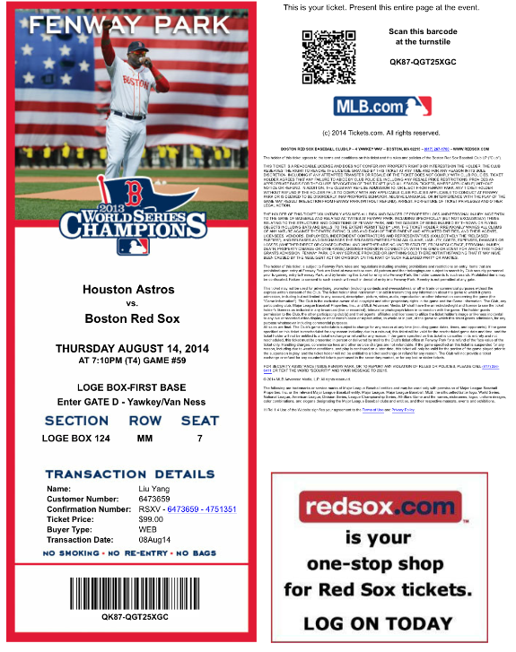

　　美国很多票都可以网上买，然后系统发到你邮箱，你在家打印好，到时带上就行了，进场的时候扫描。

　　话归原题，波士顿红袜队的主场在Fenway park，这是一个老式球场，历史悠久，有近37000个座位，交通也很方便，离市区不远，地铁可以直接到，一路上各种穿着红袜队队服的人，感觉真是过节一样。

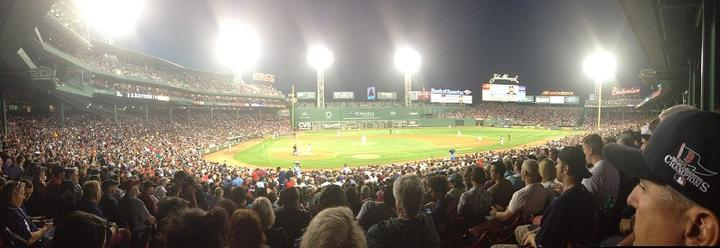

　　下面是波士顿的地图，右中部突出来的这一大片高楼很多的地方是市中心，左上角20的位置是哈佛大学，中间那个桥旁边21的位置是麻省理工，左下角23的位置就是芬威球场，波士顿总的来说到哪都近，我租了个自行车，两天就骑完了（累死胖子我了）。

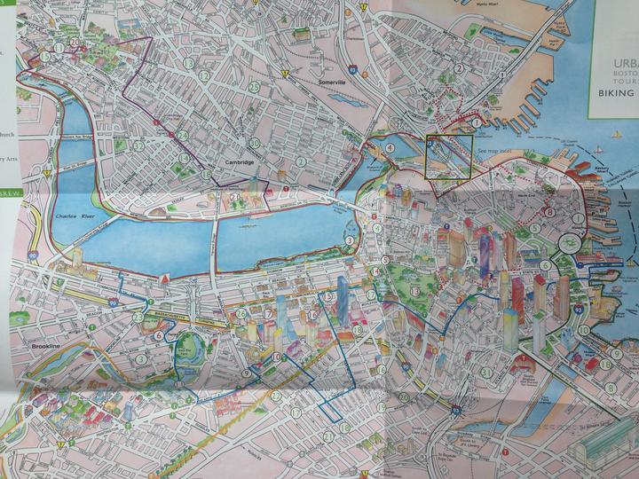

　　然后扯点波士顿的背景陈述，为后面的事情做点铺垫。

　　波士顿人，非常喜欢运动，查了下城志，这个城市是于1630年9月17日，由来自英国的清教徒移民创建的。这是一个典型的传统白人居多的城市，清教徒有极强的道德规范，对自身的要求严格，并且非常重视教育，这让波士顿地区无论从教育素质还是治安规范方面，都有很好的底子，健康自律、积极向上也成了这个城市的精神。

　　换句话说，对规则、团队配合和技巧性要求极高的棒球，天生就属于波士顿，而事实上，这里就是现代棒球的发源地，英国移民通过改进传统的板球游戏，并结合其它游戏，创造了全新的规则，并在两百年后，建立了棒球联盟，开始走上规范化。

　　下图是横穿波士顿的Charles River，河边都是跑步的，河各种帆船和划艇，波士顿人十分热爱运动。

　　美国人在棒球的规范化上探索了200多年才有现在，而中国电子竞技从1998年开始到2011年左右创立联盟，只花了13年。

　　可见，人类摸索一个新项目的速度在加快，规范整合行业的速度也在缩短，但方向大体都是一样的，管理选手、协调赛事、监督球员转会和行业各个角色之间的利益平衡，保持大家都能健康发展。

　　看完波士顿的历史，我产生了一个疑问，是什么文化滋生了中国电子竞技的成长？当然，这是另一个命题，这里就不展开了。

　　书归前说，比赛那天我到了现场，看到的是一个真正的节日。

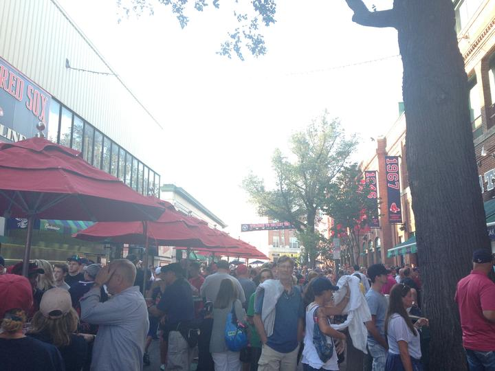

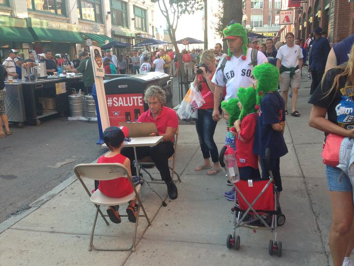

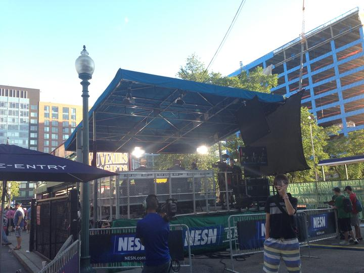

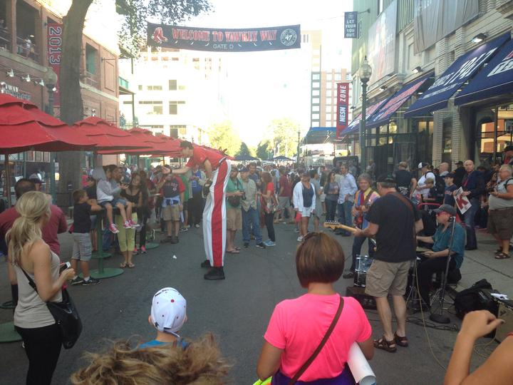

　　商店和饭馆遍布球场周围，商品种类十分齐全，周边这是我非常感兴趣的地方，所以也拍了很多参考资料，这里就不放出来，不然太多了，只放一张，他们甚至针对小孩子开发了大量的产品，果然兴盛上百年的运动就是不一样。

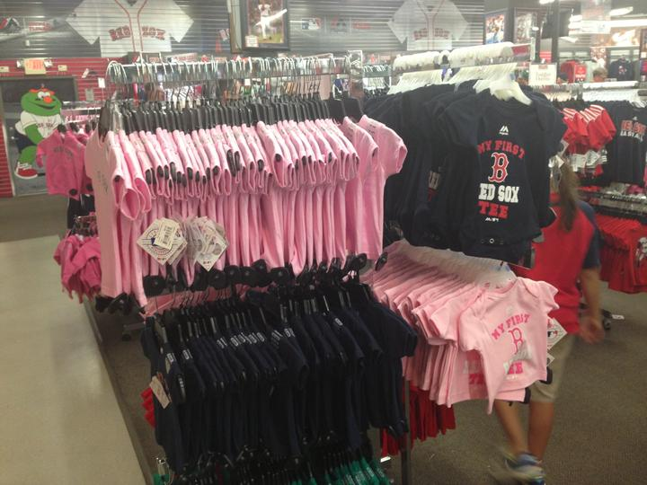

　　这些是在芬威球场拍过的影视片

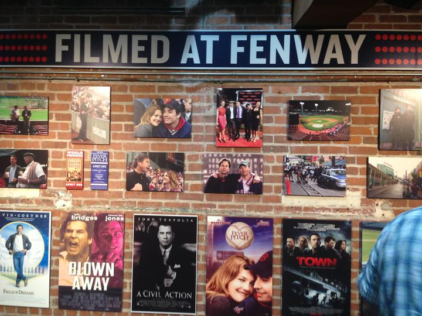

　　这是球场里卖的Italian sauasge，边吃边看，特别过瘾。

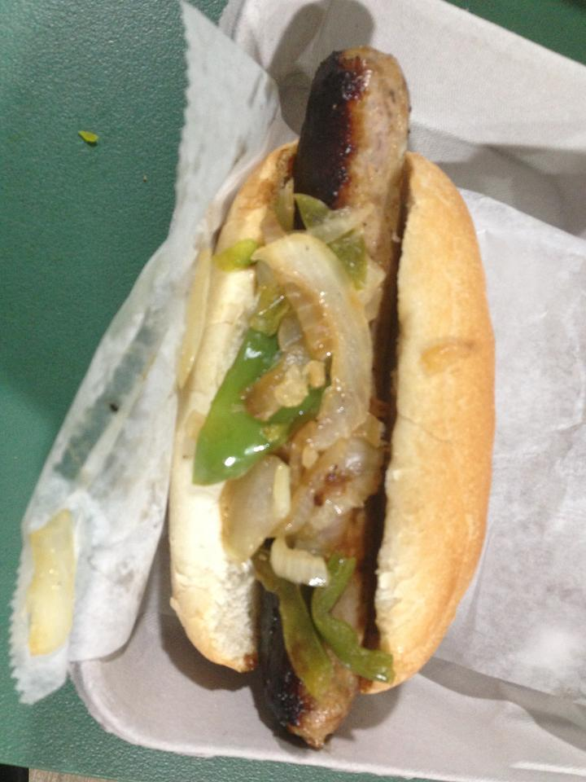

　　在赛场旁边转的差不多了，进场落座后，发现周围好多老头老太太，坐我旁边一对老夫妻，目测应该都60+了吧，开了2个小时车来看球，老太太在得知我是第一次看现场的棒球比赛后，一晚上不停的给我解释各个环节，十分热情。而我对她十分熟练的使用手机上网搜索各种资料印象十分深刻，以前一直以为中国移动互联网的普及算是比较好的，后来又遇到几次美国老太太教我用手机APP之后，我深深的觉得自己错了。还有另一个让我震惊的事情：这么大的体育场，手机上网信号竟然从头到尾都非常好！

　　看比赛的过程我就不细说了，说下我的几个感想。

　　1、棒球的规则让整个比赛的节奏很有观赏性。

　　其观赏性体现在，规则简单明了，节奏张弛有力，每个球都有可能打出本垒打，每个小节都有大大小小的高潮，转场的间隙并不长，足够你出去上个厕所，买点吃，整场比赛从晚上7点开始到10点半结束，3个半小时，看完还有地铁回家。

　　时间和节奏的控制，这非常重要，电子竞技赛事如果想更加普及化，我认为也应该进行规则上的调整，现在的比赛经常一打就是一天，赛事组织者很累，观众也很累，虽然之前WCG曾成功的Chinajoy化，但是这并不利于让电子竞技变成一个大众日常娱乐的快速消费品。

　　我觉得应该缩短小节的时间，增加小节的数量，就像NBA当年从上下半场改成小节式赛制一样，把比赛的节奏和整体时间进行调整。每节在20到30分钟以内，总时间控制在3个小时左右，这就是一个老少咸宜的晚间娱乐项目了。

　　我们应当像电影、演唱会等形式靠拢，迎合大众的娱乐习惯，而不是让大众来适应电子竞技。

　　可是，眼下的电竞项目似乎无法进行这样的调整，节奏还是偏慢，这说明调整节奏进入大众娱乐的计划要等未来的电竞项目来实现了。

　　2、比赛细节的设计

　　开场国歌的部分大家都熟知了，我拍了一个很短的视频，大家可以看看。

[

                              波士顿红袜队主场Fenway park开场国歌                http://v.youku.com/v_show/id_XNzYxMjQwNDgw.html?firsttime=0                          ](http://link.zhihu.com/?target=http%3A//v.youku.com/v_show/id_XNzYxMjQwNDgw.html%3Ffirsttime%3D0)
　　请明星来开球也是大家熟知的了，但是这次不太一样，是四个老棒球明星一起开球。

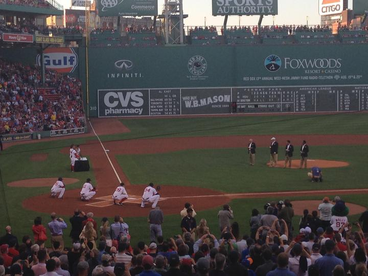

　　然后是一些大家可能不知道的细节，比赛小节之间会有名人或者战争英雄上场亮相，大家会起立致敬。还会有一些歌曲，大家会搂着旁边的人一起摇着唱，要么是会有带互动的引导语，要么是镜头拍观众，观众会在镜头前各种表现，反正在现场，及时是休息时，你也不会感到无聊，这种丰富的组织经验也保证了这个赛事的魅力，

　　这些虽然以前就注意过，但是真的临场体验后，再回头看自己的赛事，的确是有相当多改进的地方。

　　最后，我要说，波士顿这个地方真的很不错，环境优美，治安也好，非常推荐大家去看看，就是为了波士顿龙虾的完美口感，也要去一趟，友情提示：大家一定要点2磅以上的大龙虾，口感完全不一样，也推荐大家一家价格便宜量又足，本地人会去的店 Barking Crab，就在上面那个地图右下角9号的位置，非常爽！！

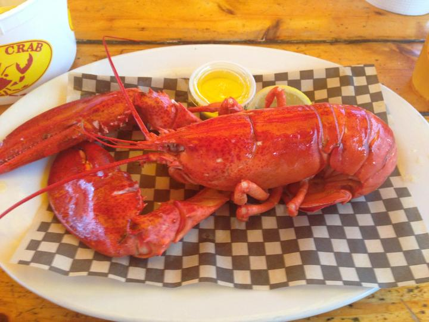

